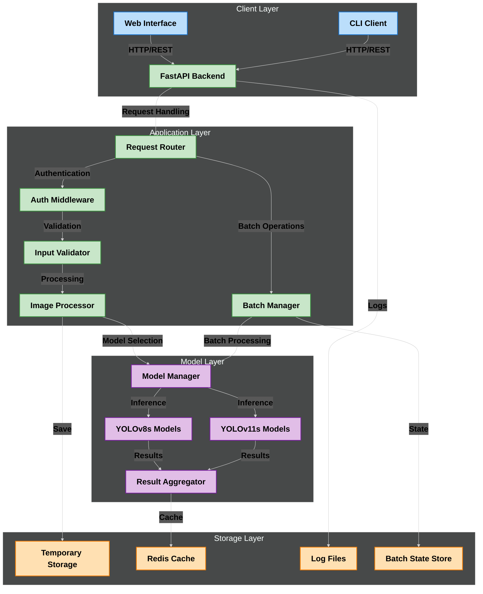
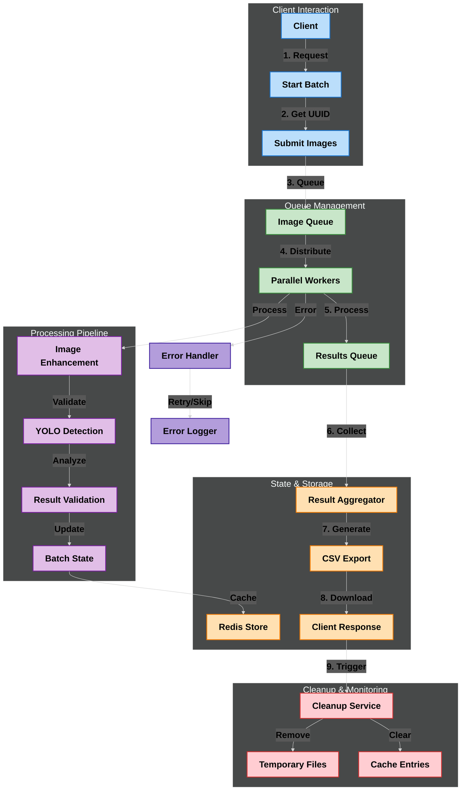
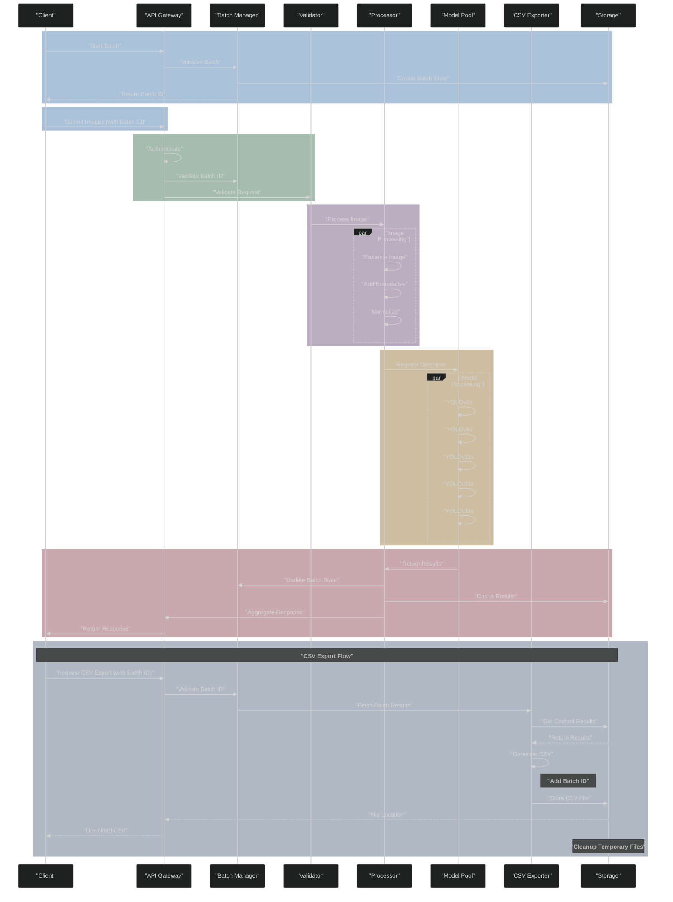
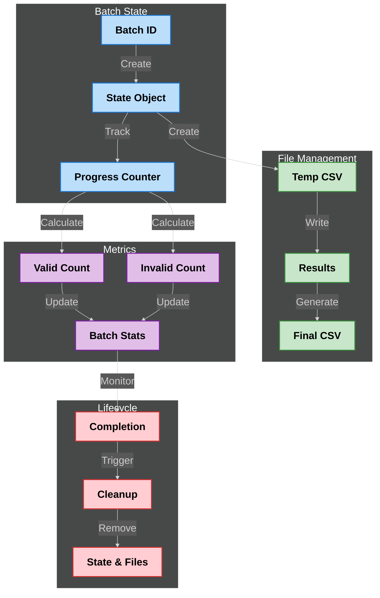
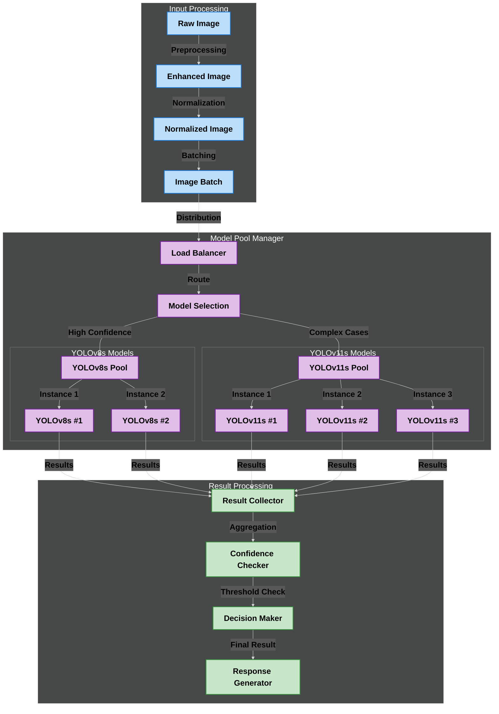
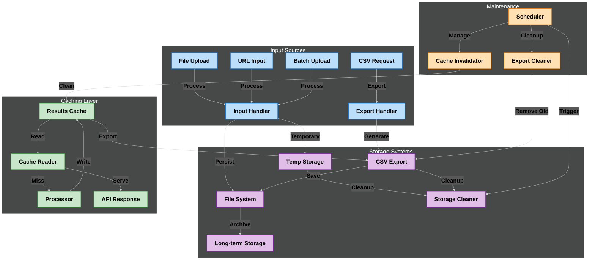

```mermaid
%%{init: {'theme': 'dark', 'themeVariables': { 'fontFamily': 'arial', 'fontSize': '22px'}}}%%
graph LR
    subgraph "Error Sources"
        style A1 fill:#ffcdd2,stroke:#d32f2f,stroke-width:2px,color:#000000,font-weight:bold
        style A2 fill:#ffcdd2,stroke:#d32f2f,stroke-width:2px,color:#000000,font-weight:bold
        style A3 fill:#ffcdd2,stroke:#d32f2f,stroke-width:2px,color:#000000,font-weight:bold
        style A4 fill:#ffcdd2,stroke:#d32f2f,stroke-width:2px,color:#000000,font-weight:bold
        A1[Input Errors] -->|Validation| B[Error Handler]
        A2[Processing Errors] -->|Runtime| B
        A3[Model Errors] -->|Inference| B
        A4[System Errors] -->|Infrastructure| B
    end

    subgraph "Error Processing" 
        style B fill:#ffe0b2,stroke:#f57c00,stroke-width:2px,color:#000000,font-weight:bold
        style C fill:#ffe0b2,stroke:#f57c00,stroke-width:2px,color:#000000,font-weight:bold
        style D fill:#ffe0b2,stroke:#f57c00,stroke-width:2px,color:#000000,font-weight:bold
        style E fill:#ffe0b2,stroke:#f57c00,stroke-width:2px,color:#000000,font-weight:bold
        style F fill:#ffe0b2,stroke:#f57c00,stroke-width:2px,color:#000000,font-weight:bold
        B -->|Categorize| C[Error Classifier]
        C -->|Log| D[Error Logger]
        C -->|Alert| E[Alert Manager]
        C -->|Metrics| F[Metrics Collector]
    end

    subgraph "Monitoring Stack" 
        style G fill:#bbdefb,stroke:#1976d2,stroke-width:2px,color:#000000,font-weight:bold
        style H fill:#bbdefb,stroke:#1976d2,stroke-width:2px,color:#000000,font-weight:bold
        style I fill:#bbdefb,stroke:#1976d2,stroke-width:2px,color:#000000,font-weight:bold
        style J fill:#bbdefb,stroke:#1976d2,stroke-width:2px,color:#000000,font-weight:bold
        style K fill:#bbdefb,stroke:#1976d2,stroke-width:2px,color:#000000,font-weight:bold
        style L fill:#bbdefb,stroke:#1976d2,stroke-width:2px,color:#000000,font-weight:bold
        style M fill:#bbdefb,stroke:#1976d2,stroke-width:2px,color:#000000,font-weight:bold
        D -->|Write| G[Log Files]
        E -->|Notify| H[Alert System]
        F -->|Store| I[Prometheus]
        
        G -->|Aggregate| J[Log Aggregator]
        I -->|Visualize| K[Grafana]
        
        J & K -->|Display| L[Dashboard]
        H -->|Notify| M[DevOps Team]
    end

    %% Style all edge labels
    linkStyle default color:#000000,font-weight:bold
```

# Image Validation Using Logo Detection: By Symphony Limited
## Powered by YOLO Object Detection

This application provides an enterprise-grade solution for detecting Symphony logos in images using multiple YOLOv8 and YOLOv11 models. It features a FastAPI backend for robust image processing and a modern web interface for seamless user interaction.

## Table of Contents
- [Key Features](#key-features)
- [System Architecture](#system-architecture)
- [Technology Stack](#technology-stack)
- [Installation](#installation)
- [Configuration](#configuration)
- [Running the Application](#running-the-application)
- [Production Deployment](#production-deployment)
- [API Documentation](#api-documentation)
- [Development Guidelines](#development-guidelines)
- [Security](#security)
- [Troubleshooting](#troubleshooting)
- [License & Support](#license--support)

## Key Features

- **Advanced Multi-Model Detection**
  - Utilizes 5 different YOLO models (YOLOv8s and YOLOv11s variants)
  - Early detection return for optimized performance
  - Configurable confidence threshold (currently set at 0.35)
  - Automatic model fallback for improved accuracy
  - Parallel model execution for faster results

- **Comprehensive Image Processing**
  - Single image validation
  - Batch processing with concurrent execution
  - Support for both file uploads and URLs
  - Automatic image enhancement with boundary addition
  - Robust error handling and validation
  - CSV export functionality with batch tracking
  - Unique batch IDs for parallel processing
  - Timestamped result downloads
  - Support for multiple image formats (JPEG, PNG)

- **Enterprise-Ready API**
  - RESTful FastAPI implementation
  - Comprehensive API documentation (Swagger & ReDoc)
  - Rate limiting and CORS protection
  - Detailed logging with rotation (10MB limit)
  - Swagger UI integration
  - CSV export endpoint for batch results
  - Health check endpoints
  - Prometheus metrics integration

- **Modern Frontend Interface**
  - React-based user interface (v19.1.0)
  - Material-UI components (v7.1.0)
  - Configurable backend URL
  - Material design components
  - Responsive layout
  - Drag-and-drop file upload
  - Real-time validation feedback
  - Progress tracking for batch operations

- **Production-Grade Infrastructure**
  - Thread-safe operations
  - Automatic temporary file cleanup
  - Configurable environment settings
  - Comprehensive error tracking
  - Performance optimization features
  - Secure file handling for exports
  - Redis caching support
  - Prometheus/Grafana monitoring

## Detailed System Architecture

### High-Level System Overview


### Batch Processing Flow Diagram


### Batch Processing Pipeline


### State Management


### Model Architecture


### Error Handling and Monitoring


### Data Flow and Storage


## Technology Stack

### Backend Infrastructure
- FastAPI (async support)
- Python 3.7+
- Ultralytics YOLOv8 and YOLOv11
- PIL for image processing
- Redis for caching
- Prometheus for metrics
- Rotating file logs
- uvicorn for ASGI server

### Frontend Stack
- React 19.1.0
- Material-UI 7.1.0
- Axios for API calls
- React Dropzone
- Cross-env for environment management
- Jest for testing
- ESLint for code quality

### AI/ML Components
- 5 specialized YOLO models
  - 2x YOLOv8s instances
  - 3x YOLOv11s instances
- Custom confidence thresholds
- Model ensemble approach
- Optimized inference pipeline
- GPU acceleration support

### Development Tools
- Poetry for dependency management
- Pre-commit hooks
- Pytest for backend testing
- Jest for frontend testing
- Black for Python formatting
- ESLint for JavaScript/TypeScript
- Docker for containerization
- Kubernetes manifests

## Installation

### Backend Setup

1. Clone the repository:
```bash
git clone [repository-url]
cd usingYolo
```

2. Create and activate a virtual environment:
```bash
python -m venv .venv
source .venv/bin/activate  # On Windows: .venv\\Scripts\\activate
```

3. Install dependencies:
```bash
pip install -r requirements.txt
```

### Frontend Setup

1. Navigate to the frontend directory:
```bash
cd frontend
```

2. Install dependencies:
```bash
npm install
```

3. Start the frontend with a custom backend URL:
```bash
# Using npm start-backend script with custom backend
npm run start-backend --backend=http://your-backend-url:8000

# Or using default backend (http://localhost:8000)
npm run start-backend
```

### Docker Installation

1. Build the Docker image:
```bash
docker build -t symphony-logo-detection .
```

2. Run the container:
```bash
docker run -p 8000:8000 -v $(pwd)/data:/app/data symphony-logo-detection
```

## Configuration

### Environment Variables

Create a `.env` file in the root directory:

```env
# API Configuration
API_HOST=0.0.0.0
API_PORT=8000
DEBUG_MODE=False

# Model Configuration
CONFIDENCE_THRESHOLD=0.35
ENABLE_GPU=True
MAX_BATCH_SIZE=50

# Security
API_KEY_HEADER=X-API-Key
CORS_ORIGINS=["http://localhost:3000"]
RATE_LIMIT=100

# Logging
LOG_LEVEL=INFO
LOG_ROTATION=10MB
```

## Running the Application

1. Start the FastAPI backend:
```bash
uvicorn App:app --reload --host 0.0.0.0 --port 8000
```

2. Access the application:
- API Documentation: http://localhost:8000/docs
- Alternative API docs: http://localhost:8000/redoc

## Production Deployment

### Using Docker Compose

1. Create `docker-compose.yml`:
```yaml
version: '3.8'
services:
  api:
    build: .
    ports:
      - "8000:8000"
    volumes:
      - ./data:/app/data
    env_file:
      - .env
    deploy:
      resources:
        reservations:
          devices:
            - driver: nvidia
              count: 1
              capabilities: [gpu]
```

2. Deploy:
```bash
docker-compose up -d
```

### Kubernetes Deployment

Basic manifests are provided in the `k8s/` directory for Kubernetes deployment.

### Monitoring

- Prometheus metrics available at `/metrics`
- Grafana dashboard templates in `monitoring/`
- Health check endpoint at `/health`

## API Documentation

### Main Endpoints

#### 1. Logo Detection Endpoints

##### Start Batch Session
```http
POST /api/start-batch

Response:
{
    "batch_id": "uuid-string"
}
```

##### Single Image Validation
```http
POST /api/check-logo/single/
Content-Type: multipart/form-data

Parameters:
- file: Image file (optional)
- image_path: Image URL (optional)

Response:
{
    "Image_Path_or_URL": string,
    "Is_Valid": boolean,
    "Error": string | null
}
```

##### Batch Processing
```http
POST /api/check-logo/batch/
Content-Type: multipart/form-data

Parameters:
- files: Array of image files (optional)
- paths: Semicolon-separated URLs (optional)
- batch_id: UUID for batch tracking (optional)

Response:
[
    {
        "Image_Path_or_URL": string,
        "Is_Valid": boolean,
        "Error": string | null
    }
]
```

#### 2. Utility Endpoints

##### Export Batch Results
```http
GET /api/check-logo/batch/export-csv
Parameters:
- batch_id: string (required)

Response: CSV file
```

##### Get Batch Status
```http
GET /check-logo/batch/getCount
Parameters:
- batch_id: string (required)

Response:
{
    "valid": number,
    "invalid": number,
    "total": number
}
```

#### 3. Monitoring Endpoints

```http
GET /health
GET /metrics
```

## Security

### Authentication & Authorization
- API key authentication
- CORS protection with configurable origins
- Rate limiting per client
- Role-based access control (optional)

### Data Security
- Secure file handling
- Temporary file cleanup
- Input validation and sanitization
- Secure error messages
- XSS protection
- CSRF protection

### Infrastructure Security
- Docker security best practices
- Kubernetes security policies
- Network isolation
- Resource limits
- Secure logging

## Error Handling

The system implements comprehensive error handling for:
- Invalid file formats
- Corrupted images
- Network issues
- Model failures
- Resource constraints
- Concurrent processing errors

## Logging System

- Rotating log files (10MB limit)
- Detailed error tracking
- Request/response logging
- Model inference logging
- Performance metrics

## Development Guidelines

1. Code Style
   - Follow PEP 8
   - Use type hints
   - Document all functions
   - Write unit tests

2. Git Workflow
   - Feature branches
   - Pull request reviews
   - Version tagging
   - Changelog updates

## Troubleshooting

1. Check logs.txt for detailed error messages
2. Verify model weights in runs/detect/ directory
3. Ensure proper file permissions
4. Validate image formats (JPG/PNG)
5. Check network connectivity
6. Verify GPU drivers (if applicable)

## License & Support

### License
Copyright © 2024 Symphony Limited. All rights reserved.

### Support
For technical support or feature requests:
- Email: support@symphony.com
- Documentation: https://docs.symphony.com
- Issue Tracker: https://github.com/symphony/logo-detection/issues

### Contributing
Please read our [Contributing Guidelines](CONTRIBUTING.md) before submitting pull requests. 

### Batch Processing Flow

The system implements a robust batch processing mechanism that enables concurrent image validation with state tracking:

1. **Batch Initialization**
   - Client requests a new batch session
   - System generates a unique UUID for the batch
   - Creates batch state object in Redis
   - Returns batch ID to client for subsequent requests

2. **Image Submission**
   - Client submits multiple images with batch ID
   - Supports both file uploads and URLs
   - Images are queued for processing
   - Batch state is updated with total count

3. **Concurrent Processing**
   - Images are processed in parallel
   - Each image goes through:
     * Validation and sanitization
     * Enhancement and normalization
     * Boundary addition
     * Model inference
   - Results are cached with batch ID reference

4. **State Management**
   - Real-time progress tracking
   - Valid/Invalid image counts
   - Processing status updates
   - Error handling and recovery
   - Automatic cleanup of temporary files

5. **Result Aggregation**
   - Results are collected and organized by batch ID
   - Statistics are computed:
     * Total processed images
     * Valid/Invalid counts
     * Error counts and types
     * Processing duration

6. **CSV Export**
   - Client requests CSV export with batch ID
   - System validates batch completion
   - Results are fetched from cache
   - CSV is generated with:
     * Image details
     * Validation results
     * Timestamps
     * Error messages (if any)
   - File is made available for download
   - Automatic cleanup after download

7. **Resource Management**
   - Temporary files are automatically cleaned
   - Cache entries are invalidated after configurable period
   - Failed processing is automatically retried
   - System resources are released properly

8. **Error Handling**
   - Invalid batch IDs are rejected
   - Corrupted images are marked and skipped
   - Network failures are handled gracefully
   - Processing errors are logged and reported

### State Management


### Model Architecture


### Error Handling and Monitoring


### Data Flow and Storage

