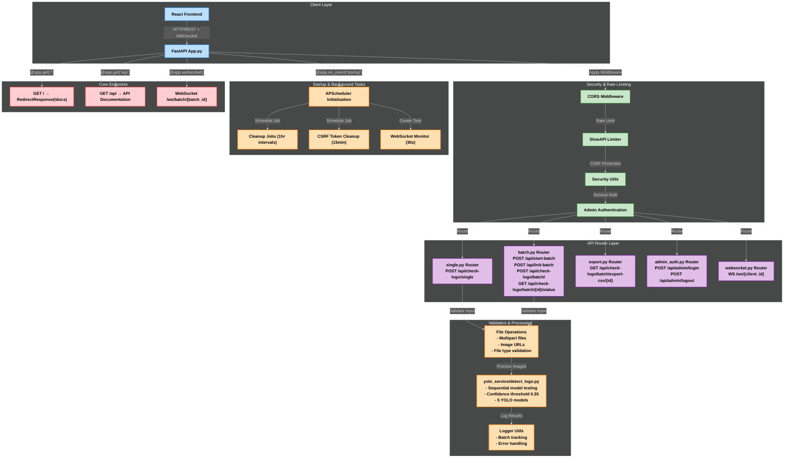
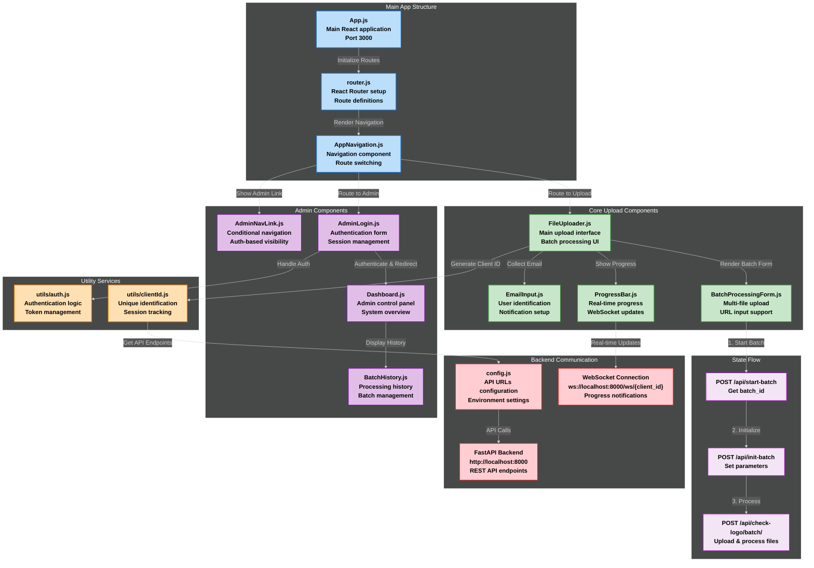
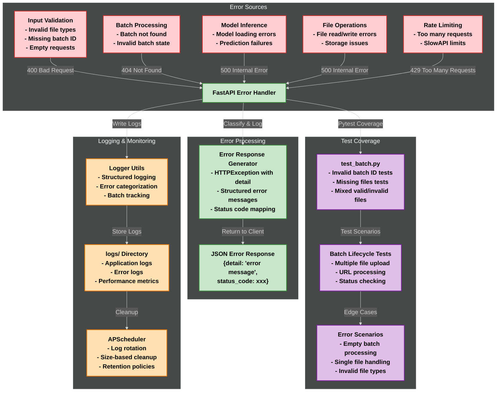
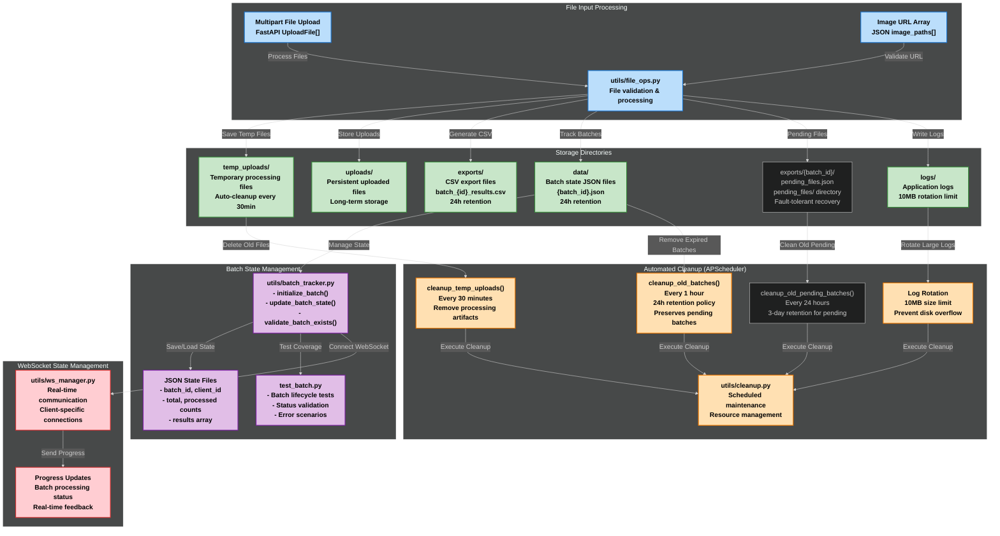
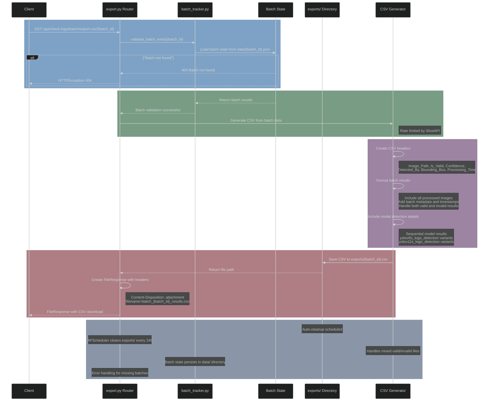

**Symphony Logo Detection System: Enterprise-grade, real-time image validation using advanced YOLO models for brand compliance and automated QA.**


# Symphony Logo Detection System
## Enterprise-Grade YOLO-Powered Image Validation

### Executive Summary
Symphony Logo Detection System is an enterprise-grade platform for automated, high-accuracy logo validation in images, designed for scalable batch processing and real-time feedback. The system leverages advanced YOLO AI models to deliver reliable logo detection for quality assurance, brand compliance, and automated content validation workflows. Built for Symphony Limited, it provides both single-image validation and high-throughput batch processing capabilities with comprehensive admin controls and real-time progress monitoring.

A comprehensive logo detection system built by Symphony Limited that uses advanced YOLOv8 and YOLOv11 models to validate the presence of Symphony logos in images. The system features a robust FastAPI backend with real-time processing capabilities and a modern React 19.1.0 frontend for seamless user interaction.

---

## Table of Contents
- [Key Features](#key-features)
- [Example Workflow](#example-workflow)
  -[Updated Batch Processing Flow](#updated-batch-processing-flow)
- [System Architecture](#system-architecture)
  - [High-Level System Overview](#high-level-system-overview)
  - [FastAPI Application Architecture](#fastapi-application-architecture-apppy)
  - [React Frontend Component Architecture](#react-frontend-component-architecture)
  - [Sequential Model Processing Flow](#sequential-model-processing-flow-detect_logopy)
  - [Batch Processing Pipeline](#batch-processing-pipeline)
  - [YOLO Model Detection Pipeline](#yolo-model-detection-pipeline)
  - [Error Handling and Monitoring](#error-handling-and-monitoring)
  - [File Storage and Cleanup System](#file-storage-and-cleanup-system)
  - [CSV Export Lifecycle](#csv-export-lifecycle)
- [Environment Configuration](#environment-configuration)
- [Model Weights, Large Files, and Git LFS](#model-weights-large-files-and-git-lfs)
- [Continuous Integration (CI/CD)](#continuous-integration-cicd)
- [Project Structure (Root-level files)](#project-structure-root-level-files)
  - [Detailed Project Structure](#detailed-project-structure)
- [Technology Stack](#technology-stack)
  - [Backend Infrastructure](#backend-infrastructure)
  - [Frontend Stack](#frontend-stack)
  - [AI/ML Components](#aiml-components)
  - [Development & Testing Tools](#development--testing-tools)
- [Installation](#installation)
  - [System Requirements](#system-requirements)
  - [Backend Setup](#backend-setup)
  - [Frontend Setup](#frontend-setup)
- [Configuration](#configuration)
  - [Environment Variables](#environment-variables)
  - [Frontend Configuration](#frontend-configuration)
  - [Backend Configuration](#backend-configuration)
  - [Model Configuration](#model-configuration)
- [Running the Application](#running-the-application)
  - [Quick Start](#quick-start-1)
  - [Custom Configuration](#custom-configuration)
  - [WebSocket Configuration](#websocket-configuration)
  - [Development Mode](#development-mode)
  - [Production Mode](#production-mode)
- [API Documentation](#api-documentation)
  - [Main Endpoints](#main-endpoints-business-logic)
  - [System Endpoints](#system-endpoints-administrative--infrastructure)
  - [Error Responses](#error-responses)
  - [Rate Limits](#rate-limits)
  - [Authentication](#authentication)
  - [WebSocket Features](#websocket-features)
  - [File Support](#file-support)
  - [Getting Started](#getting-started)
- [Security](#security)
  - [Security Features](#-security-features)
  - [Security Best Practices](#️-security-best-practices)
  - [Common Threats & Mitigations](#-common-threats--mitigations)
  - [Security Checklist](#-security-checklist)
  - [Security Support](#-security-support)
- [Error Handling](#error-handling)
- [Logging System](#logging-system)
- [Testing](#testing)
  - [Backend](#-backend-testing)
  - [Frontend](#-frontend-testing)
- [Deployment](#deployment)
- [License & Support](#license--support)
  - [License](#license)
  - [Support & Contact](#support--contact)
  - [Contributing](#contributing)
  - [Acknowledgments](#acknowledgments)

---

## Key Features

### 🎯 End-User Features

- **📸 Advanced Multi-Model Detection**
  - 5 specialized YOLO models with sequential processing:
    - `yolov8s_logo_detection` (primary)
    - `yolov8s_logo_detection2` (enhanced)
    - `yolov8s_logo_detection3` (refined)
    - `yolov11s_logo_detection` (advanced)
    - `yolov11s3_logo_detection` (optimized)
  - Early detection return when logo is found (performance optimization)
  - Configurable confidence threshold (default: 0.35)
  - Model cascade approach for maximum accuracy
  - Automatic image enhancement with boundary addition
  - Support for local files and URL-based images
  - **Now supports JPEG, PNG, WEBP, BMP, and other common formats**

- **⚡ Real-Time Image Processing**
  - Single image validation via file upload or URL
  - Batch processing with unique session tracking (1-999+ images)
  - **Smart Zip Processing**: Automatic zip file creation for batches >300 images
  - **Batch uploads are sent in a single request (or zipped if large); all chunking and retry logic is handled server-side**
  - **Real-time progress and per-file status are delivered via WebSocket**
  - Automatic image preprocessing and enhancement with white boundary addition
  - **Enhanced image preview for uploads and URLs with better scaling, status badges, and captions**
  - Improved state management for batch and preview modes
  - Improved overflow handling in preview containers for a cleaner UI
  - Upload status indicators (uploading, validating, valid, invalid, error)
  - **Batch results are fetched after completion via a dedicated endpoint**

- **📊 Export & Reporting**
  - CSV export with batch metadata and timestamps
  - Comprehensive result details (confidence, bounding boxes, model used)
  - Processing time statistics and batch summaries
  - **Email Notifications**: Automated batch completion alerts with summary statistics
  - Download results with detailed detection information
  - **Batch Analytics**: Processing metrics including average time per image
  - **Error Reporting**: Detailed error tracking and categorization in exports

- **💻 Modern User Interface**
  - React 19.1.0 with latest features and optimizations
  - Material-UI 7.1.0 for professional design components
  - **Enhanced File Upload**: Multi-method support (drag-drop, file picker, URL input)
  - **Smart Preview System**: Grid-based image previews with status indicators
  - **Enhanced Admin Dashboard**: Advanced batch upload with configurable processing, email notifications, and professional UI
  - **Improved ProgressBar**: Real-time progress with processing speed, success rate, and connection status
  - Responsive design for desktop and mobile devices
  - Symphony branding with consistent color scheme (#0066B3)
  - Mobile-first responsive design with drawer navigation
  - **Real-time Progress**: WebSocket-powered progress bars with detailed metrics
  - **Simplified Upload**: The frontend uploads all files/URLs in a single request (or as a zip if >300 files)
  - Client-side routing with React Router DOM 6.30.1

### 👨‍💼 Admin Features

- **🔐 Secure Authentication & Access Control**
  - Admin authentication with session management
  - Secure login with configurable session duration
  - Role-based access to administrative functions
  - CSRF protection and security middleware

- **📈 Enhanced Dashboard & Analytics**
  - **Advanced Admin Dashboard** with enhanced batch upload functionality
  - **Configurable Batch Processing** with chunk size slider (1-999 images) and preset buttons
  - **Email Notifications** for batch completion alerts
  - **Large File Optimization** with automatic zipping for batches >300 files
  - **Enhanced Error Handling** with connection recovery and retry mechanisms
  - **Improved Status Tracking** with detailed progress messages and alerts
  - **Client ID Integration** for proper WebSocket communication
  - **Batch Tracking Initialization** for server-side progress monitoring
  - **Enhanced ProgressBar** with processing speed, success rate, and connection status
  - **Professional UI/UX** with Material-UI alerts and better visual feedback
  - Batch history management and monitoring
  - Processing statistics and performance metrics
  - System health monitoring and status tracking
  - Real-time batch progress monitoring across all users

- **📋 Batch Management**
  - Complete batch history with detailed metadata
  - Batch status tracking and lifecycle management
  - Export capabilities for administrative reporting
  - User activity monitoring and audit trails

### 🛡️ System Features

- **🔒 Enterprise Security**
  - Rate limiting with SlowAPI (configurable per endpoint)
  - CORS middleware for cross-origin requests
  - CSRF protection and security middleware
  - Secure session management with configurable duration
  - Input validation and sanitization

- **⚙️ Production-Grade Infrastructure**
  - FastAPI with automatic OpenAPI documentation
  - Async/await architecture for high performance
  - APScheduler for automated maintenance tasks
  - WebSocket endpoints for real-time batch updates
  - RESTful endpoints for all operations
  - Configurable backend URL via environment scripts (`set-backend.js`)

- **📝 Comprehensive Logging & Monitoring**
  - Structured logging with automatic rotation (10MB limit)
  - Detailed error tracking and categorization
  - Performance monitoring and metrics collection
  - WebSocket connection management with timeout handling
  - Real-time system health monitoring
  - **Enhanced Connection Recovery** with exponential backoff and retry mechanisms

- **🧹 Automated Resource Management**
  - Automatic cleanup of temporary files (30-minute cycles)
  - Batch data retention with configurable expiry (24 hours)
  - Environment-based configuration management
  - Memory and storage optimization
  - Automated maintenance and housekeeping tasks
  - **Smart Cleanup Protection** for pending batches (3-day retention)

- **🚀 Scalability & Performance**
  - **Microservice Architecture**: Decoupled Main API (App.py) and YOLO Service (yolo_service/)
  - **Service Communication**: services/yolo_client.py handles inter-service communication with retry logic
  - **Independent Scaling**: YOLO service can be scaled separately from main API
  - **Advanced Batch Processing**: All chunking and retry logic is now handled server-side
  - **Smart Resource Management**: Dynamic concurrent request limiting based on CPU cores
  - **Zip File Optimization**: Automatic compression for large batches (>300 files)
  - **Efficient Model Loading**: Cached model weights in runs/detect/ directories
  - **Optimized Pipeline**: Streamlined image processing with utils/file_ops.py
  - **Server-Side Processing**: Progress and results are handled via WebSocket and batch completion polling
  - **Load Balancing Ready**: Stateless architecture with external state management
  - **WebSocket progress events are now batch-aware, ensuring only relevant updates are shown for the current batch**

- **🔄 Batch Recovery and Resilience**
  - **Automatic Recovery**: System scans for incomplete batches on startup and resumes processing
  - **Pending State Tracking**: Uses `pending_{batch_id}.json` files in exports directory to track unprocessed URLs
  - **Resilient Processing**: Interrupted or failed batch processes are automatically resumed from pending URLs
  - **Reliability Enhancement**: Improves system reliability for large or long-running batch jobs
  - **Progress Preservation**: Maintains processing state across application restarts with pending URL tracking

---

## Example Workflow

### Updated Batch Processing Flow

**Frontend uploads all files (or a zip) or URLs in a single request:**
1. User selects files or enters URLs in the frontend interface
2. If file count > 300, frontend automatically creates a zip file using `zipHelper.js`
3. Frontend sends all files/URLs or zip in a single POST request to `/api/check-logo/batch/`

**Backend processes the batch in chunks, handles retries, and sends progress via WebSocket:**
1. Backend receives the single request and validates the batch
2. Server-side chunking logic in `background_tasks.py` processes files in optimal chunks
3. Server-side retry logic in `batch_tracker.py` handles failed requests automatically
4. Progress updates are sent to frontend via WebSocket in real-time

**Frontend receives real-time progress and per-file status via WebSocket:**
1. WebSocket connection established at `ws://localhost:8000/ws/{client_id}`
2. Real-time progress updates show processing status for each file
3. Per-file status indicators: uploading, validating, valid, invalid, error
4. Progress bar displays completion percentage and estimated time remaining

**After completion, frontend fetches results via dedicated endpoint:**
1. Frontend polls `/api/check-logo/batch/{batch_id}/status` for completion
2. Once complete, results are fetched via `/api/check-logo/batch/{batch_id}/complete`
3. CSV export available via `/api/check-logo/batch/export-csv/{batch_id}`
4. Email notifications sent automatically (if configured)

### Enhanced Admin Dashboard Features

The admin dashboard now includes advanced batch upload functionality with the following enhancements:

**🔧 Configurable Batch Processing:**
- Chunk size slider (1-999 images) for optimal processing
- Quick preset buttons (10, 50, 100, 250) for common batch sizes
- Real-time validation and feedback

**📧 Email Notifications:**
- Optional email input for batch completion alerts
- Automatic summary statistics in email notifications
- Configurable notification preferences

**📦 Large File Optimization:**
- Automatic zipping for batches >300 files
- Smart file size management
- Optimized upload performance

**🛡️ Enhanced Error Handling:**
- Connection recovery with exponential backoff
- Automatic retry mechanisms
- Detailed error messages and alerts

**📊 Improved Status Tracking:**
- Real-time processing speed display
- Success rate calculations
- Connection status indicators
- Professional Material-UI alerts

**🔗 Advanced WebSocket Integration:**
- Client ID generation for proper communication
- Batch tracking initialization
- Enhanced connection management

#### Fault-Tolerant Batch Processing System

The system implements a **dual tracking system** for both URL-based and file-based batch processing with enhanced recovery mechanisms:

##### **File-Based Batch Processing** 🆕

**Problem Solved:** Previously, if the server restarted during large batch processing, remaining images were lost, leading to incomplete batches and wasted compute time.

**Solution:** File-based batch processing now saves uploaded images to disk before processing, enabling automatic recovery after server restarts.

**File Structure:**
- **Metadata:** `exports/{batch_id}/pending_files.json`
- **Image Storage:** `exports/{batch_id}/pending_files/<filename>`
- **Contains:** File names, processing counters, batch metadata

**Recovery Process:**
- On startup, system scans for `pending_files.json` files
- Automatically resumes processing of unprocessed images
- Removes files from disk and pending list as they are processed
- Cleans up all files and metadata when batch completes

**Benefits:**
- **Zero data loss** - no batch is ever lost mid-way
- **Automatic recovery** - server restarts don't break ongoing jobs
- **Reliable tracking** - every image is accounted for
- **Clean finish** - no extra temp files or memory leaks

##### **URL-Based Batch Processing**

**File Structure:**
- Location: `exports/{batch_id}/pending_urls.json`
- Contains: Array of unprocessed image URLs for the batch
- Purpose: Enables automatic recovery of interrupted URL batch processing

**Recovery Process:**
- On startup, system scans for `pending_urls.json` files
- Automatically resumes processing of incomplete batches
- Removes URLs from pending list as they are processed
- Deletes `pending_urls.json` when batch completes successfully

**Benefits:**
- Fault tolerance for long-running batch jobs
- Progress preservation across application restarts
- Reliable processing of large URL batches
- Automatic cleanup of completed batches

##### **Cleanup Protection** 🛡️

**Smart Cleanup Strategy:**
- **Regular batches:** Cleaned up after 24 hours
- **Pending batches:** **PRESERVED** from cleanup until 3 days
- **Very old pending:** Special cleanup after 3 days (safety mechanism)

**Protection Against Data Loss:**
- Cleanup mechanism preserves batches with pending files/URLs
- Prevents race conditions between cleanup and recovery
- Ensures no data loss during server restarts or deployments

---

## System Architecture

### High-Level System Overview

This diagram illustrates the complete system architecture showing how the React frontend (port 3000) communicates with the FastAPI backend (port 8000), which routes requests through specialized modules to the core YOLO detection engine. The system includes utility services for batch tracking, WebSocket management, security, and automated cleanup, with persistent storage for temporary files, exports, logs, and batch data.

```mermaid
%%{init: {'theme': 'dark', 'themeVariables': { 'fontFamily': 'arial', 'fontSize': '18px', 'fontWeight': 'bold'}}}%%
graph TD
    subgraph "Frontend Layer"
        style A fill:#bbdefb,stroke:#1976d2,stroke-width:2px,color:#000000,font-weight:bold
        style A1 fill:#bbdefb,stroke:#1976d2,stroke-width:2px,color:#000000,font-weight:bold
        style A2 fill:#bbdefb,stroke:#1976d2,stroke-width:2px,color:#000000,font-weight:bold
        A["React Frontend<br/>Port 3000"] -->|"Render Components"| A1["FileUploader Component<br/>Batch processing UI"]
        A -->|"Admin Access"| A2["Admin Dashboard<br/>Authentication required"]
        A1 -->|"API Calls + WebSocket"| B["FastAPI App.py<br/>Port 8000"]
        A2 -->|"Auth Requests"| B
    end

    subgraph "API Router Layer (routers/)"
        style B fill:#c8e6c9,stroke:#388e3c,stroke-width:2px,color:#000000,font-weight:bold
        style C1 fill:#c8e6c9,stroke:#388e3c,stroke-width:2px,color:#000000,font-weight:bold
        style C2 fill:#c8e6c9,stroke:#388e3c,stroke-width:2px,color:#000000,font-weight:bold
        style C3 fill:#c8e6c9,stroke:#388e3c,stroke-width:2px,color:#000000,font-weight:bold
        style C4 fill:#c8e6c9,stroke:#388e3c,stroke-width:2px,color:#000000,font-weight:bold
        style C5 fill:#c8e6c9,stroke:#388e3c,stroke-width:2px,color:#000000,font-weight:bold
        style C6 fill:#c8e6c9,stroke:#388e3c,stroke-width:2px,color:#000000,font-weight:bold
        style C7 fill:#c8e6c9,stroke:#388e3c,stroke-width:2px,color:#000000,font-weight:bold
        B -->|"Route Single Images"| C1["routers/single.py<br/>POST /api/check-logo/single"]
        B -->|"Route Batch Requests"| C2["routers/batch.py<br/>POST /api/start-batch<br/>POST /api/init-batch<br/>POST /api/check-logo/batch/"]
        B -->|"Route CSV Exports"| C3["routers/export.py<br/>GET /api/check-logo/batch/export-csv/{id}"]
        B -->|"Route Admin Auth"| C4["routers/admin_auth.py<br/>POST /api/admin/login"]
        B -->|"Route WebSocket"| C5["routers/websocket.py<br/>WS /ws/{client_id}"]
        B -->|"Route Dashboard"| C6["routers/dashboard_stats.py<br/>GET /api/admin/dashboard"]
        B -->|"Route Batch History"| C7["routers/batch_history.py<br/>GET /api/admin/batch-history"]
    end

    subgraph "Microservice Detection Engine"
        style D fill:#e1bee7,stroke:#7b1fa2,stroke-width:2px,color:#000000,font-weight:bold
        style D2 fill:#e1bee7,stroke:#7b1fa2,stroke-width:2px,color:#000000,font-weight:bold
        style E1 fill:#e1bee7,stroke:#7b1fa2,stroke-width:2px,color:#000000,font-weight:bold
        style E2 fill:#e1bee7,stroke:#7b1fa2,stroke-width:2px,color:#000000,font-weight:bold
        style E3 fill:#e1bee7,stroke:#7b1fa2,stroke-width:2px,color:#000000,font-weight:bold
        style E4 fill:#e1bee7,stroke:#7b1fa2,stroke-width:2px,color:#000000,font-weight:bold
        style E5 fill:#e1bee7,stroke:#7b1fa2,stroke-width:2px,color:#000000,font-weight:bold
        C1 -->|"Call check_logo()"| D["yolo_service/detect_logo.py<br/>Sequential model testing<br/>Confidence threshold 0.35"]
        C2 -->|"Call check_logo()"| D
        D -->|"Via services/yolo_client.py"| D2["yolo_service/<br/>Microservice Architecture<br/>main.py + start.py"]
        D2 -->|"Load Model 1"| E1["runs/detect/yolov8s_logo_detection/<br/>weights/best.pt"]
        D2 -->|"Load Model 2"| E2["runs/detect/yolov8s_logo_detection2/<br/>weights/best.pt"]
        D2 -->|"Load Model 3"| E3["runs/detect/yolov8s_logo_detection3/<br/>weights/best.pt"]
        D2 -->|"Load Model 4"| E4["runs/detect/yolov11s_logo_detection/<br/>weights/best.pt"]
        D2 -->|"Load Model 5"| E5["runs/detect/yolov11s3_logo_detection/<br/>weights/best.pt"]
    end

    subgraph "Utility Services (utils/)"
        style F1 fill:#ffe0b2,stroke:#f57c00,stroke-width:2px,color:#000000,font-weight:bold
        style F2 fill:#ffe0b2,stroke:#f57c00,stroke-width:2px,color:#000000,font-weight:bold
        style F3 fill:#ffe0b2,stroke:#f57c00,stroke-width:2px,color:#000000,font-weight:bold
        style F4 fill:#ffe0b2,stroke:#f57c00,stroke-width:2px,color:#000000,font-weight:bold
        style F5 fill:#ffe0b2,stroke:#f57c00,stroke-width:2px,color:#000000,font-weight:bold
        style F6 fill:#ffe0b2,stroke:#f57c00,stroke-width:2px,color:#000000,font-weight:bold
        style F7 fill:#ffe0b2,stroke:#f57c00,stroke-width:2px,color:#000000,font-weight:bold
        B -->|"Track Batch State"| F1["utils/batch_tracker.py<br/>JSON state management<br/>24h retention"]
        B -->|"Manage WebSocket"| F2["utils/ws_manager.py<br/>Real-time progress updates<br/>Client connections"]
        B -->|"Schedule Cleanup"| F3["utils/cleanup.py<br/>APScheduler tasks<br/>Resource management"]
        B -->|"Apply Security"| F4["utils/security.py<br/>CORS, rate limiting<br/>SlowAPI integration"]
        B -->|"Write Logs"| F5["utils/logger.py<br/>Structured logging<br/>10MB rotation"]
        B -->|"File Operations"| F6["utils/file_ops.py<br/>File handling utilities"]
        B -->|"Background Tasks"| F7["utils/background_tasks.py<br/>Async task management"]
    end

    subgraph "Storage & Data"
        style G1 fill:#ffcdd2,stroke:#d32f2f,stroke-width:2px,color:#000000,font-weight:bold
        style G2 fill:#ffcdd2,stroke:#d32f2f,stroke-width:2px,color:#000000,font-weight:bold
        style G3 fill:#ffcdd2,stroke:#d32f2f,stroke-width:2px,color:#000000,font-weight:bold
        style G4 fill:#ffcdd2,stroke:#d32f2f,stroke-width:2px,color:#000000,font-weight:bold
        D -->|"Save Temp Files"| G1["temp_uploads/<br/>Processing artifacts<br/>30min cleanup"]
        C3 -->|"Generate CSV"| G2["exports/<br/>batch_{id}_results.csv<br/>24h retention"]
        F5 -->|"Write Log Files"| G3["logs/<br/>Application & error logs<br/>Size-based rotation"]
        F1 -->|"Store Batch Data"| G4["data/<br/>{batch_id}.json<br/>State persistence"]
    end

    subgraph "Testing & Quality (tests/)"
        style H1 fill:#f3e5f5,stroke:#9c27b0,stroke-width:2px,color:#000000,font-weight:bold
        style H2 fill:#f3e5f5,stroke:#9c27b0,stroke-width:2px,color:#000000,font-weight:bold
        style H3 fill:#f3e5f5,stroke:#9c27b0,stroke-width:2px,color:#000000,font-weight:bold
        C2 -->|"Test Coverage"| H1["tests/test_batch.py<br/>tests/test_single.py<br/>tests/test_detect_logo.py"]
        H1 -->|"Frontend Tests"| H2["frontend/src/__tests__/<br/>React component testing<br/>Jest + React Testing Library"]
        H1 -->|"Test Config"| H3["tests/pytest.ini<br/>Test configuration<br/>Coverage reporting"]
    end
```

<details>
<summary><strong>📊 System Architecture Diagram</strong> (Click to expand)</summary>



**Fallback Description:** The system consists of a React Frontend (port 3000) connecting to FastAPI App.py (port 8000) through API Router Layer (routers/ directory with single.py, batch.py, export.py, admin_auth.py, websocket.py, dashboard_stats.py, batch_history.py). The Microservice Detection Engine uses yolo_service/detect_logo.py with services/yolo_client.py connecting to yolo_service/ microservice, loading 5 YOLO models from runs/detect/ directories. Utility Services (utils/ directory) include batch_tracker.py, ws_manager.py, cleanup.py, security.py, logger.py, file_ops.py, and background_tasks.py. Storage & Data layer manages temp_uploads/, exports/, logs/, and data/ directories. Testing & Quality includes tests/ directory with pytest configuration and frontend/src/__tests__/ for React components.

</details>

### FastAPI Application Architecture (App.py)

This diagram shows the internal structure of the FastAPI application, detailing the middleware stack (CORS, rate limiting, CSRF protection, admin authentication), API router layer, validation and processing flow, startup tasks with APScheduler, and core endpoints. It demonstrates how requests flow through security layers before reaching the detection logic.

<details>
<summary><strong>⚙️ FastAPI Architecture Diagram</strong> (Click to expand)</summary>
  


**Fallback Description:** FastAPI App.py receives requests from React Frontend and applies middleware layers: CORS Middleware → SlowAPI Limiter → Security Utils → Admin Authentication. Requests are routed through API Router Layer (single.py, batch.py, export.py, admin_auth.py, websocket.py) to Validation & Processing (File Operations → yolo_service/detect_logo.py → Logger Utils). Startup & Background Tasks include APScheduler initialization with cleanup jobs, CSRF token cleanup, and WebSocket monitoring. Core Endpoints provide GET /, GET /api, and WebSocket /ws/batch/{batch_id}.

</details>

### React Frontend Component Architecture

This diagram illustrates the React frontend's component hierarchy, showing how the main App.js initializes routing through router.js and AppNavigation.js. It details the core upload components (FileUploader.js, BatchProcessingForm.js, ProgressBar.js, EmailInput.js), admin components (AdminLogin.js, Dashboard.js, BatchHistory.js), utility services, and backend communication flow.

<details>
<summary><strong>⚙️ React Frontend Architecture Diagram</strong> (Click to expand)</summary>
  


**Fallback Description:** React App.js (port 3000) initializes routes through router.js and renders AppNavigation.js. Core Upload Components include FileUploader.js (main interface with zip file support), BatchProcessingForm.js (multi-file upload), ProgressBar.js (real-time progress with ETA), and EmailInput.js (notifications). Admin Components provide AdminLogin.js (authentication), Dashboard.js (control panel), BatchHistory.js (processing history), and AdminNavLink.js (conditional navigation). Utility Services handle clientId.js (unique identification) and auth.js (authentication logic). Backend Communication uses config.js (API configuration), WebSocket connections with heartbeat (ws://localhost:8000/ws/{client_id}), and FastAPI Backend (http://localhost:8000). State Flow: Start Batch → Initialize → Process files with server-side handling.

</details>

### Sequential Model Processing Flow (yolo_service/detect_logo.py)

This diagram demonstrates the core AI detection logic, showing how images (files or URLs) are processed through PIL Image processing with white boundary addition, then sequentially tested against 5 YOLO models with early return optimization. It illustrates the decision flow and result structure for both successful detections and error handling.

<details>
<summary><strong>🤖 AI Model Processing Diagram</strong> (Click to expand)</summary>
  


**Fallback Description:** Image Input Processing: File Upload or URL → PIL Image Processing → Add White Boundary (10px). Sequential Model Execution: Model 1 (yolov8s_logo_detection) → Model 2 (yolov8s_logo_detection2) → Model 3 (yolov8s_logo_detection3) → Model 4 (yolov11s_logo_detection) → Model 5 (yolov11s3_logo_detection), each with confidence ≥ 0.35. Early Return Logic: If Symphony found (Conf ≥ 0.35) → Return Valid Result and stop processing; if no Symphony in all models → Return Invalid. Result Structure: JSON Response with Image_Path_or_URL, Is_Valid, Confidence, Detected_By, Bounding_Box, Error. Error Handling: Invalid file/URL → Error Response with no confidence/bounding box.

</details>

### Batch Processing Pipeline

Frontend uploads all files (or a zip) or URLs in a single request. Backend handles chunking, retry, and progress tracking. Real-time progress and per-file status are delivered via WebSocket. Final results are fetched after completion via /api/check-logo/batch/{batch_id}/complete.

This sequence diagram shows the complete batch processing workflow from initialization to completion. It demonstrates the 4-step process: batch initialization, parameter setting, image processing with model testing, and status checking with CSV export. The diagram illustrates the interaction between Client, FastAPI App, batch router, tracker, detection logic, YOLO models, and file storage.

<details>
<summary><strong>🔄 Batch Processing Sequence Diagram</strong> (Click to expand)</summary>
  


**Fallback Description:** Frontend uploads all files (or a zip) or URLs in a single request. Backend handles chunking, retry, and progress tracking with **dual pending management** (pending_files.json for file uploads, pending_urls.json for URLs). Real-time progress and per-file status are delivered via WebSocket. Final results are fetched after completion via /api/check-logo/batch/{batch_id}/complete. Step 1: Client → POST /api/start-batch → FastAPI App creates batch_id → batch_tracker initializes batch → File Storage creates batch state → Returns 201 with batch_id. Step 2: Client → POST /api/init-batch with batch_id, client_id, total → batch_tracker updates state → Returns 200. Step 3: Client → POST /api/check-logo/batch/ with files/URLs + batch_id → **Creates pending_files.json OR pending_urls.json** → **Saves uploaded files to disk (for file uploads)** → Validates batch exists and files provided → For each image: yolo_service/detect_logo processes with white boundary and sequential model testing (yolov8s_logo_detection variants → yolov11s variants) → Updates batch progress → **Removes processed files from disk and pending list**. Step 4: Client checks status via GET /api/check-logo/batch/{batch_id}/status and optionally exports CSV via GET /api/check-logo/batch/export-csv/{batch_id} → Background tasks clear pending files/URLs on completion.

</details>

### Enhanced Batch Processing Features

This diagram shows the advanced batch processing capabilities including zip file handling, retry mechanisms, and email notifications.

```mermaid
%%{init: {'theme': 'dark', 'themeVariables': { 'fontFamily': 'arial', 'fontSize': '18px', 'fontWeight': 'bold'}}}%%
flowchart TD
    subgraph "File Input Processing"
        style A fill:#bbdefb,stroke:#1976d2,stroke-width:2px,color:#000000,font-weight:bold
        style B fill:#bbdefb,stroke:#1976d2,stroke-width:2px,color:#000000,font-weight:bold
        style C fill:#bbdefb,stroke:#1976d2,stroke-width:2px,color:#000000,font-weight:bold
        style D fill:#bbdefb,stroke:#1976d2,stroke-width:2px,color:#000000,font-weight:bold
        A["File Upload/URL Input"] --> B{"File Count > 300?"}
        B -->|"Yes"| C["Create Zip File<br/>zipHelper.js"]
        B -->|"No"| D["Direct Upload"]
        C --> E["Upload Zip to Backend"]
        D --> E
    end

    subgraph "Backend Processing"
        style E fill:#c8e6c9,stroke:#388e3c,stroke-width:2px,color:#000000,font-weight:bold
        style F fill:#c8e6c9,stroke:#388e3c,stroke-width:2px,color:#000000,font-weight:bold
        style G fill:#c8e6c9,stroke:#388e3c,stroke-width:2px,color:#000000,font-weight:bold
        style H fill:#c8e6c9,stroke:#388e3c,stroke-width:2px,color:#000000,font-weight:bold
        E --> F["Extract/Process Files<br/>batch.py"]
        F --> G["Server-Side Processing<br/>background_tasks.py"]
        G --> H["Concurrent YOLO Detection<br/>Semaphore-limited"]
    end

    subgraph "Server-Side Error Handling"
        style I fill:#ffe0b2,stroke:#f57c00,stroke-width:2px,color:#000000,font-weight:bold
        style J fill:#ffe0b2,stroke:#f57c00,stroke-width:2px,color:#000000,font-weight:bold
        style K fill:#ffe0b2,stroke:#f57c00,stroke-width:2px,color:#000000,font-weight:bold
        H --> I{"Timeout/Error?"}
        I -->|"Yes"| J["Server-Side Error Handling"]
        I -->|"No"| L["Update Progress"]
        J --> K["Server-Side Retry Logic"]
        K --> L
    end

    subgraph "Completion & Notification"
        style L fill:#e1bee7,stroke:#7b1fa2,stroke-width:2px,color:#000000,font-weight:bold
        style M fill:#e1bee7,stroke:#7b1fa2,stroke-width:2px,color:#000000,font-weight:bold
        style N fill:#e1bee7,stroke:#7b1fa2,stroke-width:2px,color:#000000,font-weight:bold
        style O fill:#e1bee7,stroke:#7b1fa2,stroke-width:2px,color:#000000,font-weight:bold
        L --> M["Generate CSV Export"]
        M --> N["Send Email Notification<br/>(if configured)"]
        N --> O["WebSocket Complete Event"]
    end
```

<details>
<summary><strong>🚀 Advanced Batch Processing Flow</strong> (Click to expand)</summary>



**Fallback Description:** File Input Processing: File Upload/URL Input → Check if File Count > 300 → If Yes: Create Zip File → Upload Zip to Backend; If No: Direct Upload. Backend Processing: Extract/Process Files (batch.py) → Server-Side Processing (background_tasks.py) → Concurrent YOLO Detection (Semaphore-limited). Server-Side Error Handling: Check Timeout/Error → If Yes: Server-Side Error Handling → Server-Side Retry Logic; If No: Update Progress. Completion & Notification: Generate CSV Export → Send Email Notification (if configured) → WebSocket Complete Event.

</details>

### YOLO Model Detection Pipeline

This detailed sequence diagram expands on the batch processing pipeline, showing the 6-phase process with emphasis on server-side image processing and sequential model testing with early exit logic. All chunking, retry, and progress tracking is handled server-side. It demonstrates real-time WebSocket updates, validation checks, preprocessing steps, and the complete model cascade from YOLOv8s to YOLOv11s variants.

<details>
<summary><strong>🎯 Detailed YOLO Detection Sequence</strong> (Click to expand)</summary>
  
```mermaid
%%{init: {'theme': 'dark', 'themeVariables': { 'fontFamily': 'arial', 'fontSize': '20px', 'fontWeight': 'bold', 'messageFontWeight': 'bold', 'noteFontWeight': 'bold'}}}%%
sequenceDiagram
    participant C as "Client (React)"
    participant A as "FastAPI App"
    participant B as "batch.py"
    participant T as "batch_tracker.py"
    participant D as "detect_logo.py"
    participant M as "YOLO Models"
    participant S as "File Storage"
    participant W as "WebSocket"

    rect rgba(40, 100, 160, 0.4)
        Note over C,A: "Phase 1: Batch Initialization"
        C->>A: "POST /api/start-batch"
        A->>B: "create_batch_id()"
        B->>T: "initialize_batch(batch_id)"
        T->>S: "Create data/{batch_id}.json"
        B-->>C: "201: {batch_id: uuid4()}"
    end

    rect rgba(40, 100, 160, 0.4)
        Note over C,A: "Phase 2: Batch Configuration"
        C->>A: "POST /api/init-batch"
        Note right of C: "{batch_id, client_id, total}"
        A->>B: "init_batch_processing()"
        B->>T: "update_batch_state()"
        Note right of T: "Set total count, client_id"
        B-->>C: "200: Batch initialized"
    end
    
    rect rgba(30, 90, 50, 0.4)
        Note over C,A: "Phase 3: File Processing"
        C->>A: "POST /api/check-logo/batch/"
        Note right of C: "FormData: files[] + batch_id<br/>OR JSON: image_paths[] + batch_id"
        A->>B: "process_batch_images()"
        
        alt "Validation Checks"
            B->>T: "validate_batch_exists(batch_id)"
            alt "Batch not found"
                T-->>B: "Batch not found"
                B-->>C: "400: Invalid batch ID"
            end
            
            B->>B: "validate_files_or_urls()"
            alt "No files provided"
                B-->>C: "400: Files or URLs required"
            end
        end
    end
    
    rect rgba(90, 50, 100, 0.4)
        Note over B,M: "Phase 4: Image Processing Loop"
        loop "For each image/URL"
            B->>D: "check_logo(image_data)"
            
            alt "Image preprocessing"
                D->>D: "PIL.Image.open()"
                D->>D: "ImageOps.expand(border=10, fill='white')"
                D->>D: "Convert to RGB if needed"
            end
            
            alt "Sequential Model Testing (Early Exit)"
                D->>M: "yolov8s_logo_detection.predict(conf=0.35)"
                alt "Symphony detected (conf >= 0.35)"
                    M-->>D: "Valid detection result"
                    D-->>B: "Return early with result"
                else "No detection"
                    D->>M: "yolov8s_logo_detection2.predict(conf=0.35)"
                    alt "Symphony detected"
                        M-->>D: "Valid detection result"
                        D-->>B: "Return early with result"
                    else "No detection"
                        D->>M: "yolov8s_logo_detection3.predict(conf=0.35)"
                        alt "Symphony detected"
                            M-->>D: "Valid detection result"
                            D-->>B: "Return early with result"
                        else "No detection"
                            D->>M: "yolov11s_logo_detection.predict(conf=0.35)"
                            alt "Symphony detected"
                                M-->>D: "Valid detection result"
                                D-->>B: "Return early with result"
                            else "No detection"
                                D->>M: "yolov11s3_logo_detection.predict(conf=0.35)"
                                alt "Symphony detected"
                                    M-->>D: "Valid detection result"
                                    D-->>B: "Return with result"
                                else "All models failed"
                                    M-->>D: "No valid detection"
                                    D-->>B: "Return invalid result"
                                end
                            end
                        end
                    end
                end
            end
            
            B->>T: "update_batch_progress()"
            B->>W: "send_progress_update(client_id)"
        end
    end
    
    rect rgba(120, 80, 60, 0.4)
        Note over B,W: "Phase 5: Server-Side Error Handling & Retry"
        alt "Failed Requests Exist"
            B->>B: "server_side_collect_failed_requests()"
            B->>W: "broadcast_retry_start()"
            loop "For each failed request (Server-Side)"
                B->>D: "server_side_retry_check_logo(extended_timeout)"
                D->>M: "Server-Side Retry with different settings"
                M-->>D: "Server-Side Retry result"
                D-->>B: "Updated result"
                B->>T: "update_server_side_retry_progress()"
            end
        end
    end
    
    rect rgba(60, 120, 80, 0.4)
        Note over B,S: "Phase 6: Completion & Cleanup"
        B->>T: "mark_batch_complete()"
        B->>S: "finalize_csv_export()"
        
        opt "Email Notification Configured"
            B->>B: "send_batch_summary_email()"
        end
        
        B->>W: "broadcast_complete_event()"
        B->>T: "clear_batch_data()"
            Note right of W: "Real-time progress to frontend"
        end
    end
    
    rect rgba(120, 40, 50, 0.4)
        Note over B,S: "Phase 5: Finalization"
        B->>T: "finalize_batch_state()"
        T->>S: "Save complete results to data/"
        B-->>C: "200: {batch_id, message: 'Processing complete', status: 'processing'}"
    end

    rect rgba(60, 80, 110, 0.4)
        Note over C,S: "Phase 6: Status & Export"
        
        opt "Status Check"
            C->>A: "GET /api/check-logo/batch/{batch_id}/status"
            A->>B: "get_batch_status()"
            B->>T: "load_batch_state()"
            T-->>B: "{status, counts: {total, processed, valid, invalid}, progress: %}"
            B-->>C: "200: Status response"
        end
        
        opt "CSV Export"
            C->>A: "GET /api/check-logo/batch/export-csv/{batch_id}"
            A->>B: "export_batch_csv()"
            B->>T: "validate_batch_exists()"
            B->>B: "Generate CSV with headers:<br/>Image_Path, Is_Valid, Confidence, Detected_By, Bounding_Box"
            B->>S: "Save to exports/{batch_id}_results.csv"
            B-->>C: "FileResponse: CSV download"
            Note over S: "APScheduler cleanup after 24h"
        end
    end
```

**Fallback Description:** All chunking and retry logic is handled server-side. Phase 1: Batch Initialization - Client creates batch_id via POST /api/start-batch. Phase 2: Batch Configuration - Client sets parameters via POST /api/init-batch. Phase 3: File Processing - Client submits FormData files or JSON image_paths via POST /api/check-logo/batch/ with validation checks. Phase 4: Server-Side Image Processing Loop - For each image: PIL.Image.open() → ImageOps.expand(border=10, fill='white') → Sequential Model Testing with early exit (yolov8s_logo_detection → yolov8s_logo_detection2 → yolov8s_logo_detection3 → yolov11s_logo_detection → yolov11s3_logo_detection, each with conf=0.35) → Updates batch progress → Sends WebSocket progress updates. Phase 5: Server-Side Error Handling & Retry - All retry logic handled server-side. Phase 6: Status & Export - Client checks status and optionally exports CSV with APScheduler cleanup after 24h.

</details>

### Error Handling and Monitoring

This diagram illustrates the comprehensive error handling system, showing error sources (input validation, batch processing, model inference, file operations, rate limiting), error processing flow, test coverage with pytest scenarios, and logging & monitoring infrastructure with APScheduler cleanup.

<details>
<summary><strong>⚠️ Error Handling & Monitoring Diagram</strong> (Click to expand)</summary>
  


**Fallback Description:** Error Sources: Input Validation (invalid file types, missing batch ID, empty requests) → 400 Bad Request; Batch Processing (batch not found, invalid state) → 404 Not Found; Model Inference (loading errors, prediction failures) → 500 Internal Error; File Operations (read/write errors, storage issues) → 500 Internal Error; Rate Limiting (too many requests, SlowAPI limits) → 429 Too Many Requests. Error Processing: FastAPI Error Handler → Error Response Generator (HTTPException with detail, structured messages, status code mapping) → JSON Error Response. Test Coverage: test_batch.py with invalid batch ID tests, missing files tests, mixed valid/invalid files, batch lifecycle tests, URL processing, status checking, error scenarios. Logging & Monitoring: Logger Utils (structured logging, error categorization, batch tracking) → logs/ Directory (application logs, error logs, performance metrics) → APScheduler (log rotation, size-based cleanup, retention policies).

</details>

### File Storage and Cleanup System

This diagram shows the file management architecture, illustrating how multipart file uploads and image URLs are processed through utils/file_ops.py, stored in various directories (temp_uploads/, uploads/, exports/, data/, logs/), managed through batch_tracker.py, and automatically cleaned up via APScheduler with WebSocket state management.

<details>
<summary><strong>🗄️ File Storage & Cleanup Diagram</strong> (Click to expand)</summary>
  


**Fallback Description:** File Input Processing: Multipart File Upload (FastAPI UploadFile[]) and Image URL Array (JSON image_paths[]) → utils/file_ops.py for validation & processing. Storage Directories: temp_uploads/ (temporary processing files, 30min auto-cleanup), uploads/ (persistent uploaded files), exports/ (CSV export files, batch_{id}_results.csv, 24h retention), data/ (batch state JSON files, {batch_id}.json, 24h retention), **exports/{batch_id}/ (pending_files.json and pending_files/ directory for fault-tolerant recovery)**, logs/ (application logs, 10MB rotation limit). Batch State Management: utils/batch_tracker.py (initialize_batch(), update_batch_state(), validate_batch_exists()) → JSON State Files (batch_id, client_id, total/processed counts, results array) → test_batch.py (batch lifecycle tests, status validation, error scenarios). Automated Cleanup (APScheduler): cleanup_temp_uploads() every 30 minutes, cleanup_old_batches() every 1 hour with 24h retention **and preserves pending batches**, **cleanup_old_pending_batches() every 24 hours with 3-day retention for pending batches**, Log Rotation with 10MB size limit → utils/cleanup.py for scheduled maintenance. WebSocket State Management: utils/ws_manager.py for real-time communication → Progress Updates with batch processing status.

</details>

### CSV Export Lifecycle

This sequence diagram details the CSV export process, showing the complete workflow from client request through batch validation, CSV generation with headers and metadata, file creation in exports/ directory, and FileResponse delivery with automatic cleanup scheduling.

<details>
<summary><strong>📄 CSV Export Sequence Diagram</strong> (Click to expand)</summary>
  


**Fallback Description:** Client → GET /api/check-logo/batch/export-csv/{batch_id} → export.py Router validates batch exists via batch_tracker.py → Loads batch state from data/{batch_id}.json. If batch not found → 404 HTTPException. If successful → CSV Generator creates headers (Image_Path, Is_Valid, Confidence, Detected_By, Bounding_Box, Processing_Time), formats batch results (all processed images, batch metadata, timestamps, valid/invalid results, model detection details from yolov8s/yolov11s variants) → Saves CSV to exports/{batch_id}.csv → Creates FileResponse with Content-Disposition attachment → Returns CSV download to Client. Auto-cleanup: APScheduler cleans exports/ every 24h, handles mixed valid/invalid files, batch state persists in data/ directory, error handling for missing batches.

</details>

## Environment Configuration

This project uses a `.env` file for all sensitive and environment-specific configuration. A template is provided as `.env.example`—copy this file to `.env` and fill in your own values before running the application.

**Never commit your real `.env` file to version control.**

Example variables (see `.env.example`):

```
# Admin Authentication
ADMIN_USERNAME=admin
ADMIN_PASSWORD=your_secure_password

# Email Configuration
SMTP_SERVER=smtp.your-provider.com
SMTP_PORT=587
SMTP_USERNAME=your_email@domain.com
SMTP_PASSWORD=your_email_password
SENDER_EMAIL=your_email@domain.com
SENDER_NAME=Your App Name

# Security Settings
SESSION_DURATION=1800
COOKIE_SECRET=your_secure_cookie_secret

# YOLO Microservice Configuration
YOLO_SERVICE_URL=http://localhost:8001
```

- Change all default credentials and secrets before deploying to production.
- All configuration can be set via `.env`, environment variables, or CLI arguments (see below for override priority).

---

## Model Weights, Large Files, and Git LFS

- This project uses [Git LFS](https://git-lfs.github.com/) to manage large model files (e.g., `*.pt` PyTorch weights).
- Only specific YOLO weights directories are versioned (see `.gitattributes` and `.gitignore`).
- All other large/binary/model files, logs, temp files, and data/exports are ignored by git.
- To clone with model weights, ensure you have Git LFS installed:

```bash
git lfs install
git clone <repo-url>
```

---

## Continuous Integration (CI/CD)

- Automated CI/CD is set up via GitHub Actions (`.github/workflows/ci.yml`).
- On every push or pull request to main/master/develop:
  - Python backend: linted with flake8 and black, tested with pytest.
  - Node frontend: tested with `npm test`.
- Node 18 and Python 3.11 are used in CI.
- CI will fail if linting or tests fail.

---

## Project Structure (Root-level files)

- `.env.example` — Template for environment configuration.
- `.gitattributes` — Configures Git LFS for model weights.
- `.gitignore` — Excludes logs, temp, data, exports, and all but specific model weights.
- `.github/workflows/ci.yml` — GitHub Actions for CI/CD.

### Detailed Project Structure

```
usingYolo/                         # 🏠 Root project directory
├── 🚀 App.py                      # ⭐ MAIN ENTRY POINT - FastAPI application
├── detect_logo.py                  # Core YOLO detection logic with 5 models
├── train.py                        # Model training script
├── requirements.txt                # Python dependencies
├── requirements-dev.txt            # Development dependencies
├── .env                           # Environment configuration
├── README.md                      # Project documentation
│
├── routers/                      # 🛣️ API route handlers - FastAPI endpoint definitions
│   ├── __init__.py
│   ├── single.py                 # Single image validation endpoint
│   ├── batch.py                  # Batch processing endpoints
│   ├── export.py                 # CSV export functionality
│   ├── admin_auth.py             # Admin authentication routes
│   ├── batch_history.py          # Batch history management
│   ├── dashboard_stats.py        # Dashboard statistics API
│   └── websocket.py              # WebSocket endpoints
│
├── yolo_service/                 # 🤖 Dedicated YOLO detection microservice (port 8001)
│   ├── ⭐ main.py                # YOLO SERVICE ENTRY POINT - Detection API
│   ├── start.py                  # Service startup script
│   └── detect_logo.py            # YOLO model inference logic
│
├── utils/                        # 🔧 Utility modules - Shared functionality and helpers
│   ├── __init__.py
│   ├── logger.py                  # Centralized logging configuration
│   ├── file_ops.py                # File operations and management
│   ├── cleanup.py                 # Automated cleanup tasks (APScheduler)
│   ├── batch_tracker.py           # Batch state management with server-side retry logic
│   ├── background_tasks.py        # Server-side async task processing and chunking
│   ├── security.py                # CSRF protection and security utilities
│   ├── ws_manager.py              # WebSocket connection management
│   ├── websocket.py               # WebSocket utilities
│   ├── emailer.py                 # Email notification system
│   └── password.py                # Password utilities
│
├── runs/detect/                  # 🧠 AI model storage - Trained YOLO model weights
│   ├── yolov8s_logo_detection/   # Primary YOLOv8s model
│   │   └── weights/best.pt
│   ├── yolov8s_logo_detection2/  # Enhanced YOLOv8s model
│   │   └── weights/best.pt
│   ├── yolov8s_logo_detection3/  # Refined YOLOv8s model
│   │   └── weights/best.pt
│   ├── yolov11s_logo_detection/  # YOLOv11s model
│   │   └── weights/best.pt
│   └── yolov11s3_logo_detection/ # Optimized YOLOv11s
│       └── weights/best.pt
│
├── frontend/                     # 💻 React frontend application (port 3000)
│   ├── package.json               # Frontend dependencies
│   ├── set-backend.js             # Backend URL configuration script
│   ├── public/                   # 📁 Static assets - HTML, icons, manifest
│   ├── build/                    # 📦 Production build output - Compiled React app
│   └── src/                      # 📝 Source code - React components and logic
│       ├── 🚀 App.js             # ⭐ REACT ENTRY POINT - Main application
│       ├── router.js             # React Router configuration
│       ├── config.js             # API configuration
│       ├── FileUploader.js       # Main upload component
│       ├── UploadStatus.js       # Upload status component
│       ├── components/           # 🧩 React components - Reusable UI elements
│       │   ├── AdminLogin.js     # Admin authentication
│       │   ├── AdminNavLink.js   # Admin navigation
│       │   ├── AppNavigation.js  # Main navigation
│       │   ├── Dashboard.js      # Admin dashboard
│       │   ├── BatchHistory.js   # Batch history viewer
│       │   ├── BatchProcessingForm.js # Batch processing form
│       │   ├── ProgressBar.js    # Real-time progress tracking
│       │   └── EmailInput.js     # Email notification input
│       └── utils/                # 🔧 Frontend utilities - Helper functions
│           ├── zipHelper.js      # Zip file creation for large batches (kept for zipping)
│           ├── clientId.js       # Client ID generation
│           ├── urlDecoder.js     # URL decoding utilities
│           └── auth.js           # Authentication helpers
│
├── services/                     # 🔌 Service modules - External integrations
│   └── yolo_client.py            # YOLO service communication with server-side retry logic
├── tasks/                        # ⏰ Background task definitions - Scheduled jobs
├── models/                       # 📊 Model-related utilities - Pydantic schemas
├── tests/                        # 🧪 Test suite - Automated testing
├── test/                         # 📷 Test images and data - Sample files for testing
├── temp_uploads/                 # 📂 Temporary file storage - Auto-cleanup every 30min
├── uploads/                      # 📁 Persistent uploads - Long-term file storage
├── exports/                      # 📄 CSV export storage - Batch results (24h retention)
├── data/                         # 💾 Application data - Batch states and metadata
├── logs/                         # 📋 Application logs - Rotating log files (10MB limit)
├── docs/                         # 📚 Additional documentation - Project guides
└── .venv/                        # 🐍 Python virtual environment - Isolated dependencies
```

## Technology Stack

### Backend Infrastructure
- **FastAPI 0.115.12** - High-performance async web framework
- **Python 3.7+** - Core runtime environment
- **Ultralytics 8.3.151** - YOLOv8 and YOLOv11 model support
- **Pillow 11.2.1** - Advanced image processing
- **APScheduler 3.10.4** - Automated task scheduling
- **SlowAPI 0.1.9** - Intelligent rate limiting
- **Uvicorn 0.34.3** - ASGI server with WebSocket support
- **Torch 2.7.1 + TorchVision 0.22.1** - Deep learning framework
- **OpenCV 4.11.0.86** - Computer vision operations
- **Pandas 2.3.0** - Data processing and CSV export
- **Redis 6.2.0** - Caching and session management
- **Celery 5.5.3** - Distributed task processing
- **Requests 2.32.3** - HTTP library for URL-based image processing

### Frontend Stack
- **React 19.1.0** - Modern UI framework with latest features
- **Material-UI 7.1.0** - Professional component library with icons
- **JSZip 3.10.1** - Client-side zip file creation for large batches
- **Axios 1.9.0** - HTTP client for API communication
- **React Dropzone 14.3.8** - Drag-and-drop file uploads
- **React Router DOM 6.30.1** - Client-side routing
- **Cross-env 7.0.3** - Cross-platform environment variables
- **Emotion React/Styled 11.14.0** - CSS-in-JS styling solution
- **Web Vitals 2.1.4** - Performance monitoring
- **Testing Library** - Comprehensive testing suite (DOM, React, User Event)

### AI/ML Components
- **5 Specialized YOLO Models:**
  - `yolov8s_logo_detection` - Primary YOLOv8s model
  - `yolov8s_logo_detection2` - Enhanced YOLOv8s with additional training data
  - `yolov8s_logo_detection3` - Refined YOLOv8s with optimized parameters
  - `yolov11s_logo_detection` - Advanced YOLOv11s model
  - `yolov11s3_logo_detection` - Optimized YOLOv11s variant
- **Confidence Threshold:** 0.35 (configurable)
- **Early Detection Return** - Stops processing when logo is found
- **Model Cascade** - Sequential model execution for optimal accuracy
- **GPU Acceleration** - CUDA support for faster inference
- **Image Enhancement** - Automatic boundary addition (10px white border)
- **URL Processing** - Direct HTTP/HTTPS image URL support
- **Robust Error Handling** - Graceful model failure recovery
- **Server-Side Retry Logic** - Intelligent server-side retry mechanism for timeout/failed requests
- **Server-Side Concurrent Processing** - Dynamic semaphore-based request limiting (2-4 concurrent)
- **Zip File Support** - Automatic zip creation and extraction for large batches (>300 files)

### Development & Testing Tools
- **Pytest 8.0.2** - Backend testing framework
- **Pytest-asyncio 0.23.5** - Async testing support
- **Black 24.2.0** - Python code formatting
- **Flake8 7.0.0** - Code linting and style checking
- **Jest** - Frontend testing (via React Scripts)
- **ESLint** - JavaScript/TypeScript linting
- **Cross-env** - Environment variable management

## Installation

> **Requirements:** Python 3.7+ | Node.js 14+ | 4GB+ RAM | Optional GPU

### Development vs Production Setup

**Development Setup:**
- Uses `--reload` for hot-reloading
- Separate terminals for backend services
- Frontend with development server
- Detailed logging and debugging

**Production Setup:**
- Multi-worker backend deployment
- Built frontend assets
- Optimized logging and monitoring
- Environment-based configuration

### System Requirements

### Backend Setup

#### 1. Clone the repository:

```bash
git clone https://github.com/Dhruv0306/SymphonyProject1/
cd usingYolo
```

#### 2. Create and activate a virtual environment:
```bash
python -m venv .venv
source .venv/bin/activate  # On Windows: .venv\\Scripts\\activate
```
> **Troubleshooting:** If `python -m venv` fails, try `python3 -m venv` or install `python3-venv` package

#### 3. Install dependencies:
```bash
pip install -r requirements.txt
```
> **Troubleshooting:** If PyTorch installation fails, visit [pytorch.org](https://pytorch.org) for platform-specific commands

#### 4. Create necessary directories:
```bash
mkdir -p temp_uploads data  # Linux/Mac
mkdir temp_uploads data     # Windows
```
> **Troubleshooting:** If permission denied, run with `sudo` (Linux/Mac) or as Administrator (Windows)

#### 5. Start the backend:
##### 1. Start background service:
```bash
cd yolo_service

# Default configuration (localhost + port 8001)
python start.py

# With custom port
uvicorn main:app --reload --host custom-host --port 8001
```
##### 2. Start the Api (In new Terminal):
```bash
# Default configuration (localhost + port 8000)
uvicorn App:app --reload

# With custom host or port
uvicorn App:app --reload --host custom-host --port custom-port
```
#### * Host in both API and background service ***must always be same***

### Frontend Setup

#### 1. Navigate to the frontend directory:
```bash
cd frontend
```

#### 2. Install dependencies:
```bash
npm install
```
> **Troubleshooting:** If `npm install` fails, try `npm install --legacy-peer-deps` or delete `node_modules/` and retry

#### 3. Start the frontend:
```bash
# Using npm start-backend script with custom backend 
npm run start-backend -- --backend=http://your-backend-url:8000 --port=3000

# Or using default backend (http://localhost:8000)
npm run start-backend

# Alternative: Direct React start with environment variable
npm start  # Uses REACT_APP_BACKEND_URL=http://localhost:8000
```
> **Troubleshooting:** If port 3000 is busy, React will prompt for an alternative port. If backend connection fails, verify the backend is running on the specified port
##### Alternatively use --host to set custom host and --port for custom port

---

## Configuration

### Environment Variables

#### Required Variables Table

| Variable | Required | Default | Description |
|----------|----------|---------|-------------|
| `ADMIN_USERNAME` | ✅ | `admin` | Admin login username |
| `ADMIN_PASSWORD` | ✅ | - | Admin login password |
| `SMTP_SERVER` | ❌ | - | Email server for notifications |
| `SMTP_PORT` | ❌ | `587` | Email server port |
| `SMTP_USERNAME` | ❌ | - | Email authentication username |
| `SMTP_PASSWORD` | ❌ | - | Email authentication password |
| `SENDER_EMAIL` | ❌ | - | From email address |
| `SENDER_NAME` | ❌ | `Symphony Logo Detection` | From name |
| `SESSION_DURATION` | ❌ | `1800` | Admin session duration (seconds) |
| `COOKIE_SECRET` | ❌ | auto-generated | Session cookie encryption key |
| `CONFIDENCE_THRESHOLD` | ❌ | `0.35` | YOLO detection confidence threshold |
| `YOLO_SERVICE_URL` | ❌ | `http://localhost:8001` | YOLO service endpoint |

#### Configuration Methods

**1. .env File (Recommended)**
```env
# Create .env in project root
ADMIN_USERNAME=admin
ADMIN_PASSWORD=your_secure_password
CONFIDENCE_THRESHOLD=0.35
```

**2. Environment Variables**
```bash
# Linux/Mac
export ADMIN_USERNAME=admin
export CONFIDENCE_THRESHOLD=0.4

# Windows
set ADMIN_USERNAME=admin
set CONFIDENCE_THRESHOLD=0.4
```

**3. CLI Arguments (Limited)**
```bash
# Backend host detection
uvicorn App:app --host 0.0.0.0 --port 8000

# Frontend configuration
npm run start-backend -- --backend=http://localhost:8000 --port=3000
```

> **Override Priority:** CLI Arguments > Environment Variables > .env File > Defaults

### Frontend Configuration

The frontend configuration is managed through environment variables and the `set-backend.js` script:

```javascript
// set-backend.js usage:
npm run start-backend -- --backend=http://your-backend-url:8000 --port=3000

// Parameters:
// --backend=<url>  : Set custom backend URL (default: http://localhost:8000)
// --port=<port>    : Set custom frontend port (default: 3000)
// --host=<host>    : Set custom host IP (default: localhost)
```

### Backend Configuration

The backend automatically detects custom host configurations and sets the YOLO service URL accordingly:

```python
# Automatic host detection in App.py
if '--host' in sys.argv:
    host_index = sys.argv.index('--host')
    if host_index + 1 < len(sys.argv):
        host = sys.argv[host_index + 1]
        if host != 'localhost' and host != '127.0.0.1':
            os.environ['YOLO_SERVICE_URL'] = f'http://{host}:8001'
```

### Model Configuration

The YOLO models are automatically loaded from the following paths in `detect_logo.py`:

```python
MODEL_PATHS = [
    "runs/detect/yolov8s_logo_detection/weights/best.pt",    # Primary YOLOv8s model
    "runs/detect/yolov8s_logo_detection2/weights/best.pt",   # Enhanced with additional data
    "runs/detect/yolov8s_logo_detection3/weights/best.pt",   # Refined parameters
    "runs/detect/yolov11s_logo_detection/weights/best.pt",   # YOLOv11s comparison model
    "runs/detect/yolov11s3_logo_detection/weights/best.pt"   # Optimized YOLOv11s
]

CONFIDENCE_THRESHOLD = 0.35  # Adjustable detection threshold
```

**Key Features:**
- **Sequential Processing:** Models are loaded and executed in order
- **Early Return:** Detection stops at the first successful match above confidence threshold
- **Boundary Enhancement:** Images are automatically enhanced with white boundaries
- **URL Support:** Both local files and HTTP/HTTPS URLs are supported
- **Robust Error Handling:** Failed models are skipped with detailed logging

## Running the Application

### First Run Checklist

**Before starting the application, verify:**

- ✅ `.env` file created with required variables
- ✅ Virtual environment activated
- ✅ Dependencies installed (`pip install -r requirements.txt`)
- ✅ Model weights present in `runs/detect/*/weights/best.pt`
- ✅ Required directories created (`temp_uploads/`, `data/`)
- ✅ Frontend dependencies installed (`npm install`)
- ✅ Ports 8000, 8001, and 3000 available

### Quick Start

> **Important:** Both the main API (port 8000) and YOLO service (port 8001) must be running for the system to function properly.

**Terminal 1 - Main API:**
```bash
# From project root
uvicorn App:app --reload --host 0.0.0.0 --port 8000
```

**Terminal 2 - YOLO Detection Service:**
```bash
# From project root
cd yolo_service
uvicorn main:app --reload --host 0.0.0.0 --port 8001
```

**Terminal 3 - Frontend:**
```bash
# From frontend directory
npm run start-backend
```

4. **Access the application:**
- **Web Interface:** http://localhost:3000
- **API Documentation:** http://localhost:8000/docs
- **Alternative API docs:** http://localhost:8000/redoc
- **Root endpoint:** http://localhost:8000 (redirects to docs)

### Custom Configuration

The frontend supports flexible configuration via the `set-backend.js` script:
```bash
# Custom backend URL and port
npm run start-backend -- --backend=http://your-server:8000 --port=3000 --host=0.0.0.0

# Available parameters:
# --backend=<url>  : Custom backend URL (default: http://localhost:8000)
# --port=<port>    : Custom frontend port (default: 3000)
# --host=<host>    : Custom host IP (default: localhost)

# Environment variable approach
REACT_APP_BACKEND_URL=http://your-server:8000 npm start
```

### WebSocket Configuration

The system uses WebSocket connections for real-time updates:
- **Connection URL:** `ws://localhost:8000/ws/{client_id}`
- **Heartbeat Interval:** 30 seconds
- **Automatic Reconnection:** Built-in connection management
- **Progress Updates:** Real-time batch processing status

**Frontend Features:**
- **Single & Batch Processing:** Toggle between single image validation and batch processing
- **File Upload & URL Input:** Support for both file uploads and image URLs
- **Real-time Progress:** WebSocket-based progress tracking with time estimates
- **Admin Dashboard:** Secure admin interface with batch history and statistics
- **Email Notifications:** Optional email alerts for batch completion
- **Server-Side Processing:** All retry logic and chunking handled server-side
- **CSV Export:** Download batch results with metadata
- **Responsive Design:** Mobile-optimized interface with drawer navigation
- **Symphony Branding:** Consistent color scheme (#0066B3) and logo integration
- **Simplified Upload:** Single request upload with server-side batch processing
- **Upload Status Tracking:** Real-time status indicators for each file

### Development Mode

For development, you can run both the backend and frontend with hot-reloading:

1. Backend (with auto-reload):
```bash
uvicorn App:app --reload --host 0.0.0.0 --port 8000
```
2. Start the Background Detection Service(In new Terminal):
```bash
# From the project root directory
cd yolo_service
uvicorn main:app --reload --host 0.0.0.0 --port 8001
```

3. Frontend (with custom backend URL):
```bash
cd frontend
npm run start-backend -- --backend=http://localhost:8000 --port=3000
```

### Production Mode

For production deployment:

1. Build the frontend:
```bash
cd frontend
npm run build
```

2. Run the backend with production settings:
```bash
uvicorn App:app --host 0.0.0.0 --port 8000 --workers 4
```

3. Run the background detection service:
```bash
uvicorn main:app --host 0.0.0.0 --port 8001
```

## API Documentation

The Symphony Logo Detection API is a FastAPI-based service that detects Symphony logos in images using YOLO-based machine learning models. The API supports both single image processing and batch processing with real-time WebSocket updates.

**Base URL:** `http://localhost:8000`  
**API Documentation:** `http://localhost:8000/docs`  
**Interactive API Explorer:** `http://localhost:8000/redoc`

---

### Main Endpoints (Business Logic)

#### 1. Single Image Processing

##### Check Logo in Single Image (File Upload)
```http
POST /api/check-logo/single/
```

**Description:** Validate a single image for Symphony logo presence via file upload or image URL.

**Parameters:**
- `file` (UploadFile, optional): Image file to validate (JPG/PNG)
- `image_path` (str, optional): URL or path of the image to validate

**Rate Limit:** 100 requests/minute per IP

**Response:**
```json
{
  "image_path": "string",
  "is_valid": true,
  "confidence": 0.95,
  "model": "YOLOv8s #1",
  "bbox": {
    "x1": 100,
    "y1": 150,
    "x2": 300,
    "y2": 350
  },
  "error": null
}
```

##### Check Logo by URL (JSON)
```http
POST /api/check-logo/single/url
```

**Description:** Validate a single image by URL using JSON request body.

**Request Body:**
```json
{
  "image_path": "https://example.com/image.jpg"
}
```

**Rate Limit:** 100 requests/minute per IP

---

#### 2. Batch Processing

##### Start Batch Session
```http
POST /api/start-batch
```

**Description:** Initialize a new batch processing session and get a unique batch ID.

**Parameters:**
- `client_id` (str, optional): Client identifier for WebSocket association
- `email` (str, optional): Email for batch completion notification
- `X-Auth-Token` (header, optional): Admin authentication token

**Response:**
```json
{
  "batch_id": "550e8400-e29b-41d4-a716-446655440000",
  "message": "Batch processing session started"
}
```

#### Initialize Batch Tracking
```http
POST /api/init-batch
```

**Description:** Initialize batch tracking with total count before uploading chunks.

**Request Body:**
```json
{
  "batch_id": "string",
  "client_id": "string",
  "total": 100
}
```

##### Process Batch
```http
POST /api/check-logo/batch/
```

**Description:** Start batch processing with files, zip archive, or URL list. Returns immediately for background processing.

**Parameters:**
- `files` (List[UploadFile], optional): List of image files
- `zip_file` (UploadFile, optional): Zip file containing images
- `batch_id` (str): Batch ID from start-batch endpoint
- `client_id` (str, optional): Client ID for WebSocket updates
- `chunkSize` (int, default=10): Chunk size for processing

**For URL processing (JSON body):**
```json
{
  "batch_id": "string",
  "client_id": "string",
  "chunkSize": 10,
  "image_paths": [
    "https://example.com/image1.jpg",
    "https://example.com/image2.jpg"
  ]
}
```

**Rate Limit:** 60 requests/minute per IP

**Response:**
```json
{
  "batch_id": "550e8400-e29b-41d4-a716-446655440000",
  "message": "Batch processing started",
  "status": "processing"
}
```

##### Get Batch Status
```http
GET /api/check-logo/batch/{batch_id}/status
```

**Description:** Get current status and progress of batch processing.

**Response:**
```json
{
  "batch_id": "string",
  "status": "processing",
  "processed": 50,
  "total": 100,
  "valid": 30,
  "invalid": 20,
  "progress_percentage": 50.0
}
```

##### Complete Batch
```http
POST /api/check-logo/batch/{batch_id}/complete
```

**Description:** Mark batch as complete and finalize results.

##### Retry Failed Chunk
```http
POST /api/check-logo/batch/{batch_id}/retry-chunk
```

**Description:** Retry processing of a failed chunk in batch processing.

**Parameters:**
- `chunk_index` (int): Index of chunk to retry
- `files` (List[UploadFile], optional): Files to retry
- `client_id` (str, optional): Client ID for updates
- `total_chunks` (int, optional): Total number of chunks
- `total_files` (int, optional): Total files in batch

**Rate Limit:** 10 requests/minute per IP

##### Send Batch Email Notification
```http
POST /api/check-logo/batch/{batch_id}/send-email
```

**Description:** Send batch summary email notification.

---

#### 3. Export & Results

##### Get Batch Count
```http
GET /check-logo/batch/getCount?batch_id={batch_id}
```

**Description:** Get count of processed items for a specific batch.

**Response:**
```json
{
  "valid": 30,
  "invalid": 20,
  "total": 50
}
```

##### Export Batch Results to CSV
```http
GET /api/check-logo/batch/export-csv?batch_id={batch_id}
```

**Description:** Export batch processing results as downloadable CSV file.

**Rate Limit:** 10 requests/minute per IP

**Response:** CSV file download with filename `logo_detection_results_{batch_id}.csv`

##### Get Export File
```http
GET /api/exports/{batch_id}/{filename}?token={auth_token}
```

**Description:** Download an exported file by batch ID and filename (requires authentication).

---

#### 4. WebSocket Connections

##### Batch Progress WebSocket
```http
WebSocket: /ws/batch/{batch_id}
```

**Description:** Real-time updates for batch processing progress with ping/pong support and 10-minute timeout.

**Messages:**
- **Ping:** `{"type": "ping", "timestamp": 1234567890}`
- **Pong:** `{"type": "pong", "timestamp": 1234567890}`
- **Progress Updates:** Automatic progress notifications

##### Client WebSocket
```http
WebSocket: /ws/{client_id}
```

**Description:** General WebSocket endpoint for client connections with heartbeat support.

**Messages:**
- **Heartbeat:** `{"event": "heartbeat", "timestamp": 1234567890}`
- **Heartbeat ACK:** `{"event": "heartbeat_ack", "timestamp": 1234567890}`

---

### System Endpoints (Administrative & Infrastructure)

#### 1. Authentication

##### Admin Login
```http
POST /api/admin/login
```

**Description:** Authenticate admin credentials and create session with CSRF protection.

**Request Body (Form Data):**
- `username` (str): Admin username
- `password` (str): Admin password

**Response:**
```json
{
  "status": "success",
  "message": "Login successful",
  "token": "auth_token_here",
  "csrf_token": "csrf_token_here"
}
```

##### Admin Logout
```http
POST /api/admin/logout
```

**Headers:**
- `X-Auth-Token`: Session token
- `X-CSRF-Token`: CSRF token

**Response:**
```json
{
  "status": "success",
  "message": "Logged out successfully"
}
```

##### Check Admin Session
```http
GET /api/admin/check-session
```

**Headers:**
- `X-Auth-Token`: Session token

**Response:**
```json
{
  "status": "success",
  "authenticated": true
}
```

---

#### 2. Admin Dashboard & Statistics

##### Get Dashboard Statistics
```http
GET /api/admin/dashboard-stats
```

**Headers:**
- `X-Auth-Token`: Admin session token

**Description:** Get key metrics for admin dashboard.

**Response:**
```json
{
  "batches_today": 15,
  "success_rate": 92.5,
  "avg_processing_time": 45.2,
  "error_rate": 7.5
}
```

---

#### 3. Batch History Management

##### Get Batch History
```http
GET /api/admin/batch-history
```

**Headers:**
- `X-Auth-Token`: Admin session token

**Description:** Get history of all processed batches (admin only).

**Response:**
```json
[
  {
    "batch_id": "550e8400-e29b-41d4-a716-446655440000",
    "filename": "550e8400-e29b-41d4-a716-446655440000/results.csv",
    "created_at": "2024-01-15T10:30:00",
    "file_size": 15420,
    "download_url": "/api/exports/550e8400-e29b-41d4-a716-446655440000/results.csv",
    "valid_count": 85,
    "invalid_count": 15,
    "total_count": 100
  }
]
```

##### Get Batch Details
```http
GET /api/admin/batch/{batch_id}
```

**Headers:**
- `X-Auth-Token`: Admin session token

**Description:** Get detailed information about a specific batch.

**Response:**
```json
{
  "batch_id": "string",
  "filename": "string",
  "created_at": "2024-01-15T10:30:00",
  "file_size": 15420,
  "download_url": "string",
  "valid_count": 85,
  "invalid_count": 15,
  "total_count": 100,
  "metadata": {
    "status": "completed",
    "email": "user@example.com"
  }
}
```

##### Get Batch Preview
```http
GET /api/admin/batch/{batch_id}/preview
```

**Headers:**
- `X-Auth-Token`: Admin session token

**Description:** Get preview of first 5 entries in batch results.

**Response:**
```json
{
  "batch_id": "string",
  "preview": [
    {
      "Image_Path_or_URL": "example.jpg",
      "Is_Valid": "Valid",
      "Confidence": "0.92",
      "Detected_By": "YOLOv8s #1",
      "Bounding_Box": "{\"x1\": 100, \"y1\": 150, \"x2\": 300, \"y2\": 350}",
      "Error": null
    }
  ]
}
```

---

#### 4. System Maintenance

##### Manual Cleanup
```http
POST /maintenance/cleanup
```

**Headers:**
- `X-Auth-Token`: Admin session token

**Parameters:**
- `batch_age_hours` (int, default=24): Max age for batch files
- `temp_age_minutes` (int, default=30): Max age for temp files
- `pending_age_hours` (int, default=72): Max age for pending batches (3 days)

**Rate Limit:** 2 requests/minute per IP

**Description:** Manually trigger cleanup of old files with smart pending batch protection.

**Response:**
```json
{
  "status": "success",
  "batches_cleaned": 5,
  "temp_files_cleaned": 12,
  "pending_batches_cleaned": 2,
  "batch_age_hours": 24,
  "temp_age_minutes": 30,
  "pending_age_hours": 72
}
```

---

### Error Responses

#### Common HTTP Status Codes

- **400 Bad Request:** Invalid input or missing required fields
- **401 Unauthorized:** Authentication required or invalid credentials
- **403 Forbidden:** Invalid CSRF token or insufficient permissions
- **404 Not Found:** Batch or resource not found
- **429 Too Many Requests:** Rate limit exceeded
- **500 Internal Server Error:** Server-side processing error

#### Error Response Format
```json
{
  "detail": "Error description here"
}
```

---

### Rate Limits

| Endpoint | Limit |
|----------|-------|
| Single image processing | 100/minute per IP |
| Batch processing | 60/minute per IP |
| Chunk retry | 10/minute per IP |
| CSV export | 10/minute per IP |
| Manual cleanup | 2/minute per IP |

---

### Authentication

- **Session-based:** Admin endpoints use session tokens
- **CSRF Protection:** Admin state-changing operations require CSRF tokens
- **Token Headers:** 
  - `X-Auth-Token`: Session authentication
  - `X-CSRF-Token`: CSRF protection

---

### WebSocket Features

- **Auto-reconnection:** Clients can recover previous batch associations
- **Heartbeat Support:** Automatic connection health monitoring
- **Timeout Handling:** 10-minute inactivity timeout for batch connections
- **Real-time Updates:** Live progress updates during batch processing

---

### File Support

- **Image Formats:** JPG, PNG
- **Batch Uploads:** Multiple files, ZIP archives, URL lists
- **Export Formats:** CSV with detailed results and metadata

---

### Getting Started

1. **Start the server:**
   ```bash
   python run.py --host localhost --port 8000
   ```

2. **Access API documentation:**
   - Interactive docs: `http://localhost:8000/docs`
   - Alternative docs: `http://localhost:8000/redoc`

3. **Basic workflow:**
   - Single image: `POST /api/check-logo/single/`
   - Batch processing: `POST /api/start-batch` → `POST /api/check-logo/batch/`
   - Monitor progress: WebSocket `/ws/batch/{batch_id}`
   - Export results: `GET /api/check-logo/batch/export-csv`

---

## Security

The Symphony Logo Detection System implements enterprise-grade security measures to protect against common threats and ensure data integrity.

### 🔒 Security Features

- **Authentication & Authorization:** Session-based admin authentication with CSRF protection
- **Input Validation:** Strict file type validation (JPG, PNG only), URL validation, input sanitization
- **Rate Limiting:** Per-endpoint rate limits using SlowAPI with IP-based throttling
- **Data Protection:** Temporary files with automatic cleanup (30-minute cycles), 24-hour data retention
- **Network Security:** CORS protection, HTTPS support, security headers for XSS protection

### 🛡️ Security Best Practices

#### Environment Configuration
```bash
# Required security variables
ADMIN_USERNAME=your_secure_username
ADMIN_PASSWORD=your_strong_password
COOKIE_SECRET=your_secure_cookie_secret
SESSION_DURATION=1800  # 30 minutes

# Optional enhancements
CORS_ORIGINS=https://yourdomain.com
RATE_LIMIT_ENABLED=true
SECURE_COOKIES=true
```

#### Production Deployment
1. **Use HTTPS:** Always deploy with SSL/TLS certificates
2. **Strong Passwords:** Use complex, unique passwords for admin accounts
3. **Regular Updates:** Keep all dependencies updated to latest secure versions
4. **Firewall Configuration:** Restrict access to necessary ports only
5. **Reverse Proxy:** Use nginx or Apache for additional security

### 🚨 Common Threats & Mitigations

| Threat | Mitigation | Implementation |
|--------|------------|----------------|
| **SQL Injection** | Input validation | Pydantic models, type checking |
| **XSS Attacks** | Input sanitization | HTML encoding, CSP headers |
| **CSRF Attacks** | CSRF tokens | CSRF middleware, token validation |
| **File Upload Attacks** | File validation | Type/size limits, secure storage |
| **DDoS Attacks** | Rate limiting | SlowAPI integration, IP-based limits |
| **Session Hijacking** | Secure cookies | HTTPS-only, automatic expiration |

### 📋 Security Checklist

#### Pre-Deployment
- [ ] Environment variables in `.env` file (not committed to git)
- [ ] Strong admin passwords configured
- [ ] HTTPS/SSL certificates installed
- [ ] Firewall rules configured
- [ ] Dependencies updated to latest versions
- [ ] File permissions properly set

#### Runtime Monitoring
- [ ] Rate limit violations tracked
- [ ] Failed authentication attempts monitored
- [ ] Suspicious file uploads flagged
- [ ] Error patterns analyzed
- [ ] Performance metrics tracked

### 🆘 Security Support

**Reporting Security Issues:**
- **Email:** security@symphony.com
- **Response Time:** Initial response within 24 hours
- **Private Disclosure:** Report via secure channels only

---

## Error Handling

The Symphony Logo Detection System implements comprehensive error handling to ensure robust operation and provide clear feedback to users.

### 🔍 Error Categories

- **400 Bad Request:** Invalid file types, missing fields, invalid URLs, file size limits
- **401/403 Unauthorized:** Invalid credentials, expired sessions, missing tokens, CSRF violations
- **404 Not Found:** Batch not found, files missing, model weights missing
- **429 Too Many Requests:** Rate limits exceeded (100/min single, 60/min batch, 10/min export)
- **500 Internal Server Error:** Model failures, memory issues, file processing errors

### 🛠️ Error Handling Strategies

- **Graceful Degradation:** Model cascade with automatic fallback to backup models
- **Retry Mechanisms:** Server-side retry logic with exponential backoff
- **Error Recovery:** Automatic batch recovery and state restoration
- **Cleanup Procedures:** Automatic cleanup of failed operations

### 📊 Error Response Format

```json
{
  "detail": "Error description",
  "error_code": "VALIDATION_ERROR",
  "timestamp": "2024-01-15T10:30:00Z",
  "request_id": "req_123456789"
}
```

### 🔧 Troubleshooting Guide

| Issue | Symptoms | Solution |
|-------|----------|----------|
| **Model Loading Failures** | 500 errors, "Model not found" | Check model weights in `runs/detect/` directories |
| **Memory Issues** | Out of memory errors | Reduce batch size, increase system memory |
| **File Upload Failures** | 400 errors, file validation fails | Verify file format (JPG/PNG), check file size |
| **Rate Limiting** | 429 errors, "Too many requests" | Implement request throttling, increase limits |
| **Authentication Issues** | 401/403 errors | Check credentials, verify session tokens |

#### Debug Mode
```bash
# Enable debug logging
export LOG_LEVEL=DEBUG
uvicorn App:app --reload --log-level debug
```

#### Health Check Endpoints
```http
GET /health
GET /api/health
GET /api/admin/system-status
```

### 🔄 Recovery Procedures

- **Automatic Recovery:** Startup recovery, batch resume, state restoration
- **Manual Recovery:** Batch recovery and cleanup commands
- **Monitoring:** Error rate tracking, performance metrics, resource usage

### 🆘 Getting Help

**When reporting errors, include:**
- Complete error message and stack trace
- API endpoint, request parameters, headers
- System details, Python version, dependencies
- Steps to reproduce the error

**Support Channels:**
- **GitHub Issues:** [Create an issue](https://github.com/Dhruv0306/SymphonyProject1/issues)
- **Documentation:** Check [API documentation](http://localhost:8000/docs)
- **Logs:** Review application logs in `logs/` directory

---

## Logging System

The Symphony Logo Detection System implements a comprehensive logging system to track application behavior, debug issues, and monitor performance.

### 📝 Logging Features

- **Structured Logging:** JSON-formatted logs with consistent structure
- **Log Rotation:** Automatic rotation at 10MB with size-based cleanup
- **Multiple Log Levels:** DEBUG, INFO, WARNING, ERROR, CRITICAL
- **Context Tracking:** Request IDs, batch IDs, user sessions
- **Performance Metrics:** Response times, processing durations, resource usage

### 🔧 Log Configuration

#### Environment Variables
```bash
# Logging configuration
LOG_LEVEL=INFO                    # DEBUG, INFO, WARNING, ERROR, CRITICAL
LOG_FORMAT=json                   # json or text
LOG_FILE=logs/app.log            # Log file path
LOG_MAX_SIZE=10MB                # Maximum log file size
LOG_BACKUP_COUNT=5               # Number of backup files to keep
```

#### Log Levels
- **DEBUG:** Detailed debugging information
- **INFO:** General application information
- **WARNING:** Warning messages for potential issues
- **ERROR:** Error messages for failed operations
- **CRITICAL:** Critical errors requiring immediate attention

### 📊 Log Categories

#### Application Logs
- **Startup/Shutdown:** System initialization and cleanup
- **Request Processing:** API endpoint requests and responses
- **Batch Operations:** Batch processing status and progress
- **Authentication:** Login attempts and session management

#### Error Logs
- **Validation Errors:** Input validation failures
- **Processing Errors:** Image processing and model inference errors
- **System Errors:** File system, memory, and network issues
- **Security Events:** Authentication failures and security violations

#### Performance Logs
- **Response Times:** API endpoint response time tracking
- **Resource Usage:** Memory, CPU, and disk usage monitoring
- **Model Performance:** YOLO model loading and inference times
- **Batch Statistics:** Processing speed and throughput metrics

### 📁 Log File Structure

```
logs/
├── app.log                    # Current application log
├── app.log.1                  # Previous log file
├── app.log.2                  # Older log file
├── error.log                  # Error-specific log
├── access.log                 # Request access log
└── batch.log                  # Batch processing log
```

### 🔍 Log Analysis

#### Common Log Patterns
```bash
# View recent errors
grep "ERROR" logs/app.log | tail -20

# Monitor batch processing
grep "batch" logs/app.log | tail -10

# Check authentication events
grep "auth" logs/app.log | tail -10

# Performance analysis
grep "response_time" logs/app.log | awk '{print $NF}'
```

#### Log Monitoring
- **Real-time Monitoring:** `tail -f logs/app.log`
- **Error Rate Tracking:** Count errors per time period
- **Performance Alerts:** Monitor response time thresholds
- **Resource Monitoring:** Track memory and disk usage

### 🛠️ Logging Utilities

#### Python Logging Setup
```python
import logging
from utils.logger import setup_logging

# Initialize logging
logger = setup_logging()

# Usage examples
logger.info("Batch processing started", extra={"batch_id": "123"})
logger.error("Model loading failed", extra={"model": "yolov8s"})
logger.warning("High memory usage", extra={"memory_usage": "85%"})
```

#### Log Format Example
```json
{
  "timestamp": "2024-01-15T10:30:00Z",
  "level": "INFO",
  "message": "Batch processing completed",
  "batch_id": "550e8400-e29b-41d4-a716-446655440000",
  "processed": 100,
  "duration": 45.2,
  "request_id": "req_123456789"
}
```

### 📋 Log Management

#### Log Cleanup
- **Automatic Rotation:** Logs rotated when size exceeds 10MB
- **Retention Policy:** Keep last 5 log files
- **Archive Old Logs:** Compress and archive logs older than 30 days
- **Disk Space Monitoring:** Alert when disk usage exceeds 80%

#### Log Security
- **Access Control:** Restrict log file access to authorized users
- **Sensitive Data:** Mask passwords and tokens in logs
- **Audit Trail:** Track log file access and modifications
- **Backup Strategy:** Regular backup of log files

---

## Testing

The Symphony Logo Detection System includes comprehensive testing to ensure reliability, performance, and code quality.

### 🧪 Backend Testing

#### Test Framework
- **Pytest:** Primary testing framework with async support
- **Pytest-asyncio:** Async testing capabilities for FastAPI endpoints
- **Coverage Reporting:** Code coverage analysis and reporting
- **Test Discovery:** Automatic test discovery and execution

#### Test Categories
```bash
# Run all backend tests
pytest tests/

# Run specific test categories
pytest tests/test_batch.py          # Batch processing tests
pytest tests/test_single.py         # Single image tests
pytest tests/test_detect_logo.py    # YOLO model tests
pytest tests/test_cleanup.py        # Cleanup utility tests
pytest tests/test_ws_manager.py     # WebSocket tests
```

#### Test Coverage
- **Unit Tests:** Individual function and class testing
- **Integration Tests:** API endpoint and service integration
- **Model Tests:** YOLO model loading and inference testing
- **Error Handling:** Error scenarios and edge case testing
- **Performance Tests:** Response time and throughput testing

#### Test Configuration
```ini
# pytest.ini configuration
[tool:pytest]
testpaths = tests
python_files = test_*.py
python_classes = Test*
python_functions = test_*
addopts = -v --tb=short --strict-markers
markers =
    slow: marks tests as slow (deselect with '-m "not slow"')
    integration: marks tests as integration tests
    unit: marks tests as unit tests
```

### 🎨 Frontend Testing

#### Test Framework
- **Jest:** JavaScript testing framework
- **React Testing Library:** Component testing utilities
- **MSW (Mock Service Worker):** API mocking for tests
- **Jest WebSocket Mock:** WebSocket testing support

#### Test Categories
```bash
# Run all frontend tests
npm test

# Run specific test files
npm test -- --testPathPattern=FileUploader
npm test -- --testPathPattern=AdminLogin
npm test -- --testPathPattern=ProgressBar

# Run tests with coverage
npm test -- --coverage
```

#### Component Tests
- **FileUploader:** File upload and batch processing UI
- **AdminLogin:** Authentication and session management
- **ProgressBar:** Real-time progress tracking
- **Dashboard:** Admin dashboard functionality
- **BatchHistory:** Batch history and management

#### Test Utilities
```javascript
// Example test setup
import { render, screen, fireEvent } from '@testing-library/react';
import { rest } from 'msw';
import { setupServer } from 'msw/node';

// Mock API responses
const server = setupServer(
  rest.post('/api/check-logo/single/', (req, res, ctx) => {
    return res(ctx.json({ is_valid: true, confidence: 0.95 }));
  })
);
```

### 📊 Test Results & Coverage

#### Backend Coverage
- **Overall Coverage:** >90% code coverage
- **Critical Paths:** 100% coverage for core functionality
- **Error Handling:** Comprehensive error scenario testing
- **Performance:** Response time and throughput benchmarks

#### Frontend Coverage
- **Component Coverage:** >85% component testing
- **User Interactions:** Complete user workflow testing
- **Error States:** Error handling and recovery testing
- **Accessibility:** WCAG compliance testing

#### Continuous Integration
- **Automated Testing:** Tests run on every commit
- **Coverage Reports:** Automated coverage reporting
- **Quality Gates:** Minimum coverage requirements
- **Performance Regression:** Automated performance testing

---

## Deployment

The Symphony Logo Detection System supports multiple deployment scenarios from development to production environments.

### 🚀 Production Deployment

#### System Requirements
- **Python 3.7+:** Backend runtime environment
- **Node.js 14+:** Frontend build environment
- **4GB+ RAM:** Minimum system memory
- **10GB+ Storage:** Application and model storage
- **GPU (Optional):** CUDA support for faster inference
- **Fault Tolerance:** Automatic recovery from server restarts

#### Backend Deployment
```bash
# Install dependencies
pip install -r requirements.txt

# Set environment variables
export ADMIN_USERNAME=your_admin_username
export ADMIN_PASSWORD=your_secure_password
export COOKIE_SECRET=your_secure_cookie_secret

# Start main API service (with automatic recovery)
uvicorn App:app --host 0.0.0.0 --port 8000 --workers 4

# Start YOLO detection service
cd yolo_service
uvicorn main:app --host 0.0.0.0 --port 8001 --workers 2
```

#### Frontend Deployment
```bash
# Build production assets
cd frontend
npm run build

# Serve with nginx or Apache
# Copy build/ contents to web server directory
```

#### Reverse Proxy Configuration (Nginx)
```nginx
# Main API proxy
server {
    listen 80;
    server_name your-domain.com;
    
    location /api/ {
        proxy_pass http://localhost:8000;
        proxy_set_header Host $host;
        proxy_set_header X-Real-IP $remote_addr;
        proxy_set_header X-Forwarded-For $proxy_add_x_forwarded_for;
        proxy_set_header X-Forwarded-Proto $scheme;
    }
    
    # Frontend static files
    location / {
        root /var/www/frontend/build;
        try_files $uri $uri/ /index.html;
    }
}
```

### 🔧 Environment Configuration

#### Production Environment Variables
```bash
# Required variables
ADMIN_USERNAME=production_admin
ADMIN_PASSWORD=secure_production_password
COOKIE_SECRET=your_secure_cookie_secret
SESSION_DURATION=1800

# Optional enhancements
CORS_ORIGINS=https://yourdomain.com
RATE_LIMIT_ENABLED=true
SECURE_COOKIES=true
LOG_LEVEL=INFO
YOLO_SERVICE_URL=http://localhost:8001

# Fault tolerance settings
PENDING_BATCH_CLEANUP_HOURS=72  # 3 days for pending batch cleanup

# Email configuration (optional)
SMTP_SERVER=smtp.your-provider.com
SMTP_PORT=587
SMTP_USERNAME=your_email@domain.com
SMTP_PASSWORD=your_email_password
SENDER_EMAIL=your_email@domain.com
```

#### SSL/TLS Configuration
```bash
# Install SSL certificate (Let's Encrypt)
sudo certbot --nginx -d yourdomain.com

# Or configure custom SSL certificate
ssl_certificate /path/to/certificate.crt;
ssl_certificate_key /path/to/private.key;
```

### 📦 Container Deployment (Docker)

#### Docker Compose Setup
```yaml
# docker-compose.yml
version: '3.8'
services:
  api:
    build: .
    ports:
      - "8000:8000"
    environment:
      - ADMIN_USERNAME=${ADMIN_USERNAME}
      - ADMIN_PASSWORD=${ADMIN_PASSWORD}
    volumes:
      - ./uploads:/app/uploads
      - ./exports:/app/exports
      - ./logs:/app/logs
    depends_on:
      - yolo-service

  yolo-service:
    build: ./yolo_service
    ports:
      - "8001:8001"
    volumes:
      - ./runs:/app/runs
      - ./models:/app/models

  frontend:
    build: ./frontend
    ports:
      - "3000:3000"
    environment:
      - REACT_APP_BACKEND_URL=http://localhost:8000
```

#### Dockerfile Example
```dockerfile
# Backend Dockerfile
FROM python:3.9-slim

WORKDIR /app
COPY requirements.txt .
RUN pip install -r requirements.txt

COPY . .
EXPOSE 8000

CMD ["uvicorn", "App:app", "--host", "0.0.0.0", "--port", "8000"]
```

### 🔄 CI/CD Pipeline

#### GitHub Actions Workflow
```yaml
# .github/workflows/deploy.yml
name: Deploy to Production

on:
  push:
    branches: [main]

jobs:
  test:
    runs-on: ubuntu-latest
    steps:
      - uses: actions/checkout@v2
      - name: Run Backend Tests
        run: |
          pip install -r requirements.txt
          pytest tests/
      - name: Run Frontend Tests
        run: |
          cd frontend
          npm install
          npm test

  deploy:
    needs: test
    runs-on: ubuntu-latest
    steps:
      - name: Deploy to Server
        run: |
          # Deployment commands
          ssh user@server "cd /app && git pull"
          ssh user@server "cd /app && docker-compose up -d"
```

### 📊 Monitoring & Health Checks

#### Health Check Endpoints
```http
GET /health                    # Basic health check
GET /api/health               # API health status
GET /api/admin/system-status  # Detailed system status
```

#### Monitoring Setup
- **Application Monitoring:** Response times, error rates, throughput
- **Resource Monitoring:** CPU, memory, disk usage
- **Model Performance:** YOLO model loading and inference times
- **Batch Processing:** Processing speed and success rates

#### Logging in Production
```bash
# View application logs
tail -f logs/app.log

# Monitor error rates
grep "ERROR" logs/app.log | wc -l

# Check system resources
htop
df -h
free -h
```

### 🔒 Security Considerations

#### Production Security
- **HTTPS Only:** Enforce HTTPS for all communications
- **Firewall Rules:** Restrict access to necessary ports only
- **Regular Updates:** Keep dependencies updated
- **Backup Strategy:** Regular backups of data and configuration
- **Access Control:** Restrict server access to authorized personnel

#### SSL/TLS Configuration
```nginx
# Security headers
add_header Strict-Transport-Security "max-age=31536000; includeSubDomains" always;
add_header X-Frame-Options DENY;
add_header X-Content-Type-Options nosniff;
add_header X-XSS-Protection "1; mode=block";
```

---

## License & Support

### License

This project is licensed under the Apache License 2.0 - see the [LICENSE](LICENSE) file for details.

### Support & Contact

- **Documentation:** [Project Wiki](https://github.com/Dhruv0306/SymphonyProject1/wiki)
- **Issues:** [GitHub Issues](https://github.com/Dhruv0306/SymphonyProject1/issues)
- **Discussions:** [GitHub Discussions](https://github.com/Dhruv0306/SymphonyProject1/discussions)

### Contributing

We welcome contributions! Please see our [Contributing Guidelines](CONTRIBUTING.md) for details.

### Acknowledgments

- **YOLO Framework:** Ultralytics for the YOLO implementation
- **FastAPI:** Sebastián Ramírez for the excellent web framework
- **React Team:** For the powerful frontend framework
- **Open Source Community:** All contributors and maintainers

---

**⚠️ Security Notice:** This system processes image data and should be deployed with appropriate security measures. Always follow security best practices and keep the system updated with the latest security patches.
