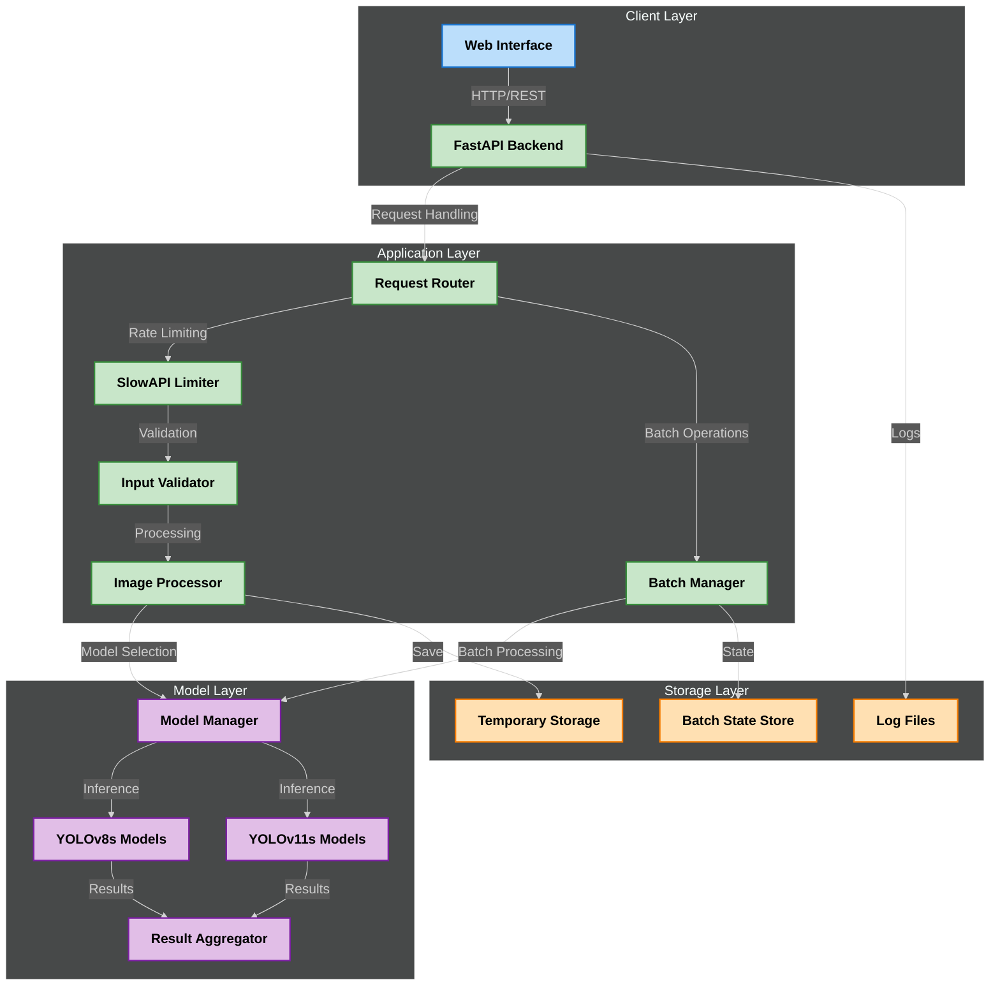
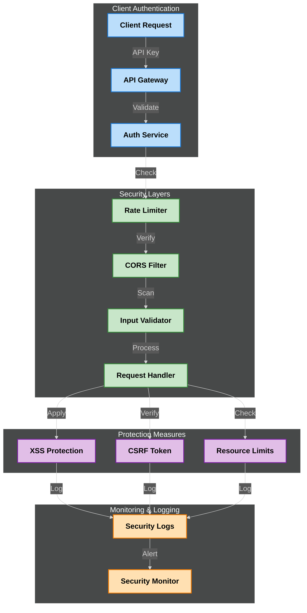
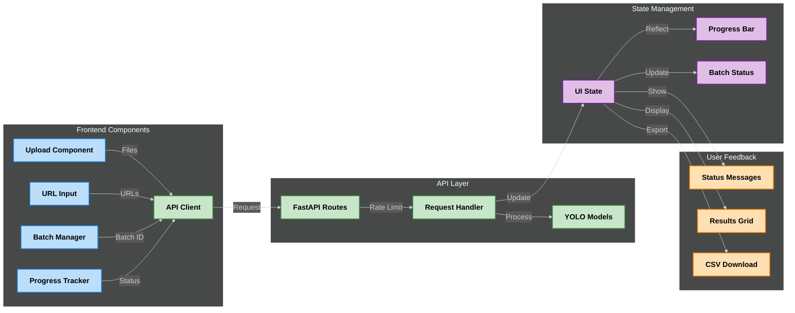
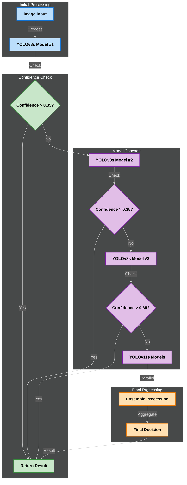
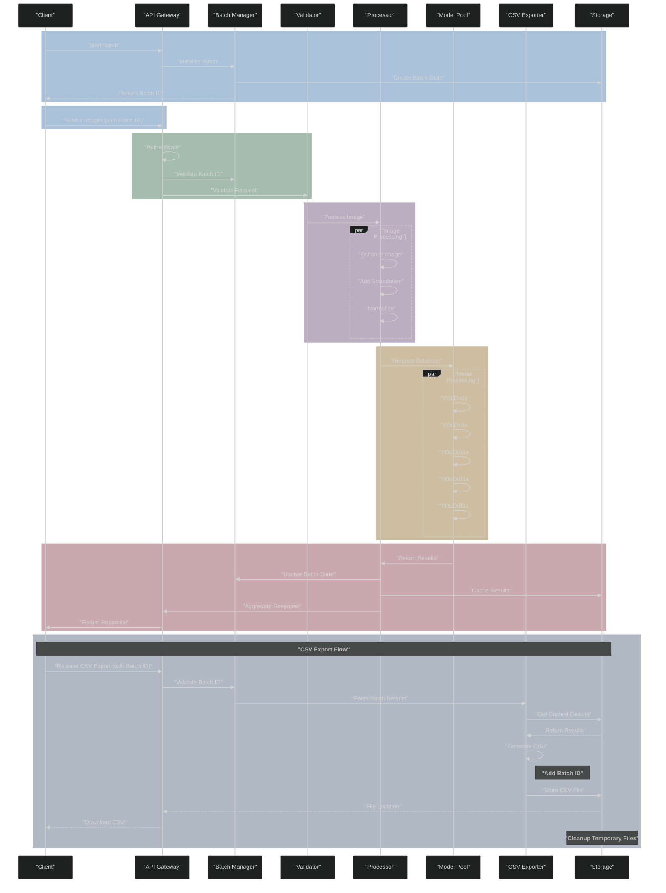
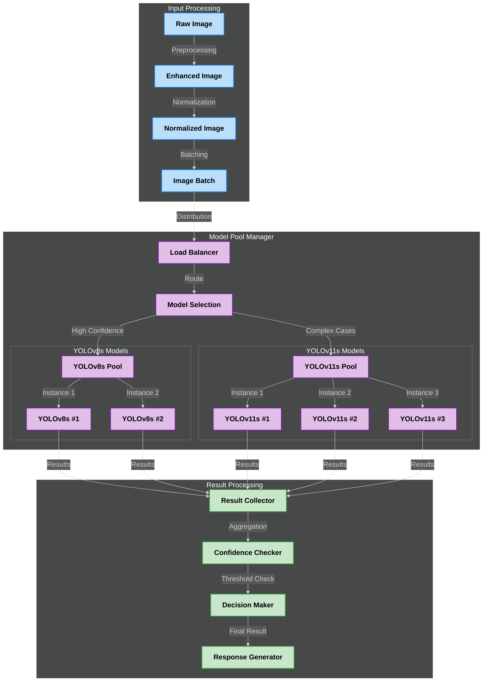
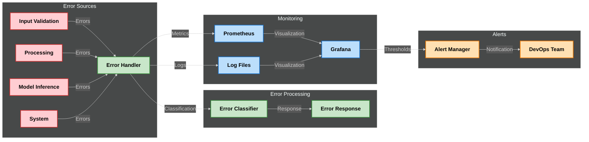
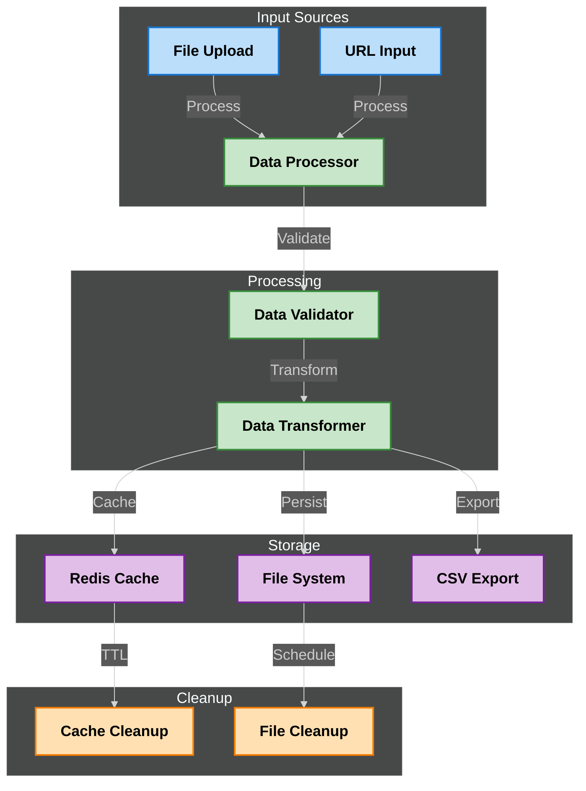
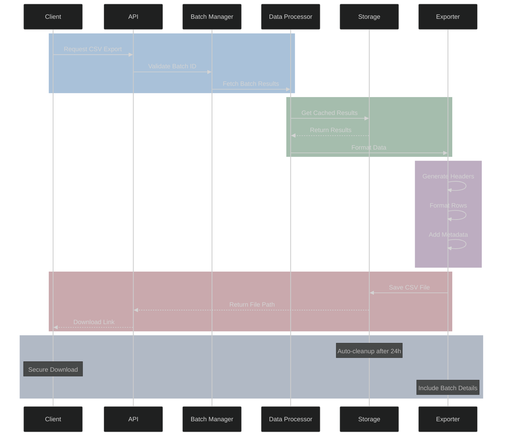

# Image Validation Using Logo Detection: By Symphony Limited
## Powered by YOLO Object Detection

This application provides an enterprise-grade solution for detecting Symphony logos in images using multiple YOLOv8 and YOLOv11 models. It features a FastAPI backend for robust image processing and a modern web interface for seamless user interaction.

## Table of Contents
1. [Key Features](#key-features)
2. [System Architecture](#system-architecture)
3. [Technology Stack](#technology-stack)
4. [Installation](#installation)
5. [Configuration](#configuration)
6. [Running the Application](#running-the-application)
7. [API Documentation](#api-documentation)
8. [Security](#security)
9. [Error Handling](#error-handling)
10. [Logging System](#logging-system)
11. [Development Guidelines](#development-guidelines)
12. [Troubleshooting](#troubleshooting)
13. [License & Support](#license--support)

## Key Features

- **Advanced Multi-Model Detection**
  - Utilizes 5 different YOLO models (YOLOv8s and YOLOv11s variants)
  - Early detection return for optimized performance
  - Configurable confidence threshold (currently set at 0.35)
  - Automatic model fallback for improved accuracy
  - Parallel model execution for faster results

- **Comprehensive Image Processing**
  - Single image validation
  - Batch processing with concurrent execution
  - Support for both file uploads and URLs
  - Automatic image enhancement with boundary addition
  - Robust error handling and validation
  - CSV export functionality with batch tracking
  - Unique batch IDs for parallel processing
  - Timestamped result downloads
  - Support for multiple image formats (JPEG, PNG)

- **Enterprise-Ready API**
  - RESTful FastAPI implementation
  - Comprehensive API documentation (Swagger & ReDoc)
  - Rate limiting and CORS protection
  - Detailed logging with rotation (10MB limit)
  - Swagger UI integration
  - CSV export endpoint for batch results
  - Health check endpoints
  - Prometheus metrics integration

- **Modern Frontend Interface**
  - React-based user interface (v19.1.0)
  - Material-UI components (v7.1.0)
  - Configurable backend URL
  - Material design components
  - Responsive layout
  - Drag-and-drop file upload
  - Real-time validation feedback
  - Progress tracking for batch operations

- **Production-Grade Infrastructure**
  - Thread-safe operations
  - Automatic temporary file cleanup
  - Configurable environment settings
  - Comprehensive error tracking
  - Performance optimization features
  - Secure file handling for exports
  - Redis caching support
  - Prometheus/Grafana monitoring

## System Architecture

### High-Level System Overview


### Authentication & API Security Flow


### Frontend-to-Backend Interaction Map


### Model Fallback Logic Flow


### Batch Processing Pipeline


### Model Architecture


### Error Handling and Monitoring


### Data Flow and Storage


### CSV Export Lifecycle


## Technology Stack

### Backend Infrastructure
- FastAPI (async support)
- Python 3.7+
- Ultralytics YOLOv8 and YOLOv11
- PIL for image processing
- Redis for caching
- Prometheus for metrics
- Rotating file logs
- uvicorn for ASGI server

### Frontend Stack
- React 19.1.0
- Material-UI 7.1.0
- Axios for API calls
- React Dropzone 14.3.8
- Cross-env 7.0.3 for environment management
- Jest for testing
- ESLint for code quality

### AI/ML Components
- 5 specialized YOLO models
  - 2x YOLOv8s instances
  - 3x YOLOv11s instances
- Custom confidence thresholds (0.35)
- Model ensemble approach
- Optimized inference pipeline
- GPU acceleration support

### Development Tools
- Poetry for dependency management
- Pre-commit hooks
- Pytest for backend testing
- Jest for frontend testing
- Black for Python formatting
- ESLint for JavaScript/TypeScript
- Docker for containerization
- Kubernetes manifests

## Installation

### Backend Setup

1. Clone the repository:
```bash
git clone https://github.com/Dhruv0306/SymphonyProject1.git
cd usingYolo
```

2. Create and activate a virtual environment:
```bash
python -m venv .venv
source .venv/bin/activate  # On Windows: .venv\\Scripts\\activate
```

3. Install dependencies:
```bash
pip install -r requirements.txt
```

4. Create necessary directories:
```bash
mkdir -p temp_uploads data
```

### Frontend Setup

1. Navigate to the frontend directory:
```bash
cd frontend
```

2. Install dependencies:
```bash
npm install
```

3. Configure the backend URL:
```bash
# Using npm start-backend script with custom backend
npm run start-backend -- --backend=http://your-backend-url:8000

# Or using default backend (http://localhost:8000)
npm run start-backend
```

## Configuration

### Environment Variables

Create a `.env` file in the root directory:

```env
# API Configuration
API_HOST=0.0.0.0
API_PORT=8000
DEBUG_MODE=False

# Model Configuration
CONFIDENCE_THRESHOLD=0.35
ENABLE_GPU=True
MAX_BATCH_SIZE=50

# Security
API_KEY_HEADER=X-API-Key
CORS_ORIGINS=["http://localhost:3000"]
RATE_LIMIT=100

# Logging
LOG_LEVEL=INFO
LOG_ROTATION=10MB
```

### Frontend Configuration

The frontend configuration is managed through environment variables and the `set-backend.js` script:

```javascript
// set-backend.js usage:
npm run start-backend -- --backend=http://your-backend-url:8000 --port=3000 --host=0.0.0.0

// Parameters:
// --backend=<url>  : Set custom backend URL (default: http://localhost:8000)
// --port=<port>    : Set custom frontend port (default: 3000)
// --host=<host>    : Set custom host IP (default: localhost)
```

### Model Configuration

The YOLO models are configured in `detect_logo.py`:

```python
MODEL_PATHS = [
    'runs/detect/yolov8s_logo_detection/weights/best.pt',    # YOLOv8s model trained on logo dataset
    'runs/detect/yolov8s_logo_detection2/weights/best.pt',   # Second iteration with additional data
    'runs/detect/yolov8s_logo_detection3/weights/best.pt',   # Third iteration with refined data
    'runs/detect/yolov11s_logo_detection/weights/best.pt',   # YOLOv11s model for comparison
    'runs/detect/yolov11s3_logo_detection/weights/best.pt'   # YOLOv11s with optimized parameters
]

CONFIDENCE_THRESHOLD = 0.35  # Minimum confidence threshold for logo detection
```

## Running the Application

1. Start the FastAPI backend:
```bash
# From the project root directory
uvicorn App:app --reload --host 0.0.0.0 --port 8000
```

2. Start the React frontend:
```bash
# From the frontend directory
npm run start-backend
```

3. Access the application:
- Web Interface: http://localhost:3000
- API Documentation: http://localhost:8000/docs
- Alternative API docs: http://localhost:8000/redoc

### Development Mode

For development, you can run both the backend and frontend with hot-reloading:

1. Backend (with auto-reload):
```bash
uvicorn App:app --reload --host 0.0.0.0 --port 8000
```

2. Frontend (with custom backend URL):
```bash
cd frontend
npm run start-backend -- --backend=http://localhost:8000 --port=3000
```

### Production Mode

For production deployment:

1. Build the frontend:
```bash
cd frontend
npm run build
```

2. Run the backend with production settings:
```bash
uvicorn App:app --host 0.0.0.0 --port 8000 --workers 4
```

### Health Checks

The application provides health check endpoints:

- Backend health: http://localhost:8000/health
- Metrics: http://localhost:8000/metrics

## API Documentation

### Main Endpoints

#### 1. Logo Detection Endpoints

##### Start Batch Session
```http
POST /api/start-batch

Response:
{
    "batch_id": "uuid-string"
}
```

##### Single Image Validation
```http
POST /api/check-logo/single/
Content-Type: multipart/form-data

Parameters:
- file: Image file (required if image_path not provided)
- image_path: Image URL (required if file not provided)

Response:
{
    "Image_Path_or_URL": string,
    "Is_Valid": "Valid" | "Invalid",
    "Confidence": float | null,
    "Detected_By": string | null,
    "Bounding_Box": {
        "x1": int,
        "y1": int,
        "x2": int,
        "y2": int
    } | null,
    "Error": string | null
}
```

##### Batch Processing
```http
POST /api/check-logo/batch/
Content-Type: multipart/form-data

Parameters:
- batch_id: UUID for batch tracking (required)
- files: Array of image files (required if paths not provided)
- paths: Array of image URLs (required if files not provided)

Response:
{
    "batch_id": string,
    "total_processed": int,
    "valid_count": int,
    "invalid_count": int,
    "results": [
        {
            "Image_Path_or_URL": string,
            "Is_Valid": "Valid" | "Invalid",
            "Confidence": float | null,
            "Detected_By": string | null,
            "Bounding_Box": object | null,
            "Error": string | null
        }
    ]
}
```

#### 2. Utility Endpoints

##### Export Batch Results
```http
GET /api/check-logo/batch/export-csv
Parameters:
- batch_id: string (required)

Response: CSV file
```

##### Get Batch Status
```http
GET /api/check-logo/batch/getCount
Parameters:
- batch_id: string (required)

Response:
{
    "valid": number,
    "invalid": number,
    "total": number
}
```

#### 3. Monitoring Endpoints

```http
GET /health
Response: Health status of the application

GET /metrics
Response: Prometheus-formatted metrics
```

### Rate Limiting

The API implements rate limiting:
- Single image endpoint: 100 requests per minute
- Batch processing endpoint: 20 requests per minute

### Error Responses

All endpoints follow a consistent error response format:

```json
{
    "detail": "Error message describing what went wrong"
}
```

Common HTTP status codes:
- 200: Success
- 400: Bad Request (invalid input)
- 429: Too Many Requests (rate limit exceeded)
- 500: Internal Server Error

## Security

### Authentication and Authorization
- API Key authentication
- Rate limiting and CORS protection
- Detailed logging and monitoring
- Secure file handling for exports
- Redis caching support
- Prometheus/Grafana monitoring

### Data Protection
- Secure file uploads and downloads
- Data encryption in transit and at rest
- Access control and permissions

### Error Handling and Monitoring
- Comprehensive error tracking and logging
- Alerting and notification mechanisms
- Automated error detection and response

## Error Handling

### Common Errors
- Input validation errors
- Model inference errors
- System-level errors

### Error Handling Strategy
- Automated error classification
- Human intervention for critical errors
- Detailed logging and monitoring

## Logging System

### Logging Levels
- INFO, WARNING, ERROR, CRITICAL

### Logging Sources
- FastAPI backend
- Frontend interactions
- Model inference
- System-level events

## Development Guidelines

### Code Quality
- PEP 8 compliance
- Code readability and maintainability
- Automated testing

### Documentation
- Comprehensive API documentation
- Code comments and docstrings
- Developer guidelines

## Troubleshooting

### Common Issues
- Model inference errors
- API connectivity issues
- Data processing delays

### Troubleshooting Steps
- Check system logs
- Verify API connectivity
- Re-run the inference pipeline

## License & Support

### License
- Apache License 2.0

### Support
- Email support
- Community forums
- Documentation and tutorials