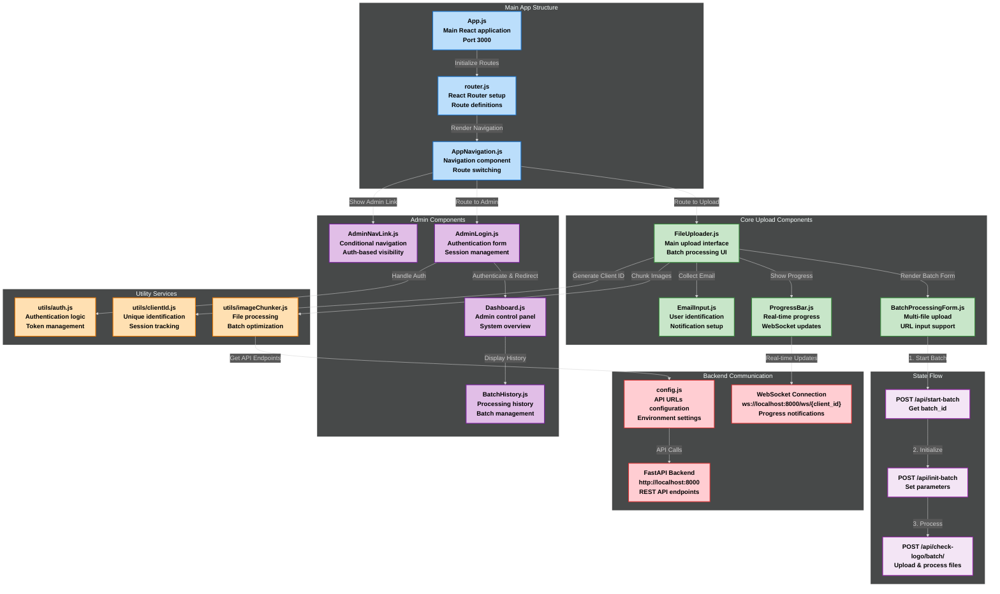
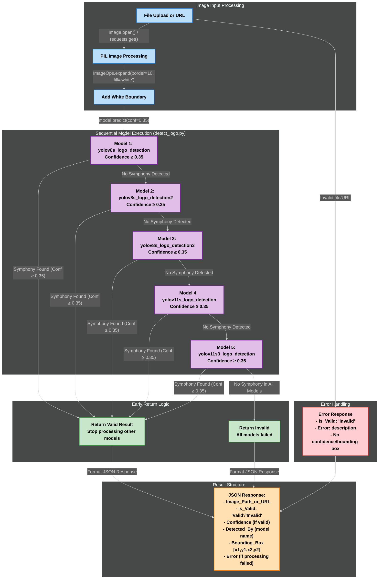
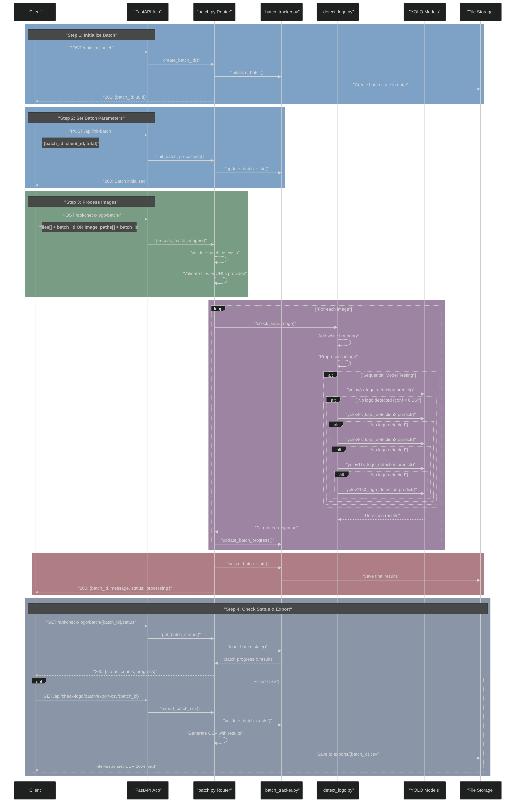
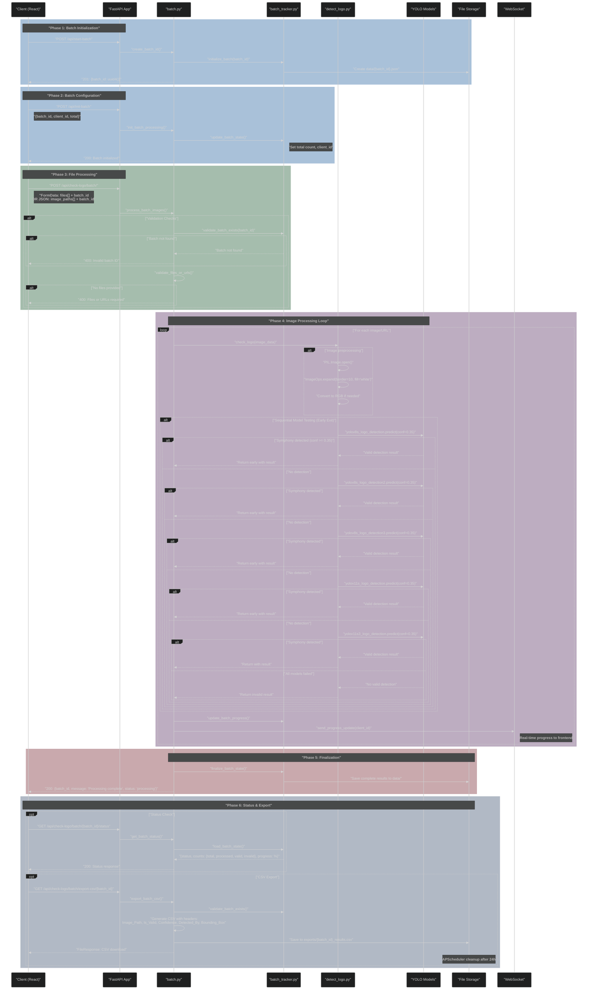
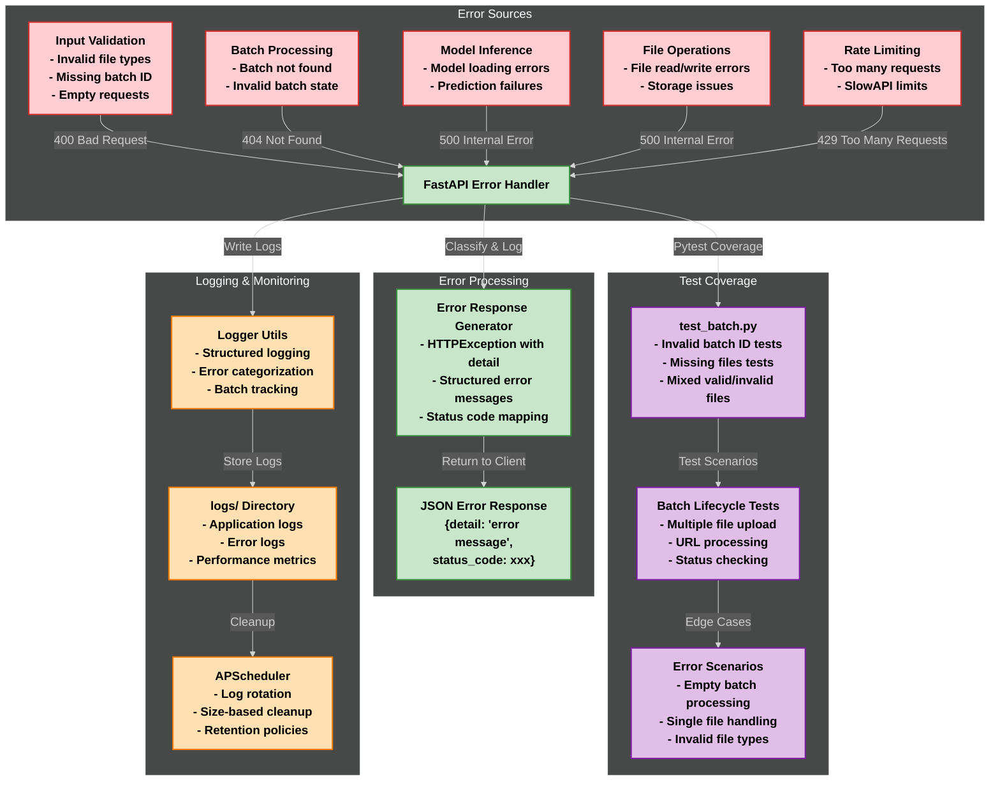
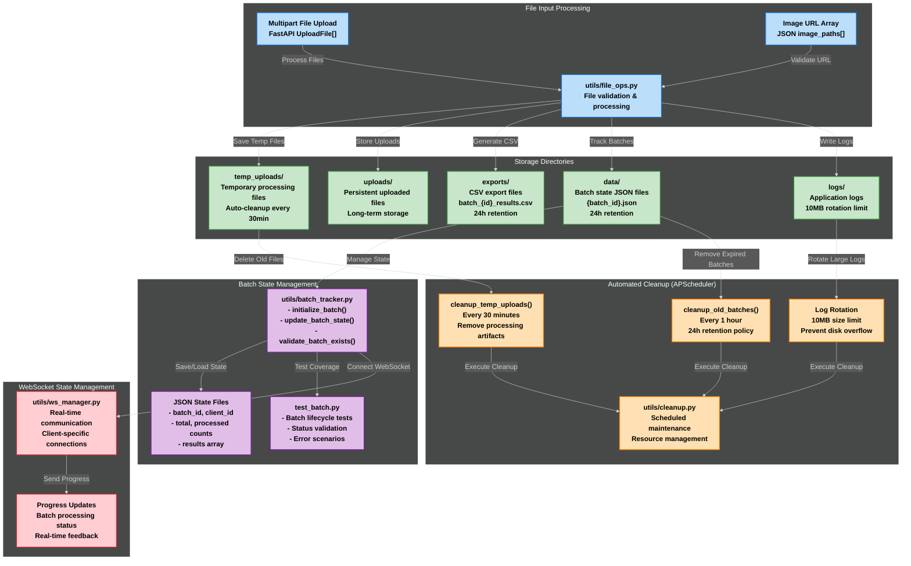
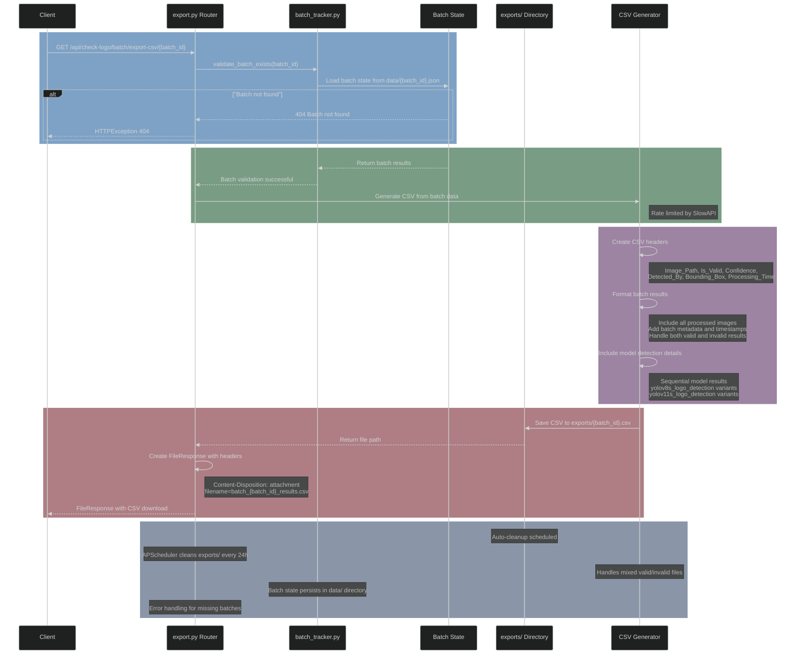

# Symphony Logo Detection System
## Enterprise-Grade YOLO-Powered Image Validation

A comprehensive logo detection system built by Symphony Limited that uses advanced YOLOv8 and YOLOv11 models to validate the presence of Symphony logos in images. The system features a robust FastAPI backend with real-time processing capabilities and a modern React 19.1.0 frontend for seamless user interaction.

## Table of Contents
1. [Key Features](#key-features)
2. [System Architecture](#system-architecture)
3. [Technology Stack](#technology-stack)
4. [Project Structure](#project-structure)
5. [Installation](#installation)
6. [Configuration](#configuration)
7. [Running the Application](#running-the-application)
8. [API Documentation](#api-documentation)
9. [Security](#security)
10. [Error Handling](#error-handling)
11. [Logging System](#logging-system)
12. [Development Guidelines](#development-guidelines)
13. [Troubleshooting](#troubleshooting)
14. [Code Examples](#code-examples)
15. [Deployment](#deployment)
16. [License & Support](#license--support)

## Key Features

- **Advanced Multi-Model Detection**
  - 5 specialized YOLO models with sequential processing
  - Early detection return when logo is found (performance optimization)
  - Configurable confidence threshold (default: 0.35)
  - Model cascade approach for maximum accuracy
  - Automatic image enhancement with boundary addition
  - Support for both local files and URL-based images

- **Comprehensive Image Processing**
  - Single image validation via file upload or URL
  - Batch processing with unique session tracking
  - Real-time WebSocket updates for batch progress
  - Automatic image preprocessing and enhancement
  - Support for JPEG, PNG, and other common formats
  - Robust error handling with detailed logging
  - CSV export with batch metadata and timestamps
  - Concurrent processing for improved performance

- **Enterprise-Ready API**
  - FastAPI with automatic OpenAPI documentation
  - Rate limiting with SlowAPI (configurable per endpoint)
  - CORS middleware for cross-origin requests
  - WebSocket endpoints for real-time batch updates
  - Admin authentication with session management
  - CSRF protection and security middleware
  - Structured logging with automatic rotation
  - RESTful endpoints for all operations
  - Comprehensive error handling and validation

- **Modern Frontend Interface**
  - React 19.1.0 with latest features and optimizations
  - Material-UI 7.1.0 for professional design components
  - Configurable backend URL via environment scripts (`set-backend.js`)
  - Drag-and-drop file upload with React Dropzone 14.3.8
  - Real-time progress updates via WebSocket connections
  - Responsive design for desktop and mobile devices
  - Admin dashboard for batch history and statistics
  - Client-side routing with React Router DOM 6.30.1
  - Symphony branding with consistent color scheme (#0066B3)
  - Email notification input for batch completion alerts
  - Chunked upload processing with retry logic for failed batches
  - Upload status indicators (uploading, validating, valid, invalid, error)
  - Mobile-first responsive design with drawer navigation

- **Production-Grade Infrastructure**
  - Async/await architecture for high performance
  - APScheduler for automated maintenance tasks
  - Automatic cleanup of temporary files (30-minute cycles)
  - Batch data retention with configurable expiry (24 hours)
  - Environment-based configuration management
  - Comprehensive logging with file rotation
  - Email notification system for admin alerts
  - Secure session management with configurable duration
  - WebSocket connection management with timeout handling

## System Architecture

### High-Level System Overview

```mermaid
%%{init: {'theme': 'dark', 'themeVariables': { 'fontFamily': 'arial', 'fontSize': '18px', 'fontWeight': 'bold'}}}%%
graph TD
    subgraph "Frontend Layer"
        style A fill:#bbdefb,stroke:#1976d2,stroke-width:2px,color:#000000,font-weight:bold
        style A1 fill:#bbdefb,stroke:#1976d2,stroke-width:2px,color:#000000,font-weight:bold
        style A2 fill:#bbdefb,stroke:#1976d2,stroke-width:2px,color:#000000,font-weight:bold
        A["React Frontend<br/>Port 3000"] -->|"Render Components"| A1["FileUploader Component<br/>Batch processing UI"]
        A -->|"Admin Access"| A2["Admin Dashboard<br/>Authentication required"]
        A1 -->|"API Calls + WebSocket"| B["FastAPI App.py<br/>Port 8000"]
        A2 -->|"Auth Requests"| B
    end

    subgraph "API Router Layer"
        style B fill:#c8e6c9,stroke:#388e3c,stroke-width:2px,color:#000000,font-weight:bold
        style C1 fill:#c8e6c9,stroke:#388e3c,stroke-width:2px,color:#000000,font-weight:bold
        style C2 fill:#c8e6c9,stroke:#388e3c,stroke-width:2px,color:#000000,font-weight:bold
        style C3 fill:#c8e6c9,stroke:#388e3c,stroke-width:2px,color:#000000,font-weight:bold
        style C4 fill:#c8e6c9,stroke:#388e3c,stroke-width:2px,color:#000000,font-weight:bold
        style C5 fill:#c8e6c9,stroke:#388e3c,stroke-width:2px,color:#000000,font-weight:bold
        B -->|"Route Single Images"| C1["single.py Router<br/>POST /api/check-logo/single"]
        B -->|"Route Batch Requests"| C2["batch.py Router<br/>POST /api/start-batch<br/>POST /api/init-batch<br/>POST /api/check-logo/batch/<br/>GET /api/check-logo/batch/{id}/status"]
        B -->|"Route CSV Exports"| C3["export.py Router<br/>GET /api/check-logo/batch/export-csv/{id}"]
        B -->|"Route Admin Login"| C4["admin_auth.py Router<br/>POST /api/admin/login<br/>POST /api/admin/logout"]
        B -->|"Route WebSocket"| C5["websocket.py Router<br/>WS /ws/{client_id}"]
    end

    subgraph "Core Detection Engine"
        style D fill:#e1bee7,stroke:#7b1fa2,stroke-width:2px,color:#000000,font-weight:bold
        style E1 fill:#e1bee7,stroke:#7b1fa2,stroke-width:2px,color:#000000,font-weight:bold
        style E2 fill:#e1bee7,stroke:#7b1fa2,stroke-width:2px,color:#000000,font-weight:bold
        style E3 fill:#e1bee7,stroke:#7b1fa2,stroke-width:2px,color:#000000,font-weight:bold
        style E4 fill:#e1bee7,stroke:#7b1fa2,stroke-width:2px,color:#000000,font-weight:bold
        style E5 fill:#e1bee7,stroke:#7b1fa2,stroke-width:2px,color:#000000,font-weight:bold
        C1 -->|"Call check_logo()"| D["detect_logo.py<br/>Sequential model testing<br/>Confidence threshold 0.35"]
        C2 -->|"Call check_logo()"| D
        D -->|"Load Model 1"| E1["yolov8s_logo_detection<br/>Primary detection model"]
        D -->|"Load Model 2"| E2["yolov8s_logo_detection2<br/>Secondary YOLOv8 variant"]
        D -->|"Load Model 3"| E3["yolov8s_logo_detection3<br/>Tertiary YOLOv8 variant"]
        D -->|"Load Model 4"| E4["yolov11s_logo_detection<br/>Primary YOLOv11 model"]
        D -->|"Load Model 5"| E5["yolov11s3_logo_detection<br/>Secondary YOLOv11 model"]
    end

    subgraph "Utility Services"
        style F1 fill:#ffe0b2,stroke:#f57c00,stroke-width:2px,color:#000000,font-weight:bold
        style F2 fill:#ffe0b2,stroke:#f57c00,stroke-width:2px,color:#000000,font-weight:bold
        style F3 fill:#ffe0b2,stroke:#f57c00,stroke-width:2px,color:#000000,font-weight:bold
        style F4 fill:#ffe0b2,stroke:#f57c00,stroke-width:2px,color:#000000,font-weight:bold
        style F5 fill:#ffe0b2,stroke:#f57c00,stroke-width:2px,color:#000000,font-weight:bold
        B -->|"Track Batch State"| F1["batch_tracker.py<br/>JSON state management<br/>24h retention"]
        B -->|"Manage WebSocket"| F2["ws_manager.py<br/>Real-time progress updates<br/>Client connections"]
        B -->|"Schedule Cleanup"| F3["cleanup.py<br/>APScheduler tasks<br/>Resource management"]
        B -->|"Apply Security"| F4["security.py<br/>CORS, rate limiting<br/>SlowAPI integration"]
        B -->|"Write Logs"| F5["logger.py<br/>Structured logging<br/>10MB rotation"]
    end

    subgraph "Storage & Data"
        style G1 fill:#ffcdd2,stroke:#d32f2f,stroke-width:2px,color:#000000,font-weight:bold
        style G2 fill:#ffcdd2,stroke:#d32f2f,stroke-width:2px,color:#000000,font-weight:bold
        style G3 fill:#ffcdd2,stroke:#d32f2f,stroke-width:2px,color:#000000,font-weight:bold
        style G4 fill:#ffcdd2,stroke:#d32f2f,stroke-width:2px,color:#000000,font-weight:bold
        D -->|"Save Temp Files"| G1["temp_uploads/<br/>Processing artifacts<br/>30min cleanup"]
        C3 -->|"Generate CSV"| G2["exports/<br/>batch_{id}_results.csv<br/>24h retention"]
        F5 -->|"Write Log Files"| G3["logs/<br/>Application & error logs<br/>Size-based rotation"]
        F1 -->|"Store Batch Data"| G4["data/<br/>{batch_id}.json<br/>State persistence"]
    end

    subgraph "Testing & Quality"
        style H1 fill:#f3e5f5,stroke:#9c27b0,stroke-width:2px,color:#000000,font-weight:bold
        style H2 fill:#f3e5f5,stroke:#9c27b0,stroke-width:2px,color:#000000,font-weight:bold
        C2 -->|"Test Coverage"| H1["test_batch.py<br/>Pytest test suite<br/>Batch lifecycle testing"]
        H1 -->|"Test Scenarios"| H2["Test Cases:<br/>- Multiple file upload<br/>- URL processing<br/>- Invalid batch handling<br/>- Mixed file types<br/>- Status checking"]
    end
```


### FastAPI Application Architecture (App.py)
```mermaid
%%{init: {'theme': 'dark', 'themeVariables': { 'fontFamily': 'arial', 'fontSize': '18px', 'fontWeight': 'bold'}}}%%
graph TD
    subgraph "Client Layer"
        style A fill:#bbdefb,stroke:#1976d2,stroke-width:2px,color:#000000,font-weight:bold
        style A1 fill:#bbdefb,stroke:#1976d2,stroke-width:2px,color:#000000,font-weight:bold
        A["React Frontend"] -->|"HTTP/REST + WebSocket"| A1["FastAPI App.py"]
    end

    subgraph "Security & Rate Limiting"
        style B fill:#c8e6c9,stroke:#388e3c,stroke-width:2px,color:#000000,font-weight:bold
        style C fill:#c8e6c9,stroke:#388e3c,stroke-width:2px,color:#000000,font-weight:bold
        style D fill:#c8e6c9,stroke:#388e3c,stroke-width:2px,color:#000000,font-weight:bold
        style E fill:#c8e6c9,stroke:#388e3c,stroke-width:2px,color:#000000,font-weight:bold
        A1 -->|"Apply Middleware"| B["CORS Middleware"]
        B -->|"Rate Limit"| C["SlowAPI Limiter"]
        C -->|"CSRF Protection"| D["Security Utils"]
        D -->|"Session Auth"| E["Admin Authentication"]
    end

    subgraph "API Router Layer"
        style F1 fill:#e1bee7,stroke:#7b1fa2,stroke-width:2px,color:#000000,font-weight:bold
        style F2 fill:#e1bee7,stroke:#7b1fa2,stroke-width:2px,color:#000000,font-weight:bold
        style F3 fill:#e1bee7,stroke:#7b1fa2,stroke-width:2px,color:#000000,font-weight:bold
        style F4 fill:#e1bee7,stroke:#7b1fa2,stroke-width:2px,color:#000000,font-weight:bold
        style F5 fill:#e1bee7,stroke:#7b1fa2,stroke-width:2px,color:#000000,font-weight:bold
        E -->|"Route"| F1["single.py Router<br/>POST /api/check-logo/single"]
        E -->|"Route"| F2["batch.py Router<br/>POST /api/start-batch<br/>POST /api/init-batch<br/>POST /api/check-logo/batch/<br/>GET /api/check-logo/batch/{id}/status"]
        E -->|"Route"| F3["export.py Router<br/>GET /api/check-logo/batch/export-csv/{id}"]
        E -->|"Route"| F4["admin_auth.py Router<br/>POST /api/admin/login<br/>POST /api/admin/logout"]
        E -->|"Route"| F5["websocket.py Router<br/>WS /ws/{client_id}"]
    end

    subgraph "Validation & Processing"
        style G fill:#ffe0b2,stroke:#f57c00,stroke-width:2px,color:#000000,font-weight:bold
        style H fill:#ffe0b2,stroke:#f57c00,stroke-width:2px,color:#000000,font-weight:bold
        style I fill:#ffe0b2,stroke:#f57c00,stroke-width:2px,color:#000000,font-weight:bold
        F1 & F2 -->|"Validate Input"| G["File Operations<br/>- Multipart files<br/>- Image URLs<br/>- File type validation"]
        G -->|"Process Images"| H["detect_logo.py<br/>- Sequential model testing<br/>- Confidence threshold 0.35<br/>- 5 YOLO models"]
        H -->|"Log Results"| I["Logger Utils<br/>- Batch tracking<br/>- Error handling"]
    end
```d
        style E2 fill:#e1bee7,stroke:#7b1fa2,stroke-width:2px,color:#000000,font-weight:bold
        style E3 fill:#e1bee7,stroke:#7b1fa2,stroke-width:2px,color:#000000,font-weight:bold
        style E4 fill:#e1bee7,stroke:#7b1fa2,stroke-width:2px,color:#000000,font-weight:bold
        style E5 fill:#e1bee7,stroke:#7b1fa2,stroke-width:2px,color:#000000,font-weight:bold
        style E6 fill:#e1bee7,stroke:#7b1fa2,stroke-width:2px,color:#000000,font-weight:bold
        style E7 fill:#e1bee7,stroke:#7b1fa2,stroke-width:2px,color:#000000,font-weight:bold
        D2 -->|"Include Router"| E1["single.router - /api/check-logo/single/"]
        D2 -->|"Include Router"| E2["batch.router - /api/check-logo/batch/"]
        D2 -->|"Include Router"| E3["export.router - /api/check-logo/batch/export-csv"]
        D2 -->|"Include Router"| E4["admin_auth.router - /api/admin/login"]
        D2 -->|"Include Router"| E5["batch_history.router - /api/admin/batch-history"]
        D2 -->|"Include Router"| E6["dashboard_stats.router - /api/admin/dashboard-stats"]
        D2 -->|"Include Router"| E7["websocket.router - /ws/batch/{batch_id}"]
    end

    subgraph "Startup & Background Tasks"
        style F1 fill:#ffe0b2,stroke:#f57c00,stroke-width:2px,color:#000000,font-weight:bold
        style F2 fill:#ffe0b2,stroke:#f57c00,stroke-width:2px,color:#000000,font-weight:bold
        style F3 fill:#ffe0b2,stroke:#f57c00,stroke-width:2px,color:#000000,font-weight:bold
        style F4 fill:#ffe0b2,stroke:#f57c00,stroke-width:2px,color:#000000,font-weight:bold
        A -->|"@app.on_event('startup')"| F1["APScheduler Initialization"]
        F1 -->|"Schedule Job"| F2["Cleanup Jobs (1hr intervals)"]
        F1 -->|"Schedule Job"| F3["CSRF Token Cleanup (15min)"]
        F1 -->|"Create Task"| F4["WebSocket Monitor (30s)"]
    end

    subgraph "Core Endpoints"
        style G1 fill:#ffcdd2,stroke:#d32f2f,stroke-width:2px,color:#000000,font-weight:bold
        style G2 fill:#ffcdd2,stroke:#d32f2f,stroke-width:2px,color:#000000,font-weight:bold
        style G3 fill:#ffcdd2,stroke:#d32f2f,stroke-width:2px,color:#000000,font-weight:bold
        D2 -->|"@app.get('/')"| G1["GET / → RedirectResponse(/docs)"]
        D2 -->|"@app.get('/api')"| G2["GET /api → API Documentation"]
        D2 -->|"@app.websocket()"| G3["WebSocket /ws/batch/{batch_id}"]
    end
```

### React Frontend Component Architecture


### Sequential Model Processing Flow (detect_logo.py)


### Batch Processing Pipeline


### YOLO Model Detection Pipeline


### Error Handling and Monitoring


### File Storage and Cleanup System


### CSV Export Lifecycle


## Project Structure

```
usingYolo/
├── App.py                          # Main FastAPI application entry point
├── detect_logo.py                  # Core YOLO detection logic with 5 models
├── train.py                        # Model training script
├── requirements.txt                # Python dependencies
├── requirements-dev.txt            # Development dependencies
├── .env                           # Environment configuration
├── README.md                      # Project documentation
│
├── routers/                       # FastAPI route handlers
│   ├── __init__.py
│   ├── single.py                  # Single image validation endpoint
│   ├── batch.py                   # Batch processing endpoints
│   ├── export.py                  # CSV export functionality
│   ├── admin_auth.py              # Admin authentication routes
│   ├── batch_history.py           # Batch history management
│   ├── dashboard_stats.py         # Dashboard statistics API
│   └── websocket.py               # WebSocket endpoints
│
├── utils/                         # Utility modules
│   ├── __init__.py
│   ├── logger.py                  # Centralized logging configuration
│   ├── file_ops.py                # File operations and management
│   ├── cleanup.py                 # Automated cleanup tasks (APScheduler)
│   ├── batch_tracker.py           # Batch state management
│   ├── security.py                # CSRF protection and security utilities
│   ├── ws_manager.py              # WebSocket connection management
│   ├── websocket.py               # WebSocket utilities
│   ├── emailer.py                 # Email notification system
│   └── password.py                # Password utilities
│
├── runs/detect/                   # Trained YOLO model weights
│   ├── yolov8s_logo_detection/    # Primary YOLOv8s model
│   │   └── weights/best.pt
│   ├── yolov8s_logo_detection2/   # Enhanced YOLOv8s model
│   │   └── weights/best.pt
│   ├── yolov8s_logo_detection3/   # Refined YOLOv8s model
│   │   └── weights/best.pt
│   ├── yolov11s_logo_detection/   # YOLOv11s model
│   │   └── weights/best.pt
│   └── yolov11s3_logo_detection/  # Optimized YOLOv11s model
│       └── weights/best.pt
│
├── frontend/                      # React 19.1.0 frontend application
│   ├── package.json               # Frontend dependencies
│   ├── set-backend.js             # Backend URL configuration script
│   ├── public/                    # Static assets
│   ├── build/                     # Production build output
│   └── src/
│       ├── App.js                 # Main React application
│       ├── router.js              # React Router configuration
│       ├── config.js              # API configuration
│       ├── FileUploader.js        # Main upload component
│       ├── UploadStatus.js        # Upload status component
│       ├── components/            # React components
│       │   ├── AdminLogin.js      # Admin authentication
│       │   ├── AdminNavLink.js    # Admin navigation
│       │   ├── AppNavigation.js   # Main navigation
│       │   ├── Dashboard.js       # Admin dashboard
│       │   ├── BatchHistory.js    # Batch history viewer
│       │   ├── BatchProcessingForm.js # Batch processing form
│       │   ├── ProgressBar.js     # Real-time progress tracking
│       │   └── EmailInput.js      # Email notification input
│       └── utils/                 # Frontend utilities
│           ├── imageChunker.js    # Batch processing utilities
│           ├── clientId.js        # Client ID generation
│           └── auth.js            # Authentication helpers
│
├── services/                      # Additional service modules
├── tasks/                         # Background task definitions
├── models/                        # Model-related utilities
├── tests/                         # Test suite
├── test/                          # Test images and data
├── temp_uploads/                  # Temporary file storage (auto-cleanup)
├── uploads/                       # Persistent uploads
├── exports/                       # CSV export storage
├── data/                          # Application data and batch states
├── logs/                          # Application logs (rotating)
├── docs/                          # Additional documentation
└── .venv/                         # Python virtual environment
```

## Technology Stack

### Backend Infrastructure
- **FastAPI 0.115.12** - High-performance async web framework
- **Python 3.7+** - Core runtime environment
- **Ultralytics 8.3.151** - YOLOv8 and YOLOv11 model support
- **Pillow 11.2.1** - Advanced image processing
- **APScheduler 3.10.4** - Automated task scheduling
- **SlowAPI 0.1.9** - Intelligent rate limiting
- **Uvicorn 0.34.3** - ASGI server with WebSocket support
- **Torch 2.7.1 + TorchVision 0.22.1** - Deep learning framework
- **OpenCV 4.11.0.86** - Computer vision operations
- **Pandas 2.3.0** - Data processing and CSV export
- **Redis 6.2.0** - Caching and session management
- **Celery 5.5.3** - Distributed task processing
- **Requests 2.32.3** - HTTP library for URL-based image processing

### Frontend Stack
- **React 19.1.0** - Modern UI framework with latest features
- **Material-UI 7.1.0** - Professional component library with icons
- **Axios 1.9.0** - HTTP client for API communication
- **React Dropzone 14.3.8** - Drag-and-drop file uploads
- **React Router DOM 6.30.1** - Client-side routing
- **Cross-env 7.0.3** - Cross-platform environment variables
- **Emotion React/Styled 11.14.0** - CSS-in-JS styling solution
- **Web Vitals 2.1.4** - Performance monitoring
- **Testing Library** - Comprehensive testing suite (DOM, React, User Event)

### AI/ML Components
- **5 Specialized YOLO Models:**
  - `yolov8s_logo_detection` - Primary YOLOv8s model
  - `yolov8s_logo_detection2` - Enhanced YOLOv8s with additional training data
  - `yolov8s_logo_detection3` - Refined YOLOv8s with optimized parameters
  - `yolov11s_logo_detection` - Advanced YOLOv11s model
  - `yolov11s3_logo_detection` - Optimized YOLOv11s variant
- **Confidence Threshold:** 0.35 (configurable)
- **Early Detection Return** - Stops processing when logo is found
- **Model Cascade** - Sequential model execution for optimal accuracy
- **GPU Acceleration** - CUDA support for faster inference
- **Image Enhancement** - Automatic boundary addition (10px white border)
- **URL Processing** - Direct HTTP/HTTPS image URL support
- **Robust Error Handling** - Graceful model failure recovery

### Development & Testing Tools
- **Pytest 8.0.2** - Backend testing framework
- **Pytest-asyncio 0.23.5** - Async testing support
- **Black 24.2.0** - Python code formatting
- **Flake8 7.0.0** - Code linting and style checking
- **Jest** - Frontend testing (via React Scripts)
- **ESLint** - JavaScript/TypeScript linting
- **Cross-env** - Environment variable management

## Installation

### System Requirements

- Python 3.7+ with pip
- Node.js 14+ with npm
- 4GB+ RAM recommended for model inference
- GPU support optional but recommended for faster processing

### Backend Setup

1. Clone the repository:
```bash
git clone <repository-url>
cd usingYolo
```

2. Create and activate a virtual environment:
```bash
python -m venv .venv
source .venv/bin/activate  # On Windows: .venv\\Scripts\\activate
```

3. Install dependencies:
```bash
pip install -r requirements.txt
```

4. Create necessary directories:
```bash
mkdir -p temp_uploads data
```

### Frontend Setup

1. Navigate to the frontend directory:
```bash
cd frontend
```

2. Install dependencies:
```bash
npm install
```

3. Configure and start the frontend:
```bash
# Using npm start-backend script with custom backend
npm run start-backend -- --backend=http://your-backend-url:8000

# Or using default backend (http://localhost:8000)
npm run start-backend

# Alternative: Direct React start with environment variable
npm start  # Uses REACT_APP_BACKEND_URL=http://localhost:8000
```

## Configuration

### Environment Variables

Create a `.env` file in the root directory:

```env
# Admin Authentication
ADMIN_USERNAME=admin
ADMIN_PASSWORD=your_secure_password

# Email Configuration (for notifications)
SMTP_SERVER=smtp.office365.com
SMTP_PORT=587
SMTP_USERNAME=your_email@domain.com
SMTP_PASSWORD=your_email_password
SENDER_EMAIL=your_email@domain.com
SENDER_NAME=Symphony Logo Detection

# Security Settings
SESSION_DURATION=1800
COOKIE_SECRET=your_secure_cookie_secret

# Model Configuration (optional overrides)
CONFIDENCE_THRESHOLD=0.35
```

### Frontend Configuration

The frontend configuration is managed through environment variables and the `set-backend.js` script:

```javascript
// set-backend.js usage:
npm run start-backend -- --backend=http://your-backend-url:8000 --port=3000 --host=0.0.0.0

// Parameters:
// --backend=<url>  : Set custom backend URL (default: http://localhost:8000)
// --port=<port>    : Set custom frontend port (default: 3000)
// --host=<host>    : Set custom host IP (default: localhost)
```

### Backend Configuration

The backend automatically detects custom host configurations and sets the YOLO service URL accordingly:

```python
# Automatic host detection in App.py
if '--host' in sys.argv:
    host_index = sys.argv.index('--host')
    if host_index + 1 < len(sys.argv):
        host = sys.argv[host_index + 1]
        if host != 'localhost' and host != '127.0.0.1':
            os.environ['YOLO_SERVICE_URL'] = f'http://{host}:8001'
```

### Model Configuration

The YOLO models are automatically loaded from the following paths in `detect_logo.py`:

```python
MODEL_PATHS = [
    "runs/detect/yolov8s_logo_detection/weights/best.pt",    # Primary YOLOv8s model
    "runs/detect/yolov8s_logo_detection2/weights/best.pt",   # Enhanced with additional data
    "runs/detect/yolov8s_logo_detection3/weights/best.pt",   # Refined parameters
    "runs/detect/yolov11s_logo_detection/weights/best.pt",   # YOLOv11s comparison model
    "runs/detect/yolov11s3_logo_detection/weights/best.pt"   # Optimized YOLOv11s
]

CONFIDENCE_THRESHOLD = 0.35  # Adjustable detection threshold
```

**Key Features:**
- **Sequential Processing:** Models are loaded and executed in order
- **Early Return:** Detection stops at the first successful match above confidence threshold
- **Boundary Enhancement:** Images are automatically enhanced with white boundaries
- **URL Support:** Both local files and HTTP/HTTPS URLs are supported
- **Robust Error Handling:** Failed models are skipped with detailed logging

## Running the Application

### Quick Start

1. **Start the FastAPI backend:**
```bash
# From the project root directory
uvicorn App:app --reload --host 0.0.0.0 --port 8000
```

2. **Start the React frontend:**
```bash
# From the frontend directory
npm run start-backend
```

3. **Access the application:**
- **Web Interface:** http://localhost:3000
- **API Documentation:** http://localhost:8000/docs
- **Alternative API docs:** http://localhost:8000/redoc
- **Root endpoint:** http://localhost:8000 (redirects to docs)

### Custom Configuration

The frontend supports flexible configuration via the `set-backend.js` script:
```bash
# Custom backend URL and port
npm run start-backend -- --backend=http://your-server:8000 --port=3001 --host=0.0.0.0

# Available parameters:
# --backend=<url>  : Custom backend URL (default: http://localhost:8000)
# --port=<port>    : Custom frontend port (default: 3000)
# --host=<host>    : Custom host IP (default: localhost)

# Environment variable approach
REACT_APP_BACKEND_URL=http://your-server:8000 npm start
```

### WebSocket Configuration

The system uses WebSocket connections for real-time updates:
- **Connection URL:** `ws://localhost:8000/ws/{client_id}`
- **Heartbeat Interval:** 30 seconds
- **Automatic Reconnection:** Built-in connection management
- **Progress Updates:** Real-time batch processing status

**Frontend Features:**
- **Single & Batch Processing:** Toggle between single image validation and batch processing
- **File Upload & URL Input:** Support for both file uploads and image URLs
- **Real-time Progress:** WebSocket-based progress tracking with time estimates
- **Admin Dashboard:** Secure admin interface with batch history and statistics
- **Email Notifications:** Optional email alerts for batch completion
- **Retry Logic:** Automatic retry for failed chunks with user-initiated retry option
- **CSV Export:** Download batch results with metadata
- **Responsive Design:** Mobile-optimized interface with drawer navigation
- **Symphony Branding:** Consistent color scheme (#0066B3) and logo integration
- **Configurable Batch Size:** Adjustable batch processing size (1-999 images)
- **Upload Status Tracking:** Real-time status indicators for each file

### Development Mode

For development, you can run both the backend and frontend with hot-reloading:

1. Backend (with auto-reload):
```bash
uvicorn App:app --reload --host 0.0.0.0 --port 8000
```

2. Frontend (with custom backend URL):
```bash
cd frontend
npm run start-backend -- --backend=http://localhost:8000 --port=3000
```

### Production Mode

For production deployment:

1. Build the frontend:
```bash
cd frontend
npm run build
```

2. Run the backend with production settings:
```bash
uvicorn App:app --host 0.0.0.0 --port 8000 --workers 4
```

### API Documentation

The application provides built-in documentation:

- Swagger UI: http://localhost:8000/docs
- ReDoc: http://localhost:8000/redoc

## API Documentation

### Main Endpoints

#### 1. Core Detection Endpoints

##### Start Batch Session
```http
POST /api/start-batch
Content-Type: multipart/form-data

Parameters:
- email: Optional email for notifications
- client_id: Client identifier for WebSocket updates

Response:
{
    "batch_id": "uuid-string"
}
```

##### Single Image Validation
```http
POST /api/check-logo/single/
Content-Type: multipart/form-data

Parameters:
- file: Image file (multipart upload)
- image_path: Image URL (alternative to file upload)

Response:
{
    "Image_Path_or_URL": string,
    "Is_Valid": "Valid" | "Invalid",
    "Confidence": float | null,
    "Detected_By": string | null,
    "Bounding_Box": {
        "x1": int,
        "y1": int,
        "x2": int,
        "y2": int
    } | null,
    "Error": string | null
}
```

##### Batch Processing
```http
POST /api/check-logo/batch/
Content-Type: multipart/form-data OR application/json

Parameters (File Upload):
- files: Multiple image files
- client_id: Client identifier for WebSocket updates
- batch_id: UUID for batch session tracking
- chunk_index: Current chunk index
- total_chunks: Total number of chunks
- total_files: Total number of files

Parameters (URL Processing):
- image_paths: Array of image URLs
- client_id: Client identifier for WebSocket updates
- batch_id: UUID for batch session tracking
- chunk_index: Current chunk index
- total_chunks: Total number of chunks
- total_files: Total number of URLs
- files: Multiple image files (multipart upload)
- image_paths: Semicolon-separated URLs (alternative to files)

Response:
{
    "batch_id": string,
    "total_processed": int,
    "valid_count": int,
    "invalid_count": int,
    "results": [
        {
            "Image_Path_or_URL": string,
            "Is_Valid": "Valid" | "Invalid",
            "Confidence": float | null,
            "Detected_By": string | null,
            "Bounding_Box": object | null,
            "Error": string | null
        }
    ]
}
```

#### 2. Batch Management Endpoints

##### Export Batch Results
```http
GET /api/check-logo/batch/export-csv
Parameters:
- batch_id: string (query parameter)

Response: CSV file download with batch results and metadata
```

##### Get Batch Statistics
```http
GET /api/check-logo/batch/getCount
Parameters:
- batch_id: string (query parameter)

Response:
{
    "valid": number,
    "invalid": number,
    "total": number
}
```

#### 3. Admin & Dashboard Endpoints

##### Admin Login
```http
POST /api/admin/login
Content-Type: application/x-www-form-urlencoded

Parameters:
- username: string
- password: string

Response: Sets secure session cookie
{
    "message": "Login successful",
    "redirect_url": "/admin/dashboard"
}
```

##### Batch History (Admin)
```http
GET /api/admin/batch-history
Headers:
- Cookie: session cookie from login

Response:
{
    "batches": [
        {
            "batch_id": string,
            "timestamp": string,
            "total_processed": int,
            "valid_count": int,
            "invalid_count": int
        }
    ]
}
```

##### Dashboard Statistics
```http
GET /api/admin/dashboard-stats
Headers:
- Cookie: session cookie from login

Response:
{
    "total_batches": int,
    "total_images_processed": int,
    "total_valid_logos": int,
    "success_rate": float
}
```

#### 4. Real-time Communication

##### WebSocket Connection
```
WebSocket /ws/batch/{batch_id}

Purpose: Real-time batch processing progress updates
Messages: JSON objects with processing status and progress
```

#### 5. System Endpoints

##### Root Endpoint
```http
GET /
Response: Redirects to /docs (API documentation)
```

##### API Information
```http
GET /api
Response: Comprehensive API endpoint summary with descriptions
```

### Rate Limiting

The API implements intelligent rate limiting using SlowAPI:
- **Single image endpoint:** Configurable per-minute limits
- **Batch processing endpoint:** Lower limits to prevent resource exhaustion
- **Admin endpoints:** Separate rate limiting for administrative functions
- **Rate limit headers:** Included in responses for client awareness

### Error Handling

**Standard Error Response Format:**
```json
{
    "detail": "Descriptive error message"
}
```

**HTTP Status Codes:**
- `200` - Success
- `400` - Bad Request (validation errors, missing parameters)
- `401` - Unauthorized (admin endpoints without valid session)
- `404` - Not Found (invalid batch ID, missing resources)
- `422` - Unprocessable Entity (invalid file format, corrupted data)
- `429` - Too Many Requests (rate limit exceeded)
- `500` - Internal Server Error (model loading, processing failures)

**Error Context:**
Errors include contextual information such as:
- Invalid file formats or corrupted images
- Missing or expired batch IDs
- Model loading or inference failures
- Network issues with URL-based image processing

## Security

### Authentication and Authorization
- Admin authentication with token-based security
- CSRF protection with token validation
- Rate limiting with SlowAPI
- CORS protection for cross-origin requests
- Detailed logging with rotation
- Secure file handling for uploads and exports
- File-based state management
- Input validation and sanitization

### Data Protection
- Secure file uploads and downloads
- Data encryption in transit and at rest
- Access control and permissions

### Error Handling and Monitoring
- Comprehensive error tracking and logging
- Alerting and notification mechanisms
- Automated error detection and response

## Error Handling

### Common Errors
- Input validation errors
- Model inference errors
- System-level errors

### Error Handling Strategy
- Automated error classification
- Human intervention for critical errors
- Detailed logging and monitoring

## Logging System

### Logging Levels
- INFO, WARNING, ERROR, CRITICAL

### Logging Sources
- FastAPI backend
- Frontend interactions
- Model inference
- System-level events
- Security events
- Batch processing events
- Scheduled task execution

### Log Management
- Rotating file logs with 10MB size limit
- Structured logging format
- Automatic cleanup of old log files

## Development Guidelines

### Code Quality
- PEP 8 compliance
- Code readability and maintainability
- Automated testing

### Documentation
- Comprehensive API documentation
- Code comments and docstrings
- Developer guidelines

## Troubleshooting

### Common Issues
- Model inference errors
- API connectivity issues
- Data processing delays
- WebSocket connection failures
- CORS-related issues
- Rate limiting restrictions

### Troubleshooting Steps
- Check system logs at `logs/app.log`
- Verify API connectivity with health check endpoint
- Ensure model files exist in the correct paths
- Check for proper CORS configuration
- Verify WebSocket connections
- Re-run the inference pipeline

## Code Examples

Here are examples demonstrating how to use the API:

```python
# Example: Single image validation
import requests

def check_single_image(image_path, api_url="http://localhost:8000"):
    """Check a single image for Symphony logo."""
    endpoint = f"{api_url}/api/check-logo/single/"
    
    # For file upload
    with open(image_path, "rb") as f:
        files = {"file": f}
        response = requests.post(endpoint, files=files)
    
    if response.status_code == 200:
        result = response.json()
        print(f"Image: {result['Image_Path_or_URL']}")
        print(f"Valid Logo: {result['Is_Valid'] == 'Valid'}")
        if result.get('Confidence'):
            print(f"Confidence: {result['Confidence']:.2f}")
        if result.get('Detected_By'):
            print(f"Detected By: {result['Detected_By']}")
        if result.get('Bounding_Box'):
            bbox = result['Bounding_Box']
            print(f"Bounding Box: ({bbox['x1']}, {bbox['y1']}) to ({bbox['x2']}, {bbox['y2']})")
    else:
        print(f"Error: {response.status_code} - {response.text}")

# Example: URL-based image validation
def check_image_url(image_url, api_url="http://localhost:8000"):
    """Check an image from URL for Symphony logo."""
    endpoint = f"{api_url}/api/check-logo/single/"
    
    data = {"image_path": image_url}
    response = requests.post(endpoint, data=data)
    
    return response.json()

# Example: Batch processing with files
def process_batch_files(file_paths, api_url="http://localhost:8000"):
    """Process multiple image files in batch."""
    # Start batch session
    start_response = requests.post(f"{api_url}/api/start-batch")
    batch_id = start_response.json()["batch_id"]
    
    # Prepare files for upload
    files = []
    for file_path in file_paths:
        files.append(('files', open(file_path, 'rb')))
    
    # Submit batch with files
    data = {"batch_id": batch_id}
    response = requests.post(
        f"{api_url}/api/check-logo/batch/",
        files=files,
        data=data
    )
    
    # Close file handles
    for _, file_handle in files:
        file_handle.close()
    
    return response.json()

# Example: Batch processing with URLs
def process_batch_urls(url_list, api_url="http://localhost:8000"):
    """Process multiple images via URLs."""
    # Start batch session
    start_response = requests.post(f"{api_url}/api/start-batch")
    batch_id = start_response.json()["batch_id"]
    
    # Submit URLs (semicolon-separated)
    data = {
        "batch_id": batch_id,
        "image_paths": ";".join(url_list)
    }
    
    response = requests.post(
        f"{api_url}/api/check-logo/batch/",
        data=data
    )
    
    return response.json()

# Example: Export batch results to CSV
def export_batch_csv(batch_id, api_url="http://localhost:8000"):
    """Export batch results as CSV file."""
    response = requests.get(
        f"{api_url}/api/check-logo/batch/export-csv",
        params={"batch_id": batch_id}
    )
    
    if response.status_code == 200:
        # Save CSV file
        filename = f"batch_{batch_id}_results.csv"
        with open(filename, 'wb') as f:
            f.write(response.content)
        print(f"Results exported to {filename}")
    else:
        print(f"Export failed: {response.status_code}")
```

```javascript
// Example: Frontend API client implementation
import axios from 'axios';

const API_BASE_URL = process.env.REACT_APP_BACKEND_URL || 'http://localhost:8000';

// Single image validation
const validateSingleImage = async (file) => {
  try {
    const formData = new FormData();
    formData.append('file', file);
    
    const response = await axios.post(
      `${API_BASE_URL}/api/check-logo/single/`,
      formData,
      {
        headers: {
          'Content-Type': 'multipart/form-data',
        },
      }
    );
    
    return response.data;
  } catch (error) {
    console.error('Single image validation failed:', error);
    throw error;
  }
};

// Batch processing with WebSocket updates
const processBatchWithWebSocket = async (files) => {
  try {
    // Start batch session
    const batchResponse = await axios.post(`${API_BASE_URL}/api/start-batch`);
    const batchId = batchResponse.data.batch_id;
    
    // Setup WebSocket for real-time updates
    const wsUrl = `ws://localhost:8000/ws/batch/${batchId}`;
    const websocket = new WebSocket(wsUrl);
    
    websocket.onmessage = (event) => {
      const update = JSON.parse(event.data);
      console.log('Batch progress:', update);
      // Update UI with progress
    };
    
    // Prepare and submit batch
    const formData = new FormData();
    files.forEach(file => {
      formData.append('files', file);
    });
    formData.append('batch_id', batchId);
    
    const response = await axios.post(
      `${API_BASE_URL}/api/check-logo/batch/`,
      formData,
      {
        headers: {
          'Content-Type': 'multipart/form-data',
        },
      }
    );
    
    websocket.close();
    return { batchId, results: response.data };
    
  } catch (error) {
    console.error('Batch processing failed:', error);
    throw error;
  }
};

// Export batch results
const exportBatchResults = async (batchId) => {
  try {
    const response = await axios.get(
      `${API_BASE_URL}/api/check-logo/batch/export-csv`,
      {
        params: { batch_id: batchId },
        responseType: 'blob',
      }
    );
    
    // Create download link
    const url = window.URL.createObjectURL(new Blob([response.data]));
    const link = document.createElement('a');
    link.href = url;
    link.setAttribute('download', `batch_${batchId}_results.csv`);
    document.body.appendChild(link);
    link.click();
    link.remove();
    
  } catch (error) {
    console.error('Export failed:', error);
    throw error;
  }
};

// Admin login
const adminLogin = async (username, password) => {
  try {
    const formData = new FormData();
    formData.append('username', username);
    formData.append('password', password);
    
    const response = await axios.post(
      `${API_BASE_URL}/api/admin/login`,
      formData,
      {
        headers: {
          'Content-Type': 'application/x-www-form-urlencoded',
        },
        withCredentials: true, // Important for session cookies
      }
    );
    
    return response.data;
  } catch (error) {
    console.error('Admin login failed:', error);
    throw error;
  }
};

export {
  validateSingleImage,
  processBatchWithWebSocket,
  exportBatchResults,
  adminLogin
};
```

## Deployment

### Production Deployment

#### Prerequisites
- **Server:** Linux/Windows with Python 3.7+ and Node.js 14+
- **Memory:** Minimum 4GB RAM (8GB+ recommended for multiple models)
- **Storage:** 10GB+ free space for models and temporary files
- **GPU:** Optional but recommended for faster inference

#### Deployment Steps

1. **Server Setup:**
```bash
# Clone repository
git clone <repository-url>
cd usingYolo

# Create virtual environment
python -m venv .venv
source .venv/bin/activate  # Linux/Mac
# or
.venv\Scripts\activate     # Windows

# Install dependencies
pip install -r requirements.txt
```

2. **Frontend Build:**
```bash
cd frontend
npm install
npm run build
```

3. **Environment Configuration:**
```bash
# Copy and configure environment file
cp .env.example .env
# Edit .env with production settings
```

4. **Model Setup:**
```bash
# Ensure YOLO model weights are in runs/detect/ directories
# Models should be trained and ready for inference
```

5. **Production Server:**
```bash
# Using Gunicorn (recommended)
pip install gunicorn
gunicorn App:app -w 4 -k uvicorn.workers.UvicornWorker --bind 0.0.0.0:8000

# Or using Uvicorn directly
uvicorn App:app --host 0.0.0.0 --port 8000 --workers 4
```

#### Process Management

**Using PM2 (recommended):**
```bash
npm install -g pm2

# Create ecosystem file
echo 'module.exports = {
  apps: [{
    name: "symphony-logo-api",
    script: "uvicorn",
    args: "App:app --host 0.0.0.0 --port 8000",
    instances: "max",
    exec_mode: "cluster"
  }]
}' > ecosystem.config.js

# Start application
pm2 start ecosystem.config.js
pm2 save
pm2 startup
```

#### Reverse Proxy (Nginx)

```nginx
server {
    listen 80;
    server_name your-domain.com;
    
    # Redirect HTTP to HTTPS
    return 301 https://$server_name$request_uri;
}

server {
    listen 443 ssl http2;
    server_name your-domain.com;
    
    # SSL configuration
    ssl_certificate /path/to/certificate.crt;
    ssl_certificate_key /path/to/private.key;
    
    # Frontend static files
    location / {
        root /path/to/frontend/build;
        try_files $uri $uri/ /index.html;
    }
    
    # API endpoints
    location /api/ {
        proxy_pass http://localhost:8000;
        proxy_set_header Host $host;
        proxy_set_header X-Real-IP $remote_addr;
        proxy_set_header X-Forwarded-For $proxy_add_x_forwarded_for;
        proxy_set_header X-Forwarded-Proto $scheme;
    }
    
    # WebSocket support
    location /ws/ {
        proxy_pass http://localhost:8000;
        proxy_http_version 1.1;
        proxy_set_header Upgrade $http_upgrade;
        proxy_set_header Connection "upgrade";
        proxy_set_header Host $host;
    }
    
    # File upload size limit
    client_max_body_size 100M;
}
```

### Docker Deployment

**Dockerfile:**
```dockerfile
FROM python:3.9-slim

WORKDIR /app

# Install system dependencies
RUN apt-get update && apt-get install -y \
    libgl1-mesa-glx \
    libglib2.0-0 \
    && rm -rf /var/lib/apt/lists/*

# Copy requirements and install Python dependencies
COPY requirements.txt .
RUN pip install --no-cache-dir -r requirements.txt

# Copy application code
COPY . .

# Create necessary directories
RUN mkdir -p temp_uploads exports data logs

# Expose port
EXPOSE 8000

# Start application
CMD ["uvicorn", "App:app", "--host", "0.0.0.0", "--port", "8000"]
```

**Docker Compose:**
```yaml
version: '3.8'

services:
  symphony-api:
    build: .
    ports:
      - "8000:8000"
    volumes:
      - ./runs:/app/runs
      - ./temp_uploads:/app/temp_uploads
      - ./exports:/app/exports
      - ./logs:/app/logs
    environment:
      - ADMIN_USERNAME=admin
      - ADMIN_PASSWORD=secure_password
    restart: unless-stopped
    
  nginx:
    image: nginx:alpine
    ports:
      - "80:80"
      - "443:443"
    volumes:
      - ./nginx.conf:/etc/nginx/nginx.conf
      - ./frontend/build:/usr/share/nginx/html
    depends_on:
      - symphony-api
    restart: unless-stopped
```

### Environment Configuration

**Production Environment Variables:**
```env
# Admin Authentication
ADMIN_USERNAME=admin
ADMIN_PASSWORD=your_secure_password_here

# Email Configuration
SMTP_SERVER=your-smtp-server.com
SMTP_PORT=587
SMTP_USERNAME=your-email@domain.com
SMTP_PASSWORD=your-email-password
SENDER_EMAIL=noreply@yourdomain.com
SENDER_NAME=Symphony Logo Detection

# Security
SESSION_DURATION=3600
COOKIE_SECRET=your-very-secure-random-string

# Performance
CONFIDENCE_THRESHOLD=0.35
MAX_WORKERS=4
ENABLE_GPU=true
```

### Monitoring & Maintenance

1. **Log Monitoring:**
   - Application logs: `logs/app.log`
   - Access logs via reverse proxy
   - Error tracking and alerting

2. **Health Checks:**
   - API endpoint: `GET /api`
   - Model loading verification
   - Disk space monitoring

3. **Automated Maintenance:**
   - Cleanup tasks run automatically
   - Log rotation configured
   - Batch data retention policies

4. **Backup Strategy:**
   - Model weights backup
   - Configuration backup
   - Log archival

## License & Support

### License
This project is licensed under the Apache License 2.0. See the LICENSE file for details.

### Support & Contact
- **Technical Support:** Contact Symphony Limited IT Department
- **Email:** inter.it@symphonylimited.com
- **Documentation:** Comprehensive API docs available at `/docs` endpoint
- **Issues:** Report bugs and feature requests through your organization's channels

### Contributing
This is an internal Symphony Limited project. For contributions:
1. Follow the established coding standards
2. Ensure all tests pass
3. Update documentation as needed
4. Submit changes through proper review channels

### Acknowledgments
- Built using Ultralytics YOLO models
- FastAPI framework for robust API development
- React and Material-UI for modern frontend experience
- Symphony Limited development team 