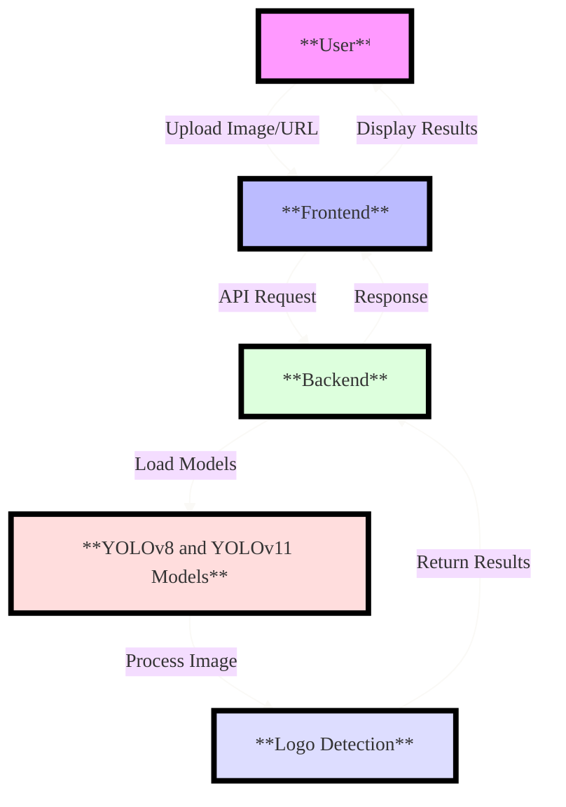
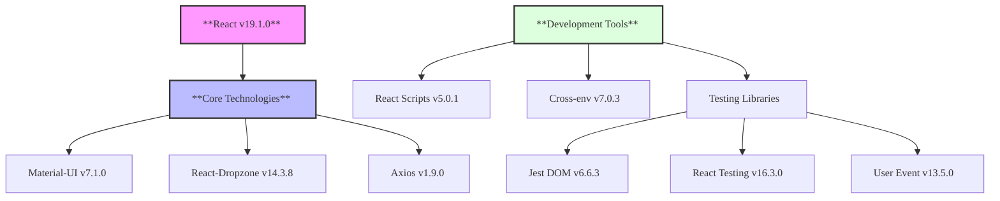

# Logo Detection Web Application

This application provides a web-based interface for detecting Symphony logos in images using YOLOv8-based detection. It consists of a FastAPI backend for processing images and a Streamlit frontend for user interaction.

## Features

- Multiple YOLO Model Support
  - Uses multiple trained YOLOv8 and YOLOv11 models for enhanced accuracy
  - Early detection return for improved performance
  - Configurable confidence threshold
- Single Image Logo Detection
  - Upload images directly
  - Provide image URLs
  - Real-time processing and results
- Batch Processing
  - Upload multiple images
  - Process multiple image URLs
  - Concurrent processing for improved performance
- Comprehensive Logging
  - Rotating file logs with 10MB size limit
  - Detailed error tracking and debugging
  - Request/response logging
- User-friendly Interface
  - Modern Streamlit frontend
  - Interactive API documentation
  - Real-time processing feedback

## System Workflow

### Basic Flow


### Detailed Processing Pipeline

```mermaid
%%{
  init: {
    'themeVariables': {
      'fontSize': '14px',
      'fontFamily': 'Arial, sans-serif'
    }
  }
}%%
flowchart LR
    subgraph Input
        A[**Image Upload**] --> B[**URL Input**]
        B --> C[**Input Validation**]
    end
    
    subgraph Processing
        C --> D[**Image Preprocessing**]
        D --> E[**Model Selection**]
        E --> F[**YOLOv8 and YOLOv11 Inference**]
        F --> G[**Confidence Check**]
    end
    
    subgraph Output
        G -->|Above Threshold| H[**Valid Logo**]
        G -->|Below Threshold| I[**Invalid Logo**]
        H --> J[**Result Storage**]
        I --> J
    end
    linkStyle default stroke-width: 3px
    linkStyle default stroke: #FAF9F6
    style A fill:#f9f,stroke:#000,stroke-width:2px,color:000
    style B fill:#f9f,stroke:#000,stroke-width:2px,color:000
    style C fill:#bbf,stroke:#000,stroke-width:2px,color:000
    style D fill:#dfd,stroke:#000,stroke-width:2px,color:000
    style E fill:#dfd,stroke:#000,stroke-width:2px,color:000
    style F fill:#dfd,stroke:#000,stroke-width:2px,color:000
    style G fill:#fdd,stroke:#000,stroke-width:2px,color:000
    style H fill:#ddf,stroke:#000,stroke-width:2px,color:000
    style I fill:#ddf,stroke:#000,stroke-width:2px,color:000
    style J fill:#ddf,stroke:#000,stroke-width:2px,color:000
```


### Batch Processing Timeline

```mermaid
gantt
    title Batch Processing Timeline
    dateFormat  s
    axisFormat %S
    
    section Input
    Validation    :a1, 0, 1s
    Queue Build   :a2, after a1, 1s
    
    section Processing
    Model Loading :b1, after a2, 2s
    Concurrent Processing :b2, after b1, 3s
    
    section Output
    Result Collection :c1, after b2, 1s
    Response Generation :c2, after c1, 1s
```


## Technology Stack

- Backend:
  - FastAPI (v0.115.12)
  - Python 3.7+
  - YOLOv8 (Ultralytics v8.3.145)
  - OpenCV
  - Pillow for image processing
- Frontend:
  - Streamlit (v1.45.1)
  - Rich UI components
- Machine Learning:
  - Multiple YOLOv8 models for logo detection
  - PyTorch (v2.7.0)
  - TorchVision (v0.22.0)

## Frontend Implementation

### Overview
The frontend is built using React (v19.1.0) with Material-UI (MUI v7.1.0) for a modern, responsive user interface. It provides an intuitive interface for both single image and batch processing of logo detection tasks.

### Technology Details


### Key Features
- **Modern React Architecture**
  - Functional components with hooks
  - Context API for state management
  - Custom hooks for API integration
  - Responsive design patterns
  - Enhanced mobile responsiveness
  - Efficient batch processing UI

- **Material-UI Components**
  - Custom theme implementation
  - Responsive grid layout
  - Modern form controls
  - Progress indicators
  - Snackbar notifications
  - Optimized mobile components
  - Dynamic scrolling for large batches
  - Sticky headers and summaries

- **Mobile Optimizations**
  - Responsive layout for all screen sizes
  - Touch-friendly interface
  - Optimized content display
  - Efficient scrolling for large batches
  - Improved text wrapping and readability
  - Adaptive padding and spacing
  - Enhanced status indicators

- **Batch Processing Features**
  - Efficient handling of large batches
  - Real-time batch summary
  - Progress tracking
  - Dynamic result display
  - Automatic scrolling
  - Performance optimizations
  - Clear status indicators
  - Error handling with visual feedback

- **File Handling**
  - Drag-and-drop file upload
  - Multi-file selection
  - File type validation
  - Progress tracking
  - Error handling
  - Mobile-friendly upload interface
  - Batch URL processing

- **API Integration**
  - Axios for HTTP requests
  - Configurable backend URL
  - Request/response interceptors
  - Error handling middleware
  - Optimized batch processing
  - Concurrent request handling

### User Interface Features
- **Responsive Design**
  - Adapts to all screen sizes
  - Mobile-first approach
  - Touch-optimized interface
  - Dynamic content scaling
  - Efficient space utilization

- **Results Display**
  - Clear visual indicators
  - Batch processing summary
  - Individual result cards
  - Status badges
  - Error messages
  - Scrollable content
  - Performance optimized

- **Navigation**
  - Intuitive mode selection
  - Easy input method switching
  - Clear processing status
  - Accessible controls
  - Mobile-friendly menus
  - Smooth transitions

### Project Structure
```
frontend/
├── src/
│   ├── App.js           # Main application component
│   ├── config.js        # Configuration and environment variables
│   ├── index.js         # Application entry point
│   ├── index.css        # Global styles
│   └── setupTests.js    # Test configuration
├── public/              # Static assets
├── build/              # Production build
└── package.json        # Dependencies and scripts
```

### Development Scripts
- `npm start` - Start development server
- `npm run start:custom --backend=<URL>` - Start with custom backend URL
- `npm run build` - Create production build
- `npm test` - Run test suite
- `npm run eject` - Eject from Create React App

### Environment Configuration
The frontend can be configured using environment variables:
```bash
REACT_APP_BACKEND_URL=http://your-backend-url # Default: http://localhost:8000
```

### Browser Support
- **Production Environment**
  - All modern browsers
  - IE11 and above
  - Mobile browsers

- **Development Environment**
  - Latest versions of:
    - Chrome
    - Firefox
    - Safari

### Testing
The frontend includes a comprehensive test suite using:
- Jest for unit testing
- React Testing Library for component testing
- User Event for interaction testing

## Backend Implementation

## System Requirements

- Python 3.7 or higher
- CUDA-compatible GPU (recommended for faster inference)
- 2GB+ RAM
- Sufficient disk space for temporary file processing
- Active internet connection for URL-based image processing
- Modern web browser (Chrome, Firefox, Safari, or Edge)

## Installation

1. Clone this repository
2. Create and activate a virtual environment (recommended):
```bash
python -m venv .venv
source .venv/bin/activate  # On Windows: .venv\\Scripts\\activate
```
3. Install the required dependencies:
```bash
pip install -r requirements.txt
```

## Running the Application

1. Start the FastAPI backend:
```bash
uvicorn App:app --reload --host 0.0.0.0 --port 8000
```
The API will be available at http://localhost:8000

2. In a new terminal, start the Streamlit frontend:
```bash
streamlit run frontend/streamlit_app.py
```
The web interface will automatically open in your default browser at http://localhost:8501

## Usage

1. Open the web interface at http://localhost:8501
2. Choose between "Single Image" or "Batch Processing" mode
3. Upload images or provide image URLs
4. Click the "Detect Logo" or "Process Batch" button
5. View the results and detection statistics

### Supported Image Formats
- JPEG/JPG
- PNG

### File Size and Type Validation
- Images must be non-empty
- Files must be valid image formats
- Automatic image format detection
- Corrupted or invalid image files will be rejected

## API Documentation

The FastAPI backend provides detailed API documentation at:
- Interactive API docs: http://localhost:8000/docs
- Alternative API docs: http://localhost:8000/redoc

### API Endpoints

- `/api/check-logo/single/`: Process single image (file upload or URL)
- `/api/check-logo/batch/`: Process multiple images
- `/check-logo/batch/getCount`: Get batch processing statistics
- `/api`: Get API documentation and endpoint descriptions

## Error Handling

The application includes comprehensive error handling for:
- Invalid file types
- Corrupted images
- Empty files
- Invalid URLs
- Model loading failures
- Inference errors
- Network connectivity issues
- Server processing errors

## Logging

The application implements a robust logging system:
- Rotating log files (10MB size limit)
- Detailed error tracking
- Request/response logging
- Model inference logging
- Image processing status updates

## Security Features

- Input validation on all file uploads
- Secure file handling with automatic cleanup
- CORS protection configured for specific origins
- Rate limiting for API endpoints
- Sanitized error messages
- Temporary file management

## Troubleshooting

If you encounter issues:

1. Check the logs.txt file for detailed error messages
2. Verify file formats (JPG/PNG only)
3. Ensure model weights are present in the runs/detect/ directory
4. Check file permissions in the temp_uploads directory
5. Verify both backend and frontend servers are running
6. Check network connectivity for URL-based processing
7. Ensure GPU drivers are up to date (if using GPU)

## Notes

- The system uses multiple YOLOv8 models for improved accuracy
- Models are loaded once at startup for better performance
- Temporary files are automatically cleaned up
- Batch processing uses concurrent execution for better performance
- The system implements configurable confidence thresholds
- All API responses include detailed error information when needed 
