**Symphony Logo Detection System: Enterprise-grade, real-time image validation using advanced YOLO models for brand compliance and automated QA.**


# Symphony Logo Detection System
## Enterprise-Grade YOLO-Powered Image Validation

### Executive Summary
Symphony Logo Detection System is an enterprise-grade platform for automated, high-accuracy logo validation in images, designed for scalable batch processing and real-time feedback. The system leverages advanced YOLO AI models to deliver reliable logo detection for quality assurance, brand compliance, and automated content validation workflows. Built for Symphony Limited, it provides both single-image validation and high-throughput batch processing capabilities with comprehensive admin controls and real-time progress monitoring.

A comprehensive logo detection system built by Symphony Limited that uses advanced YOLOv8 and YOLOv11 models to validate the presence of Symphony logos in images. The system features a robust FastAPI backend with real-time processing capabilities and a modern React 19.1.0 frontend for seamless user interaction.

---

## Table of Contents
- [Key Features](#key-features)
- [System Architecture](#system-architecture)
  - [High-Level System Overview](#high-level-system-overview)
  - [FastAPI Application Architecture](#fastapi-application-architecture-apppy)
  - [React Frontend Component Architecture](#react-frontend-component-architecture)
  - [Sequential Model Processing Flow](#sequential-model-processing-flow-detect_logopy)
  - [Batch Processing Pipeline](#batch-processing-pipeline)
  - [YOLO Model Detection Pipeline](#yolo-model-detection-pipeline)
  - [Error Handling and Monitoring](#error-handling-and-monitoring)
  - [File Storage and Cleanup System](#file-storage-and-cleanup-system)
  - [CSV Export Lifecycle](#csv-export-lifecycle)
- [Technology Stack](#technology-stack)
- [Project Structure](#project-structure)
- [Quick Start](#quick-start)
- [Installation](#installation)
  - [System Requirements](#system-requirements)
  - [Backend Setup](#backend-setup)
  - [Frontend Setup](#frontend-setup)
- [Configuration](#configuration)
  - [Environment Variables](#environment-variables)
  - [Frontend Configuration](#frontend-configuration)
  - [Backend Configuration](#backend-configuration)
  - [Model Configuration](#model-configuration)
- [Running the Application](#running-the-application)
  - [Quick Start](#quick-start-1)
  - [Custom Configuration](#custom-configuration)
  - [WebSocket Configuration](#websocket-configuration)
  - [Development Mode](#development-mode)
  - [Production Mode](#production-mode)
- [API Documentation](#api-documentation)
  - [Main Endpoints](#main-endpoints)
- [Security](#security)
- [Error Handling](#error-handling)
- [Logging System](#logging-system)
- [Testing](#testing)
  - [Backend](#backend)
  - [Frontend](#frontend)
- [Development Guidelines](#development-guidelines)
- [Troubleshooting](#troubleshooting)
- [Deployment](#deployment)
- [License & Support](#license--support)
  - [License](#license)
  - [Support & Contact](#support--contact)
  - [Contributing](#contributing)
  - [Acknowledgments](#acknowledgments)

---

## Key Features

### 🎯 End-User Features

- **📸 Advanced Multi-Model Detection**
  - 5 specialized YOLO models with sequential processing:
    - `yolov8s_logo_detection` (primary)
    - `yolov8s_logo_detection2` (enhanced)
    - `yolov8s_logo_detection3` (refined)
    - `yolov11s_logo_detection` (advanced)
    - `yolov11s3_logo_detection` (optimized)
  - Early detection return when logo is found (performance optimization)
  - Configurable confidence threshold (default: 0.35)
  - Model cascade approach for maximum accuracy
  - Automatic image enhancement with boundary addition
  - Support for both local files and URL-based images

- **⚡ Real-Time Image Processing**
  - Single image validation via file upload or URL
  - Batch processing with unique session tracking (1-999 images)
  - Real-time WebSocket updates for batch progress
  - Automatic image preprocessing and enhancement
  - Support for JPEG, PNG, and other common formats
  - Concurrent processing for improved performance
  - Upload status indicators (uploading, validating, valid, invalid, error)
  - Chunked upload processing with retry logic for failed batches

- **📊 Export & Reporting**
  - CSV export with batch metadata and timestamps
  - Comprehensive result details (confidence, bounding boxes, model used)
  - Processing time statistics and batch summaries
  - Email notification input for batch completion alerts
  - Download results with detailed detection information

- **💻 Modern User Interface**
  - React 19.1.0 with latest features and optimizations
  - Material-UI 7.1.0 for professional design components
  - Drag-and-drop file upload with React Dropzone 14.3.8
  - Responsive design for desktop and mobile devices
  - Symphony branding with consistent color scheme (#0066B3)
  - Mobile-first responsive design with drawer navigation
  - Client-side routing with React Router DOM 6.30.1

### 👨‍💼 Admin Features

- **🔐 Secure Authentication & Access Control**
  - Admin authentication with session management
  - Secure login with configurable session duration
  - Role-based access to administrative functions
  - CSRF protection and security middleware

- **📈 Dashboard & Analytics**
  - Comprehensive admin dashboard for system overview
  - Batch history management and monitoring
  - Processing statistics and performance metrics
  - System health monitoring and status tracking
  - Real-time batch progress monitoring across all users

- **📋 Batch Management**
  - Complete batch history with detailed metadata
  - Batch status tracking and lifecycle management
  - Export capabilities for administrative reporting
  - User activity monitoring and audit trails

### 🛡️ System Features

- **🔒 Enterprise Security**
  - Rate limiting with SlowAPI (configurable per endpoint)
  - CORS middleware for cross-origin requests
  - CSRF protection and security middleware
  - Secure session management with configurable duration
  - Input validation and sanitization

- **⚙️ Production-Grade Infrastructure**
  - FastAPI with automatic OpenAPI documentation
  - Async/await architecture for high performance
  - APScheduler for automated maintenance tasks
  - WebSocket endpoints for real-time batch updates
  - RESTful endpoints for all operations
  - Configurable backend URL via environment scripts (`set-backend.js`)

- **📝 Comprehensive Logging & Monitoring**
  - Structured logging with automatic rotation (10MB limit)
  - Detailed error tracking and categorization
  - Performance monitoring and metrics collection
  - WebSocket connection management with timeout handling
  - Real-time system health monitoring

- **🧹 Automated Resource Management**
  - Automatic cleanup of temporary files (30-minute cycles)
  - Batch data retention with configurable expiry (24 hours)
  - Environment-based configuration management
  - Memory and storage optimization
  - Automated maintenance and housekeeping tasks

- **🚀 Scalability & Performance**
  - **Microservice Architecture**: Decoupled Main API (App.py) and YOLO Service (yolo_service/)
  - **Service Communication**: services/yolo_client.py handles inter-service communication
  - **Independent Scaling**: YOLO service can be scaled separately from main API
  - **Concurrent Processing**: Batch processing with progress tracking via utils/batch_tracker.py
  - **Efficient Model Loading**: Cached model weights in runs/detect/ directories
  - **Optimized Pipeline**: Streamlined image processing with utils/file_ops.py
  - **Load Balancing Ready**: Stateless architecture with external state management

---

## System Architecture

### High-Level System Overview

This diagram illustrates the complete system architecture showing how the React frontend (port 3000) communicates with the FastAPI backend (port 8000), which routes requests through specialized modules to the core YOLO detection engine. The system includes utility services for batch tracking, WebSocket management, security, and automated cleanup, with persistent storage for temporary files, exports, logs, and batch data.

<details>
<summary><strong>📊 System Architecture Diagram</strong> (Click to expand)</summary>


**Fallback Description:** The system consists of a React Frontend (port 3000) connecting to FastAPI App.py (port 8000) through API Router Layer (routers/ directory with single.py, batch.py, export.py, admin_auth.py, websocket.py, dashboard_stats.py, batch_history.py). The Microservice Detection Engine uses detect_logo.py with services/yolo_client.py connecting to yolo_service/ microservice, loading 5 YOLO models from runs/detect/ directories. Utility Services (utils/ directory) include batch_tracker.py, ws_manager.py, cleanup.py, security.py, logger.py, file_ops.py, and background_tasks.py. Storage & Data layer manages temp_uploads/, exports/, logs/, and data/ directories. Testing & Quality includes tests/ directory with pytest configuration and frontend/src/__tests__/ for React components.

</details>

### FastAPI Application Architecture (App.py)

This diagram shows the internal structure of the FastAPI application, detailing the middleware stack (CORS, rate limiting, CSRF protection, admin authentication), API router layer, validation and processing flow, startup tasks with APScheduler, and core endpoints. It demonstrates how requests flow through security layers before reaching the detection logic.

<details>
<summary><strong>⚙️ FastAPI Architecture Diagram</strong> (Click to expand)</summary>
  


**Fallback Description:** FastAPI App.py receives requests from React Frontend and applies middleware layers: CORS Middleware → SlowAPI Limiter → Security Utils → Admin Authentication. Requests are routed through API Router Layer (single.py, batch.py, export.py, admin_auth.py, websocket.py) to Validation & Processing (File Operations → detect_logo.py → Logger Utils). Startup & Background Tasks include APScheduler initialization with cleanup jobs, CSRF token cleanup, and WebSocket monitoring. Core Endpoints provide GET /, GET /api, and WebSocket /ws/batch/{batch_id}.

</details>

### React Frontend Component Architecture

This diagram illustrates the React frontend's component hierarchy, showing how the main App.js initializes routing through router.js and AppNavigation.js. It details the core upload components (FileUploader.js, BatchProcessingForm.js, ProgressBar.js, EmailInput.js), admin components (AdminLogin.js, Dashboard.js, BatchHistory.js), utility services, and backend communication flow.

<details>
<summary><strong>⚙️ React Frontend Architecture Diagram</strong> (Click to expand)</summary>
  


**Fallback Description:** React App.js (port 3000) initializes routes through router.js and renders AppNavigation.js. Core Upload Components include FileUploader.js (main interface), BatchProcessingForm.js (multi-file upload), ProgressBar.js (real-time progress), and EmailInput.js (notifications). Admin Components provide AdminLogin.js (authentication), Dashboard.js (control panel), BatchHistory.js (processing history), and AdminNavLink.js (conditional navigation). Utility Services handle imageChunker.js (file processing), clientId.js (unique identification), and auth.js (authentication logic). Backend Communication uses config.js (API configuration), WebSocket connections (ws://localhost:8000/ws/{client_id}), and FastAPI Backend (http://localhost:8000). State Flow: Start Batch → Initialize → Process files.

</details>

### Sequential Model Processing Flow (detect_logo.py)

This diagram demonstrates the core AI detection logic, showing how images (files or URLs) are processed through PIL Image processing with white boundary addition, then sequentially tested against 5 YOLO models with early return optimization. It illustrates the decision flow and result structure for both successful detections and error handling.

```mermaid
%%{init: {'theme': 'dark', 'themeVariables': { 'fontFamily': 'arial', 'fontSize': '18px', 'fontWeight': 'bold'}}}%%
graph TD
    subgraph "Image Input Processing"
        style A fill:#bbdefb,stroke:#1976d2,stroke-width:2px,color:#000000,font-weight:bold
        style B fill:#bbdefb,stroke:#1976d2,stroke-width:2px,color:#000000,font-weight:bold
        style C fill:#bbdefb,stroke:#1976d2,stroke-width:2px,color:#000000,font-weight:bold
        A["File Upload or URL"] -->|"Image.open() / requests.get()"| B["PIL Image Processing"]
        B -->|"ImageOps.expand(border=10, fill='white')"| C["Add White Boundary"]
    end

    subgraph "Sequential Model Execution (detect_logo.py)"
        style D1 fill:#e1bee7,stroke:#7b1fa2,stroke-width:2px,color:#000000,font-weight:bold
        style D2 fill:#e1bee7,stroke:#7b1fa2,stroke-width:2px,color:#000000,font-weight:bold
        style D3 fill:#e1bee7,stroke:#7b1fa2,stroke-width:2px,color:#000000,font-weight:bold
        style D4 fill:#e1bee7,stroke:#7b1fa2,stroke-width:2px,color:#000000,font-weight:bold
        style D5 fill:#e1bee7,stroke:#7b1fa2,stroke-width:2px,color:#000000,font-weight:bold
        C -->|"model.predict(conf=0.35)"| D1["Model 1: yolov8s_logo_detection<br/>Confidence ≥ 0.35"]
        D1 -->|"No Symphony Detected"| D2["Model 2: yolov8s_logo_detection2<br/>Confidence ≥ 0.35"]
        D2 -->|"No Symphony Detected"| D3["Model 3: yolov8s_logo_detection3<br/>Confidence ≥ 0.35"]
        D3 -->|"No Symphony Detected"| D4["Model 4: yolov11s_logo_detection<br/>Confidence ≥ 0.35"]
        D4 -->|"No Symphony Detected"| D5["Model 5: yolov11s3_logo_detection<br/>Confidence ≥ 0.35"]
    end

    subgraph "Early Return Logic"
        style E1 fill:#c8e6c9,stroke:#388e3c,stroke-width:2px,color:#000000,font-weight:bold
        style E2 fill:#c8e6c9,stroke:#388e3c,stroke-width:2px,color:#000000,font-weight:bold
        D1 -->|"Symphony Found (Conf ≥ 0.35)"| E1["Return Valid Result<br/>Stop processing other models"]
        D2 -->|"Symphony Found (Conf ≥ 0.35)"| E1
        D3 -->|"Symphony Found (Conf ≥ 0.35)"| E1
        D4 -->|"Symphony Found (Conf ≥ 0.35)"| E1
        D5 -->|"Symphony Found (Conf ≥ 0.35)"| E1
        D5 -->|"No Symphony in All Models"| E2["Return Invalid<br/>All models failed"]
    end

    subgraph "Result Structure"
        style F fill:#ffe0b2,stroke:#f57c00,stroke-width:2px,color:#000000,font-weight:bold
        E1 -->|"Format JSON Response"| F["JSON Response:<br/>- Image_Path_or_URL<br/>- Is_Valid: 'Valid'/'Invalid'<br/>- Confidence (if valid)<br/>- Detected_By (model name)<br/>- Bounding_Box [x1,y1,x2,y2]<br/>- Error (if processing failed)"]
        E2 -->|"Format JSON Response"| F
    end

    subgraph "Error Handling"
        style G fill:#ffcdd2,stroke:#d32f2f,stroke-width:2px,color:#000000,font-weight:bold
        A -->|"Invalid file/URL"| G["Error Response<br/>- Is_Valid: 'Invalid'<br/>- Error: description<br/>- No confidence/bounding box"]
        G --> F
    end
```

<details>
<summary><strong>🤖 AI Model Processing Diagram</strong> (Click to expand)</summary>
  


**Fallback Description:** Image Input Processing: File Upload or URL → PIL Image Processing → Add White Boundary (10px). Sequential Model Execution: Model 1 (yolov8s_logo_detection) → Model 2 (yolov8s_logo_detection2) → Model 3 (yolov8s_logo_detection3) → Model 4 (yolov11s_logo_detection) → Model 5 (yolov11s3_logo_detection), each with confidence ≥ 0.35. Early Return Logic: If Symphony found (Conf ≥ 0.35) → Return Valid Result and stop processing; if no Symphony in all models → Return Invalid. Result Structure: JSON Response with Image_Path_or_URL, Is_Valid, Confidence, Detected_By, Bounding_Box, Error. Error Handling: Invalid file/URL → Error Response with no confidence/bounding box.

</details>

### Batch Processing Pipeline

This sequence diagram shows the complete batch processing workflow from initialization to completion. It demonstrates the 4-step process: batch initialization, parameter setting, image processing with model testing, and status checking with CSV export. The diagram illustrates the interaction between Client, FastAPI App, batch router, tracker, detection logic, YOLO models, and file storage.

<details>
<summary><strong>🔄 Batch Processing Sequence Diagram</strong> (Click to expand)</summary>
  


**Fallback Description:** Step 1: Client → POST /api/start-batch → FastAPI App creates batch_id → batch_tracker initializes batch → File Storage creates batch state → Returns 201 with batch_id. Step 2: Client → POST /api/init-batch with batch_id, client_id, total → batch_tracker updates state → Returns 200. Step 3: Client → POST /api/check-logo/batch/ with files/URLs + batch_id → Validates batch exists and files provided → For each image: detect_logo processes with white boundary and sequential model testing (yolov8s_logo_detection variants → yolov11s variants) → Updates batch progress. Step 4: Client checks status via GET /api/check-logo/batch/{batch_id}/status and optionally exports CSV via GET /api/check-logo/batch/export-csv/{batch_id}.

</details>

### YOLO Model Detection Pipeline

This detailed sequence diagram expands on the batch processing pipeline, showing the 6-phase process with emphasis on the image processing loop and sequential model testing with early exit logic. It demonstrates real-time WebSocket updates, validation checks, preprocessing steps, and the complete model cascade from YOLOv8s to YOLOv11s variants.

<details>
<summary><strong>🎯 Detailed YOLO Detection Sequence</strong> (Click to expand)</summary>
  


**Fallback Description:** Phase 1: Batch Initialization - Client creates batch_id via POST /api/start-batch. Phase 2: Batch Configuration - Client sets parameters via POST /api/init-batch. Phase 3: File Processing - Client submits FormData files or JSON image_paths via POST /api/check-logo/batch/ with validation checks. Phase 4: Image Processing Loop - For each image: PIL.Image.open() → ImageOps.expand(border=10, fill='white') → Sequential Model Testing with early exit (yolov8s_logo_detection → yolov8s_logo_detection2 → yolov8s_logo_detection3 → yolov11s_logo_detection → yolov11s3_logo_detection, each with conf=0.35) → Update batch progress → Send WebSocket progress updates. Phase 5: Finalization - Save complete results to data/. Phase 6: Status & Export - Client checks status and optionally exports CSV with APScheduler cleanup after 24h.

</details>

### Error Handling and Monitoring

This diagram illustrates the comprehensive error handling system, showing error sources (input validation, batch processing, model inference, file operations, rate limiting), error processing flow, test coverage with pytest scenarios, and logging & monitoring infrastructure with APScheduler cleanup.

<details>
<summary><strong>⚠️ Error Handling & Monitoring Diagram</strong> (Click to expand)</summary>
  


**Fallback Description:** Error Sources: Input Validation (invalid file types, missing batch ID, empty requests) → 400 Bad Request; Batch Processing (batch not found, invalid state) → 404 Not Found; Model Inference (loading errors, prediction failures) → 500 Internal Error; File Operations (read/write errors, storage issues) → 500 Internal Error; Rate Limiting (too many requests, SlowAPI limits) → 429 Too Many Requests. Error Processing: FastAPI Error Handler → Error Response Generator (HTTPException with detail, structured messages, status code mapping) → JSON Error Response. Test Coverage: test_batch.py with invalid batch ID tests, missing files tests, mixed valid/invalid files, batch lifecycle tests, URL processing, status checking, error scenarios. Logging & Monitoring: Logger Utils (structured logging, error categorization, batch tracking) → logs/ Directory (application logs, error logs, performance metrics) → APScheduler (log rotation, size-based cleanup, retention policies).

</details>

### File Storage and Cleanup System

This diagram shows the file management architecture, illustrating how multipart file uploads and image URLs are processed through utils/file_ops.py, stored in various directories (temp_uploads/, uploads/, exports/, data/, logs/), managed through batch_tracker.py, and automatically cleaned up via APScheduler with WebSocket state management.

<details>
<summary><strong>🗄️ File Storage & Cleanup Diagram</strong> (Click to expand)</summary>
  


**Fallback Description:** File Input Processing: Multipart File Upload (FastAPI UploadFile[]) and Image URL Array (JSON image_paths[]) → utils/file_ops.py for validation & processing. Storage Directories: temp_uploads/ (temporary processing files, 30min auto-cleanup), uploads/ (persistent uploaded files), exports/ (CSV export files, batch_{id}_results.csv, 24h retention), data/ (batch state JSON files, {batch_id}.json, 24h retention), logs/ (application logs, 10MB rotation limit). Batch State Management: utils/batch_tracker.py (initialize_batch(), update_batch_state(), validate_batch_exists()) → JSON State Files (batch_id, client_id, total/processed counts, results array) → test_batch.py (batch lifecycle tests, status validation, error scenarios). Automated Cleanup (APScheduler): cleanup_temp_uploads() every 30 minutes, cleanup_old_batches() every 1 hour with 24h retention, Log Rotation with 10MB size limit → utils/cleanup.py for scheduled maintenance. WebSocket State Management: utils/ws_manager.py for real-time communication → Progress Updates with batch processing status.

</details>

### CSV Export Lifecycle

This sequence diagram details the CSV export process, showing the complete workflow from client request through batch validation, CSV generation with headers and metadata, file creation in exports/ directory, and FileResponse delivery with automatic cleanup scheduling.

<details>
<summary><strong>📄 CSV Export Sequence Diagram</strong> (Click to expand)</summary>
  


**Fallback Description:** Client → GET /api/check-logo/batch/export-csv/{batch_id} → export.py Router validates batch exists via batch_tracker.py → Loads batch state from data/{batch_id}.json. If batch not found → 404 HTTPException. If successful → CSV Generator creates headers (Image_Path, Is_Valid, Confidence, Detected_By, Bounding_Box, Processing_Time), formats batch results (all processed images, batch metadata, timestamps, valid/invalid results, model detection details from yolov8s/yolov11s variants) → Saves CSV to exports/{batch_id}.csv → Creates FileResponse with Content-Disposition attachment → Returns CSV download to Client. Auto-cleanup: APScheduler cleans exports/ every 24h, handles mixed valid/invalid files, batch state persists in data/ directory, error handling for missing batches.

</details>

## Project Structure

```
usingYolo/                         # 🏠 Root project directory
├── 🚀 App.py                      # ⭐ MAIN ENTRY POINT - FastAPI application
├── detect_logo.py                  # Core YOLO detection logic with 5 models
├── train.py                        # Model training script
├── requirements.txt                # Python dependencies
├── requirements-dev.txt            # Development dependencies
├── .env                           # Environment configuration
├── README.md                      # Project documentation
│
├── routers/                      # 🛣️ API route handlers - FastAPI endpoint definitions
│   ├── __init__.py
│   ├── single.py                 # Single image validation endpoint
│   ├── batch.py                  # Batch processing endpoints
│   ├── export.py                 # CSV export functionality
│   ├── admin_auth.py             # Admin authentication routes
│   ├── batch_history.py          # Batch history management
│   ├── dashboard_stats.py        # Dashboard statistics API
│   └── websocket.py              # WebSocket endpoints
│
├── yolo_service/                 # 🤖 Dedicated YOLO detection microservice (port 8001)
│   ├── ⭐ main.py                # YOLO SERVICE ENTRY POINT - Detection API
│   ├── start.py                  # Service startup script
│   └── detect_logo.py            # YOLO model inference logic
│
├── utils/                        # 🔧 Utility modules - Shared functionality and helpers
│   ├── __init__.py
│   ├── logger.py                  # Centralized logging configuration
│   ├── file_ops.py                # File operations and management
│   ├── cleanup.py                 # Automated cleanup tasks (APScheduler)
│   ├── batch_tracker.py           # Batch state management
│   ├── security.py                # CSRF protection and security utilities
│   ├── ws_manager.py              # WebSocket connection management
│   ├── websocket.py               # WebSocket utilities
│   ├── emailer.py                 # Email notification system
│   └── password.py                # Password utilities
│
├── runs/detect/                  # 🧠 AI model storage - Trained YOLO model weights
│   ├── yolov8s_logo_detection/   # Primary YOLOv8s model
│   │   └── weights/best.pt
│   ├── yolov8s_logo_detection2/  # Enhanced YOLOv8s model
│   │   └── weights/best.pt
│   ├── yolov8s_logo_detection3/  # Refined YOLOv8s model
│   │   └── weights/best.pt
│   ├── yolov11s_logo_detection/  # YOLOv11s model
│   │   └── weights/best.pt
│   └── yolov11s3_logo_detection/ # Optimized YOLOv11s model
│       └── weights/best.pt
│
├── frontend/                     # 💻 React frontend application (port 3000)
│   ├── package.json               # Frontend dependencies
│   ├── set-backend.js             # Backend URL configuration script
│   ├── public/                   # 📁 Static assets - HTML, icons, manifest
│   ├── build/                    # 📦 Production build output - Compiled React app
│   └── src/                      # 📝 Source code - React components and logic
│       ├── 🚀 App.js             # ⭐ REACT ENTRY POINT - Main application
│       ├── router.js             # React Router configuration
│       ├── config.js             # API configuration
│       ├── FileUploader.js       # Main upload component
│       ├── UploadStatus.js       # Upload status component
│       ├── components/           # 🧩 React components - Reusable UI elements
│       │   ├── AdminLogin.js     # Admin authentication
│       │   ├── AdminNavLink.js   # Admin navigation
│       │   ├── AppNavigation.js  # Main navigation
│       │   ├── Dashboard.js      # Admin dashboard
│       │   ├── BatchHistory.js   # Batch history viewer
│       │   ├── BatchProcessingForm.js # Batch processing form
│       │   ├── ProgressBar.js    # Real-time progress tracking
│       │   └── EmailInput.js     # Email notification input
│       └── utils/                # 🔧 Frontend utilities - Helper functions
│           ├── imageChunker.js   # Batch processing utilities
│           ├── clientId.js       # Client ID generation
│           └── auth.js           # Authentication helpers
│
├── services/                     # 🔌 Additional service modules - External integrations
├── tasks/                        # ⏰ Background task definitions - Scheduled jobs
├── models/                       # 📊 Model-related utilities - Pydantic schemas
├── tests/                        # 🧪 Test suite - Automated testing
├── test/                         # 📷 Test images and data - Sample files for testing
├── temp_uploads/                 # 📂 Temporary file storage - Auto-cleanup every 30min
├── uploads/                      # 📁 Persistent uploads - Long-term file storage
├── exports/                      # 📄 CSV export storage - Batch results (24h retention)
├── data/                         # 💾 Application data - Batch states and metadata
├── logs/                         # 📋 Application logs - Rotating log files (10MB limit)
├── docs/                         # 📚 Additional documentation - Project guides
└── .venv/                        # 🐍 Python virtual environment - Isolated dependencies
```

## Technology Stack

### Backend Infrastructure
- **FastAPI 0.115.12** - High-performance async web framework
- **Python 3.7+** - Core runtime environment
- **Ultralytics 8.3.151** - YOLOv8 and YOLOv11 model support
- **Pillow 11.2.1** - Advanced image processing
- **APScheduler 3.10.4** - Automated task scheduling
- **SlowAPI 0.1.9** - Intelligent rate limiting
- **Uvicorn 0.34.3** - ASGI server with WebSocket support
- **Torch 2.7.1 + TorchVision 0.22.1** - Deep learning framework
- **OpenCV 4.11.0.86** - Computer vision operations
- **Pandas 2.3.0** - Data processing and CSV export
- **Redis 6.2.0** - Caching and session management
- **Celery 5.5.3** - Distributed task processing
- **Requests 2.32.3** - HTTP library for URL-based image processing

### Frontend Stack
- **React 19.1.0** - Modern UI framework with latest features
- **Material-UI 7.1.0** - Professional component library with icons
- **Axios 1.9.0** - HTTP client for API communication
- **React Dropzone 14.3.8** - Drag-and-drop file uploads
- **React Router DOM 6.30.1** - Client-side routing
- **Cross-env 7.0.3** - Cross-platform environment variables
- **Emotion React/Styled 11.14.0** - CSS-in-JS styling solution
- **Web Vitals 2.1.4** - Performance monitoring
- **Testing Library** - Comprehensive testing suite (DOM, React, User Event)

### AI/ML Components
- **5 Specialized YOLO Models:**
  - `yolov8s_logo_detection` - Primary YOLOv8s model
  - `yolov8s_logo_detection2` - Enhanced YOLOv8s with additional training data
  - `yolov8s_logo_detection3` - Refined YOLOv8s with optimized parameters
  - `yolov11s_logo_detection` - Advanced YOLOv11s model
  - `yolov11s3_logo_detection` - Optimized YOLOv11s variant
- **Confidence Threshold:** 0.35 (configurable)
- **Early Detection Return** - Stops processing when logo is found
- **Model Cascade** - Sequential model execution for optimal accuracy
- **GPU Acceleration** - CUDA support for faster inference
- **Image Enhancement** - Automatic boundary addition (10px white border)
- **URL Processing** - Direct HTTP/HTTPS image URL support
- **Robust Error Handling** - Graceful model failure recovery

### Development & Testing Tools
- **Pytest 8.0.2** - Backend testing framework
- **Pytest-asyncio 0.23.5** - Async testing support
- **Black 24.2.0** - Python code formatting
- **Flake8 7.0.0** - Code linting and style checking
- **Jest** - Frontend testing (via React Scripts)
- **ESLint** - JavaScript/TypeScript linting
- **Cross-env** - Environment variable management

## Installation

> **Requirements:** Python 3.7+ | Node.js 14+ | 4GB+ RAM | Optional GPU

### Development vs Production Setup

**Development Setup:**
- Uses `--reload` for hot-reloading
- Separate terminals for backend services
- Frontend with development server
- Detailed logging and debugging

**Production Setup:**
- Multi-worker backend deployment
- Built frontend assets
- Optimized logging and monitoring
- Environment-based configuration

### System Requirements

### Backend Setup

#### 1. Clone the repository:
```bash
```bash
git clone https://github.com/Dhruv0306/SymphonyProject1/
cd usingYolo
```

#### 2. Create and activate a virtual environment:
```bash
python -m venv .venv
source .venv/bin/activate  # On Windows: .venv\\Scripts\\activate
```
> **Troubleshooting:** If `python -m venv` fails, try `python3 -m venv` or install `python3-venv` package

#### 3. Install dependencies:
```bash
pip install -r requirements.txt
```
> **Troubleshooting:** If PyTorch installation fails, visit [pytorch.org](https://pytorch.org) for platform-specific commands

#### 4. Create necessary directories:
```bash
mkdir -p temp_uploads data  # Linux/Mac
mkdir temp_uploads data     # Windows
```
> **Troubleshooting:** If permission denied, run with `sudo` (Linux/Mac) or as Administrator (Windows)

#### 5. Start the backend:
##### 1. Start background service:
```bash
cd yolo_service

# Default configuration (localhost + port 8001)
python start.py

# With custom port
uvicorn main:app --reload --host custom-host --port 8001
```
##### 2. Start the Api (In new Terminal):
```bash
# Default configuration (localhost + port 8000)
uvicorn App:app --reload

# With custom host or port
uvicorn App:app --reload --host custom-host --port custom-port
```
#### * Host in both API and background service ***must always be same***

### Frontend Setup

#### 1. Navigate to the frontend directory:
```bash
cd frontend
```

#### 2. Install dependencies:
```bash
npm install
```
> **Troubleshooting:** If `npm install` fails, try `npm install --legacy-peer-deps` or delete `node_modules/` and retry

#### 3. Start the frontend:
```bash
# Using npm start-backend script with custom backend 
npm run start-backend -- --backend=http://your-backend-url:8000

# Or using default backend (http://localhost:8000)
npm run start-backend

# Alternative: Direct React start with environment variable
npm start  # Uses REACT_APP_BACKEND_URL=http://localhost:8000
```
> **Troubleshooting:** If port 3000 is busy, React will prompt for an alternative port. If backend connection fails, verify the backend is running on the specified port
##### Alternatively use --host to set custom host and --port for custom port

---

## Configuration

### Environment Variables

#### Required Variables Table

| Variable | Required | Default | Description |
|----------|----------|---------|-------------|
| `ADMIN_USERNAME` | ✅ | `admin` | Admin login username |
| `ADMIN_PASSWORD` | ✅ | - | Admin login password |
| `SMTP_SERVER` | ❌ | - | Email server for notifications |
| `SMTP_PORT` | ❌ | `587` | Email server port |
| `SMTP_USERNAME` | ❌ | - | Email authentication username |
| `SMTP_PASSWORD` | ❌ | - | Email authentication password |
| `SENDER_EMAIL` | ❌ | - | From email address |
| `SENDER_NAME` | ❌ | `Symphony Logo Detection` | From name |
| `SESSION_DURATION` | ❌ | `1800` | Admin session duration (seconds) |
| `COOKIE_SECRET` | ❌ | auto-generated | Session cookie encryption key |
| `CONFIDENCE_THRESHOLD` | ❌ | `0.35` | YOLO detection confidence threshold |
| `YOLO_SERVICE_URL` | ❌ | `http://localhost:8001` | YOLO service endpoint |

#### Configuration Methods

**1. .env File (Recommended)**
```env
# Create .env in project root
ADMIN_USERNAME=admin
ADMIN_PASSWORD=your_secure_password
CONFIDENCE_THRESHOLD=0.35
```

**2. Environment Variables**
```bash
# Linux/Mac
export ADMIN_USERNAME=admin
export CONFIDENCE_THRESHOLD=0.4

# Windows
set ADMIN_USERNAME=admin
set CONFIDENCE_THRESHOLD=0.4
```

**3. CLI Arguments (Limited)**
```bash
# Backend host detection
uvicorn App:app --host 0.0.0.0 --port 8000

# Frontend configuration
npm run start-backend -- --backend=http://localhost:8000 --port=3000
```

> **Override Priority:** CLI Arguments > Environment Variables > .env File > Defaults

### Frontend Configuration

The frontend configuration is managed through environment variables and the `set-backend.js` script:

```javascript
// set-backend.js usage:
npm run start-backend -- --backend=http://your-backend-url:8000 --port=3000 --host=0.0.0.0

// Parameters:
// --backend=<url>  : Set custom backend URL (default: http://localhost:8000)
// --port=<port>    : Set custom frontend port (default: 3000)
// --host=<host>    : Set custom host IP (default: localhost)
```

### Backend Configuration

The backend automatically detects custom host configurations and sets the YOLO service URL accordingly:

```python
# Automatic host detection in App.py
if '--host' in sys.argv:
    host_index = sys.argv.index('--host')
    if host_index + 1 < len(sys.argv):
        host = sys.argv[host_index + 1]
        if host != 'localhost' and host != '127.0.0.1':
            os.environ['YOLO_SERVICE_URL'] = f'http://{host}:8001'
```

### Model Configuration

The YOLO models are automatically loaded from the following paths in `detect_logo.py`:

```python
MODEL_PATHS = [
    "runs/detect/yolov8s_logo_detection/weights/best.pt",    # Primary YOLOv8s model
    "runs/detect/yolov8s_logo_detection2/weights/best.pt",   # Enhanced with additional data
    "runs/detect/yolov8s_logo_detection3/weights/best.pt",   # Refined parameters
    "runs/detect/yolov11s_logo_detection/weights/best.pt",   # YOLOv11s comparison model
    "runs/detect/yolov11s3_logo_detection/weights/best.pt"   # Optimized YOLOv11s
]

CONFIDENCE_THRESHOLD = 0.35  # Adjustable detection threshold
```

**Key Features:**
- **Sequential Processing:** Models are loaded and executed in order
- **Early Return:** Detection stops at the first successful match above confidence threshold
- **Boundary Enhancement:** Images are automatically enhanced with white boundaries
- **URL Support:** Both local files and HTTP/HTTPS URLs are supported
- **Robust Error Handling:** Failed models are skipped with detailed logging

## Running the Application

### First Run Checklist

**Before starting the application, verify:**

- ✅ `.env` file created with required variables
- ✅ Virtual environment activated
- ✅ Dependencies installed (`pip install -r requirements.txt`)
- ✅ Model weights present in `runs/detect/*/weights/best.pt`
- ✅ Required directories created (`temp_uploads/`, `data/`)
- ✅ Frontend dependencies installed (`npm install`)
- ✅ Ports 8000, 8001, and 3000 available

### Quick Start

> **Important:** Both the main API (port 8000) and YOLO service (port 8001) must be running for the system to function properly.

**Terminal 1 - Main API:**
```bash
# From project root
uvicorn App:app --reload --host 0.0.0.0 --port 8000
```

**Terminal 2 - YOLO Detection Service:**
```bash
# From project root
cd yolo_service
uvicorn main:app --reload --host 0.0.0.0 --port 8001
```

**Terminal 3 - Frontend:**
```bash
# From frontend directory
npm run start-backend
```

4. **Access the application:**
- **Web Interface:** http://localhost:3000
- **API Documentation:** http://localhost:8000/docs
- **Alternative API docs:** http://localhost:8000/redoc
- **Root endpoint:** http://localhost:8000 (redirects to docs)

### Custom Configuration

The frontend supports flexible configuration via the `set-backend.js` script:
```bash
# Custom backend URL and port
npm run start-backend -- --backend=http://your-server:8000 --port=3001 --host=0.0.0.0

# Available parameters:
# --backend=<url>  : Custom backend URL (default: http://localhost:8000)
# --port=<port>    : Custom frontend port (default: 3000)
# --host=<host>    : Custom host IP (default: localhost)

# Environment variable approach
REACT_APP_BACKEND_URL=http://your-server:8000 npm start
```

### WebSocket Configuration

The system uses WebSocket connections for real-time updates:
- **Connection URL:** `ws://localhost:8000/ws/{client_id}`
- **Heartbeat Interval:** 30 seconds
- **Automatic Reconnection:** Built-in connection management
- **Progress Updates:** Real-time batch processing status

**Frontend Features:**
- **Single & Batch Processing:** Toggle between single image validation and batch processing
- **File Upload & URL Input:** Support for both file uploads and image URLs
- **Real-time Progress:** WebSocket-based progress tracking with time estimates
- **Admin Dashboard:** Secure admin interface with batch history and statistics
- **Email Notifications:** Optional email alerts for batch completion
- **Retry Logic:** Automatic retry for failed chunks with user-initiated retry option
- **CSV Export:** Download batch results with metadata
- **Responsive Design:** Mobile-optimized interface with drawer navigation
- **Symphony Branding:** Consistent color scheme (#0066B3) and logo integration
- **Configurable Batch Size:** Adjustable batch processing size (1-999 images)
- **Upload Status Tracking:** Real-time status indicators for each file

### Development Mode

For development, you can run both the backend and frontend with hot-reloading:

1. Backend (with auto-reload):
```bash
uvicorn App:app --reload --host 0.0.0.0 --port 8000
```
2. Start the Background Detection Service(In new Terminal):
```bash
# From the project root directory
cd yolo_service
uvicorn main:app --reload --host 0.0.0.0 --port 8001
```

3. Frontend (with custom backend URL):
```bash
cd frontend
npm run start-backend -- --backend=http://localhost:8000 --port=3000
```

### Production Mode

For production deployment:

1. Build the frontend:
```bash
cd frontend
npm run build
```

2. Run the backend with production settings:
```bash
uvicorn App:app --host 0.0.0.0 --port 8000 --workers 4
```

3. Run the background detection service:
```bash
uvicorn main:app --host 0.0.0.0 --port 8001
```

## API Documentation

The application provides comprehensive API documentation:

- **Interactive Swagger UI:** [http://localhost:8000/docs](http://localhost:8000/docs)
- **ReDoc Documentation:** [http://localhost:8000/redoc](http://localhost:8000/redoc)
- **API Summary:** [http://localhost:8000/api](http://localhost:8000/api)

### Main Endpoints

| Endpoint | Method | Description |
|----------|--------|-------------|
| `/api/check-logo/single/` | POST | Validate a single image (file or URL) |
| `/api/start-batch` | POST | Start a new batch session |
| `/api/check-logo/batch/` | POST | Submit images or URLs for batch processing |
| `/api/check-logo/batch/export-csv` | GET | Export batch results as CSV |
| `/api/admin/login` | POST | Admin login |
| `/api/admin/batch-history` | GET | Admin batch history |
| `/api/admin/dashboard-stats` | GET | Admin dashboard stats |
| `/ws/batch/{batch_id}` | WebSocket | Real-time batch progress updates |

### Example Requests & Responses

**Single Image Validation:**
```bash
# File upload
curl -X POST "http://localhost:8000/api/check-logo/single/" \
  -F "file=@image.jpg"

# URL validation
curl -X POST "http://localhost:8000/api/check-logo/single/" \
  -H "Content-Type: application/json" \
  -d '{"image_path": "https://example.com/image.jpg"}'
```

**Response:**
```json
{
  "Image_Path_or_URL": "image.jpg",
  "Is_Valid": "Valid",
  "Confidence": 0.87,
  "Detected_By": "yolov8s_logo_detection",
  "Bounding_Box": [120, 45, 280, 180]
}
```

**Start Batch Processing:**
```bash
curl -X POST "http://localhost:8000/api/start-batch"
```

**Response:**
```json
{
  "batch_id": "550e8400-e29b-41d4-a716-446655440000",
  "message": "Batch created successfully"
}
```

---

## Security

### Security Features
- Admin authentication (JWT/session cookie)
- CSRF protection
- Rate limiting (SlowAPI)
- CORS protection
- Secure file handling and input validation

### Security Best Practices

**Credential Management:**
- ⚠️ **Never expose admin credentials in public repositories**
- Use strong passwords (12+ characters, mixed case, numbers, symbols)
- Store secrets in `.env` file (excluded from version control)
- Use environment variables in production

**Secret Rotation:**
```bash
# Generate new cookie secret
python -c "import secrets; print(secrets.token_hex(32))"

# Update .env file
COOKIE_SECRET=new_generated_secret

# Restart application to apply changes
```

**Production Security:**
- Enable HTTPS in production
- Use reverse proxy (nginx/Apache) with SSL termination
- Implement IP whitelisting for admin endpoints
- Regular security updates for dependencies
- Monitor logs for suspicious activity

---

## Error Handling

### Error Response Format

All API errors follow a standardized format:

```json
{
  "detail": "Batch not found with ID: invalid-batch-id",
  "status_code": 404,
  "timestamp": "2024-01-15T10:30:00Z",
  "path": "/api/check-logo/batch/invalid-batch-id/status"
}
```

### Common Error Codes
- **400 Bad Request:** Invalid input, missing files, malformed data
- **404 Not Found:** Batch not found, invalid endpoints
- **429 Too Many Requests:** Rate limit exceeded
- **500 Internal Server Error:** Model failures, system errors

### Log Files & Interpretation

**Log Locations:**
- Application logs: `logs/app.log`
- Error logs: `logs/error.log`
- Access logs: Console output

**Sample Log Entry:**
```
2024-01-15 10:30:15,123 - INFO - batch_tracker - Batch 550e8400 initialized with 5 images
2024-01-15 10:30:16,456 - ERROR - detect_logo - Model yolov8s_logo_detection failed to load
2024-01-15 10:30:17,789 - WARNING - cleanup - Cleaned 3 expired batches
```

**Log Levels:**
- **INFO:** Normal operations, batch progress
- **WARNING:** Non-critical issues, cleanup activities
- **ERROR:** Failed operations, model errors
- **DEBUG:** Detailed debugging information (development only)

---

## Testing

### Test Coverage Goals

**Backend Coverage (Target: 85%+):**
- ✅ All API endpoints (single, batch, admin, export)
- ✅ Error scenarios (invalid inputs, missing batches, model failures)
- ✅ Batch lifecycle (initialization, processing, completion)
- ✅ WebSocket connections and progress updates
- ✅ Authentication and authorization flows
- ✅ File operations and cleanup tasks

**Frontend Coverage (Target: 80%+):**
- ✅ Component rendering and user interactions
- ✅ API integration and error handling
- ✅ WebSocket communication
- ✅ Admin authentication flows
- ✅ File upload and batch processing UI

### Running Tests

**Backend Tests:**
```bash
# Run all tests
pytest

# Run with coverage report
pytest --cov=. --cov-report=html

# Run specific test file
pytest tests/test_batch.py -v
```

**Frontend Tests:**
```bash
cd frontend

# Run all tests
npm test

# Run with coverage
npm test -- --coverage --watchAll=false

# Run specific test
npm test -- --testNamePattern="FileUploader"
```

### CI/CD Integration

**GitHub Actions Example:**
```yaml
# .github/workflows/test.yml
name: Tests
on: [push, pull_request]
jobs:
  test:
    runs-on: ubuntu-latest
    steps:
      - uses: actions/checkout@v3
      - name: Run Backend Tests
        run: |
          pip install -r requirements.txt
          pytest --cov=. --cov-report=xml
      - name: Run Frontend Tests
        run: |
          cd frontend
          npm install
          npm test -- --coverage --watchAll=false
```

---

## Development Guidelines

### Code Standards
- **Python:** PEP 8 compliance, type hints, comprehensive docstrings
- **JavaScript:** ESLint + Prettier configuration, JSDoc comments
- **Git:** Conventional commits, feature branches, pull request reviews

### Best Practices
- Write tests for new features and bug fixes
- Update documentation with code changes
- Use meaningful variable and function names
- Keep functions small and focused
- Handle errors gracefully with proper logging

---

## Troubleshooting

### Common Issues

**Application Won't Start:**
- Check logs in `logs/app.log` for detailed error messages
- Verify `.env` file exists with required variables
- Ensure model weights exist in `runs/detect/*/weights/best.pt`
- Confirm ports 8000, 8001, 3000 are available

**Detection Not Working:**
- Verify both API (8000) and YOLO service (8001) are running
- Check model file permissions and paths
- Test with `/api` endpoint for system health

**Frontend Connection Issues:**
- Confirm backend URL in frontend configuration
- Check CORS settings for cross-origin requests
- Verify WebSocket connectivity for real-time updates

**Performance Issues:**
- Monitor system resources (RAM, CPU, GPU)
- Check log file sizes and rotation settings
- Review batch processing chunk sizes

---

## License & Support

### License
This project is licensed under the Apache License 2.0. See the LICENSE file for details.

### Support & Contact
- **Technical Support:** Contact Symphony Limited IT Department
- **Email:** inter.it@symphonylimited.com
- **Documentation:** Comprehensive API docs available at `/docs`
- **Issues:** Report bugs and feature requests through your organization's channels

### Contributing
This is an internal Symphony Limited project. For contributions:
1. Follow the established coding standards
2. Ensure all tests pass
3. Update documentation as needed
4. Submit changes through proper review channels

### Acknowledgments
- Built using Ultralytics YOLO models
- FastAPI framework for robust API development
- React and Material-UI for modern frontend experience
- Symphony Limited
