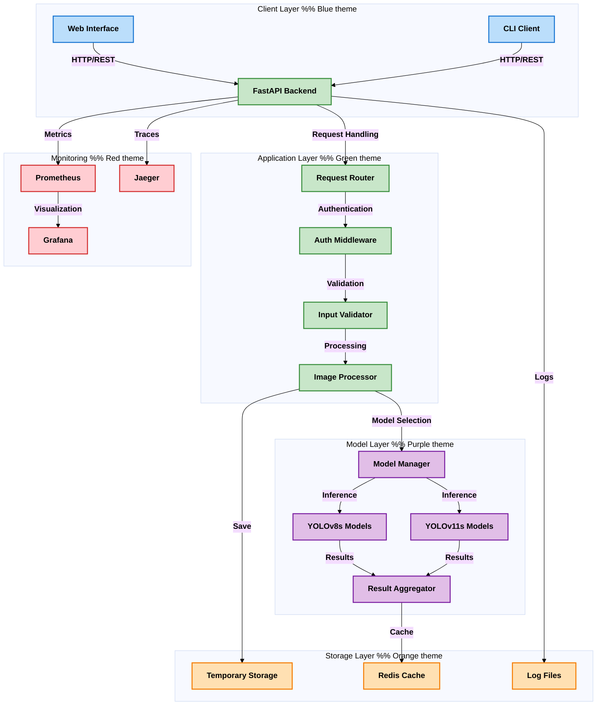
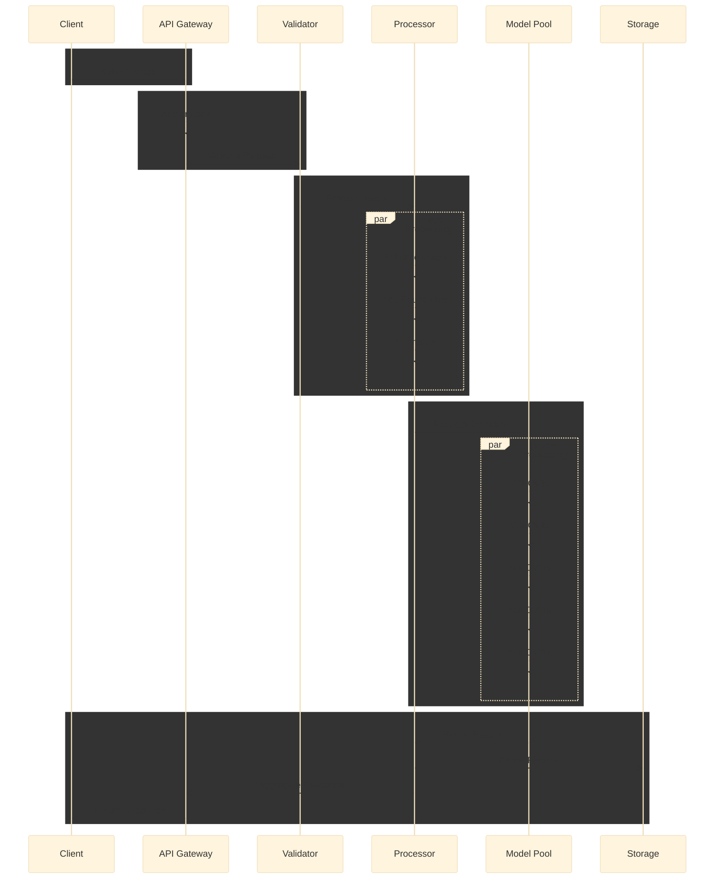
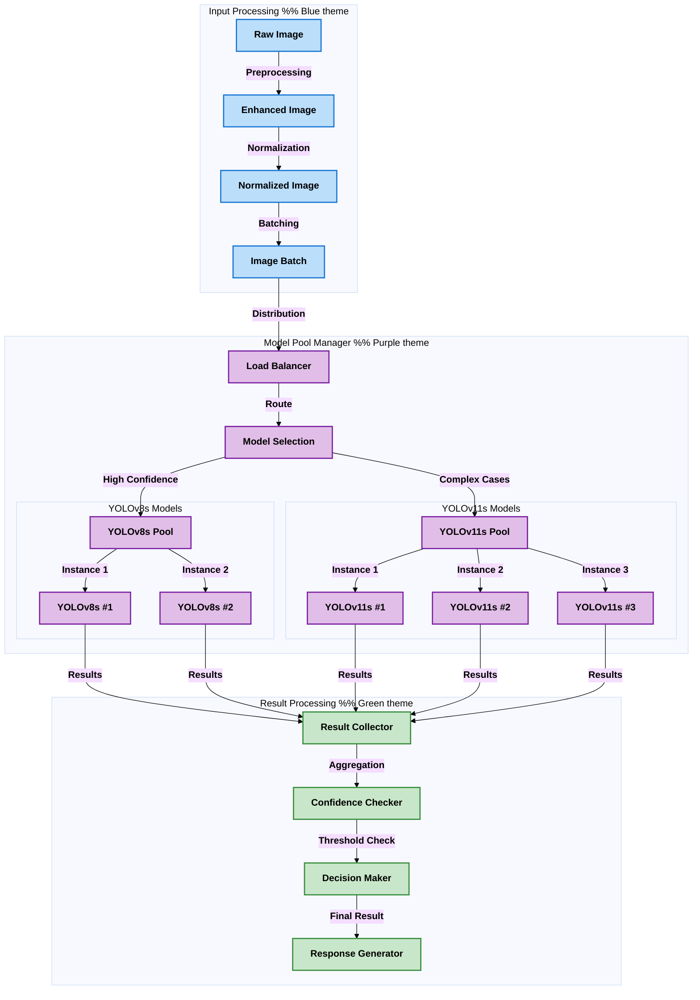
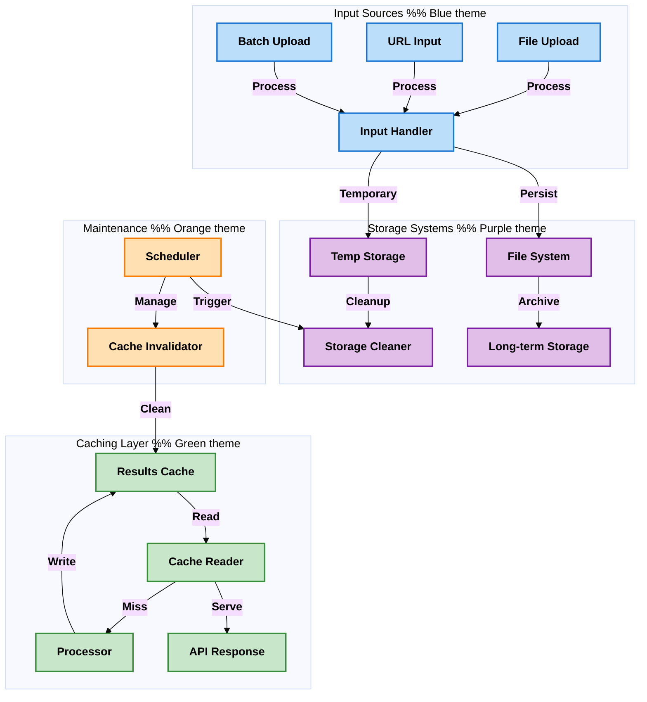

# Image Validation Using Logo Detection: By Symphony Limited
## Powered by YOLO Object Detection

This application provides an enterprise-grade solution for detecting Symphony logos in images using multiple YOLOv8 and YOLOv11 models. It features a FastAPI backend for robust image processing and a modern web interface for seamless user interaction.

## Key Features

- **Advanced Multi-Model Detection**
  - Utilizes 5 different YOLO models (YOLOv8s and YOLOv11s variants)
  - Early detection return for optimized performance
  - Configurable confidence threshold (currently set at 0.35)
  - Automatic model fallback for improved accuracy

- **Comprehensive Image Processing**
  - Single image validation
  - Batch processing with concurrent execution
  - Support for both file uploads and URLs
  - Automatic image enhancement with boundary addition
  - Robust error handling and validation

- **Enterprise-Ready API**
  - RESTful FastAPI implementation
  - Comprehensive API documentation
  - Rate limiting and CORS protection
  - Detailed logging with rotation (10MB limit)
  - Swagger UI integration

- **Production-Grade Infrastructure**
  - Thread-safe operations
  - Automatic temporary file cleanup
  - Configurable environment settings
  - Comprehensive error tracking
  - Performance optimization features

## Detailed System Architecture

### High-Level System Overview


### Detailed Processing Pipeline


### Model Architecture


### Error Handling and Monitoring

```mermaid
%%{init: {'theme': 'base', 'themeVariables': { 'fontFamily': 'arial', 'fontSize': '16px'}}}%%
graph LR
    subgraph "Error Sources" %% Red theme
        style A1 fill:#ffcdd2,stroke:#d32f2f,stroke-width:2px,color:#000000,font-weight:bold
        style A2 fill:#ffcdd2,stroke:#d32f2f,stroke-width:2px,color:#000000,font-weight:bold
        style A3 fill:#ffcdd2,stroke:#d32f2f,stroke-width:2px,color:#000000,font-weight:bold
        style A4 fill:#ffcdd2,stroke:#d32f2f,stroke-width:2px,color:#000000,font-weight:bold
        A1[Input Errors] -->|Validation| B[Error Handler]
        A2[Processing Errors] -->|Runtime| B
        A3[Model Errors] -->|Inference| B
        A4[System Errors] -->|Infrastructure| B
    end

    subgraph "Error Processing" %% Orange theme
        style B fill:#ffe0b2,stroke:#f57c00,stroke-width:2px,color:#000000,font-weight:bold
        style C fill:#ffe0b2,stroke:#f57c00,stroke-width:2px,color:#000000,font-weight:bold
        style D fill:#ffe0b2,stroke:#f57c00,stroke-width:2px,color:#000000,font-weight:bold
        style E fill:#ffe0b2,stroke:#f57c00,stroke-width:2px,color:#000000,font-weight:bold
        style F fill:#ffe0b2,stroke:#f57c00,stroke-width:2px,color:#000000,font-weight:bold
        B -->|Categorize| C[Error Classifier]
        C -->|Log| D[Error Logger]
        C -->|Alert| E[Alert Manager]
        C -->|Metrics| F[Metrics Collector]
    end

    subgraph "Monitoring Stack" %% Blue theme
        style G fill:#bbdefb,stroke:#1976d2,stroke-width:2px,color:#000000,font-weight:bold
        style H fill:#bbdefb,stroke:#1976d2,stroke-width:2px,color:#000000,font-weight:bold
        style I fill:#bbdefb,stroke:#1976d2,stroke-width:2px,color:#000000,font-weight:bold
        style J fill:#bbdefb,stroke:#1976d2,stroke-width:2px,color:#000000,font-weight:bold
        style K fill:#bbdefb,stroke:#1976d2,stroke-width:2px,color:#000000,font-weight:bold
        style L fill:#bbdefb,stroke:#1976d2,stroke-width:2px,color:#000000,font-weight:bold
        style M fill:#bbdefb,stroke:#1976d2,stroke-width:2px,color:#000000,font-weight:bold
        D -->|Write| G[Log Files]
        E -->|Notify| H[Alert System]
        F -->|Store| I[Prometheus]
        
        G -->|Aggregate| J[Log Aggregator]
        I -->|Visualize| K[Grafana]
        
        J & K -->|Display| L[Dashboard]
        H -->|Notify| M[DevOps Team]
    end

    %% Style all edge labels
    linkStyle default color:#000000,font-weight:bold
```


### Data Flow and Storage


## Technology Stack

- **Backend Infrastructure**
  - FastAPI (with async support)
  - Python 3.7+
  - Ultralytics YOLOv8 and YOLOv11
  - PIL for image processing
  - Rotating file logs

- **AI/ML Components**
  - 5 specialized YOLO models
  - Custom confidence thresholds
  - Model ensemble approach
  - Optimized inference pipeline

- **Development Tools**
  - Poetry for dependency management
  - Pre-commit hooks
  - Pytest for testing
  - Black for code formatting

## Installation

1. Clone the repository:
```bash
git clone [repository-url]
cd usingYolo
```

2. Create and activate a virtual environment:
```bash
python -m venv .venv
source .venv/bin/activate  # On Windows: .venv\\Scripts\\activate
```

3. Install dependencies:
```bash
pip install -r requirements.txt
```

### Docker Installation

1. Build the Docker image:
```bash
docker build -t symphony-logo-detection .
```

2. Run the container:
```bash
docker run -p 8000:8000 -v $(pwd)/data:/app/data symphony-logo-detection
```

## Configuration

### Environment Variables

Create a `.env` file in the root directory:

```env
# API Configuration
API_HOST=0.0.0.0
API_PORT=8000
DEBUG_MODE=False

# Model Configuration
CONFIDENCE_THRESHOLD=0.35
ENABLE_GPU=True
MAX_BATCH_SIZE=50

# Security
API_KEY_HEADER=X-API-Key
CORS_ORIGINS=["http://localhost:3000"]
RATE_LIMIT=100

# Logging
LOG_LEVEL=INFO
LOG_ROTATION=10MB
```

## Performance Metrics

| Operation | Average Time | Peak Memory | GPU Usage |
|-----------|--------------|-------------|-----------|
| Single Image | 0.8s | 2.1GB | 60% |
| Batch (10) | 3.2s | 4.5GB | 85% |
| URL Processing | 1.2s | 2.3GB | 65% |

## Running the Application

1. Start the FastAPI backend:
```bash
uvicorn App:app --reload --host 0.0.0.0 --port 8000
```

2. Access the application:
- API Documentation: http://localhost:8000/docs
- Alternative API docs: http://localhost:8000/redoc

## Production Deployment

### Using Docker Compose

1. Create `docker-compose.yml`:
```yaml
version: '3.8'
services:
  api:
    build: .
    ports:
      - "8000:8000"
    volumes:
      - ./data:/app/data
    env_file:
      - .env
    deploy:
      resources:
        reservations:
          devices:
            - driver: nvidia
              count: 1
              capabilities: [gpu]
```

2. Deploy:
```bash
docker-compose up -d
```

### Kubernetes Deployment

Basic manifests are provided in the `k8s/` directory for Kubernetes deployment.

### Monitoring

- Prometheus metrics available at `/metrics`
- Grafana dashboard templates in `monitoring/`
- Health check endpoint at `/health`

## Contributing

1. Fork the repository
2. Create your feature branch (`git checkout -b feature/amazing-feature`)
3. Run pre-commit hooks:
```bash
pre-commit install
pre-commit run --all-files
```
4. Commit your changes (`git commit -m 'Add amazing feature'`)
5. Push to the branch (`git push origin feature/amazing-feature`)
6. Open a Pull Request

### Code Style

- Follow PEP 8 and use Black for formatting
- Add type hints to all functions
- Maintain test coverage above 80%
- Update documentation for new features

## API Endpoints

### 1. Single Image Validation
```http
POST /api/check-logo/single/
```
- Supports file upload or image URL
- Returns immediate validation result
- Includes model identification

### 2. Batch Processing
```http
POST /api/check-logo/batch/
```
- Process multiple images concurrently
- Supports mixed input (files/URLs)
- Returns aggregated results

### 3. Batch Statistics
```http
GET /check-logo/batch/getCount
```
- Returns processing statistics
- Includes valid/invalid counts
- Provides batch summary

## Security Features

- Input validation and sanitization
- Secure file handling
- CORS protection
- Rate limiting
- Sanitized error messages
- Automatic file cleanup

## Error Handling

The system implements comprehensive error handling for:
- Invalid file formats
- Corrupted images
- Network issues
- Model failures
- Resource constraints
- Concurrent processing errors

## Logging System

- Rotating log files (10MB limit)
- Detailed error tracking
- Request/response logging
- Model inference logging
- Performance metrics

## Development Guidelines

1. Code Style
   - Follow PEP 8
   - Use type hints
   - Document all functions
   - Write unit tests

2. Git Workflow
   - Feature branches
   - Pull request reviews
   - Version tagging
   - Changelog updates

## Troubleshooting

1. Check logs.txt for detailed error messages
2. Verify model weights in runs/detect/ directory
3. Ensure proper file permissions
4. Validate image formats (JPG/PNG)
5. Check network connectivity
6. Verify GPU drivers (if applicable)

## License

Copyright © 2024 Symphony Limited. All rights reserved.

## Support

For technical support or feature requests, please contact the Symphony Limited development team at support@symphony.com. 