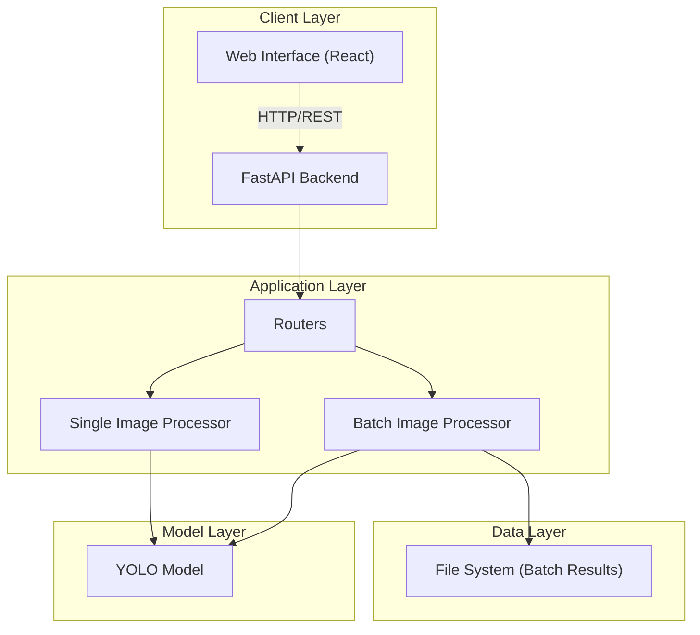
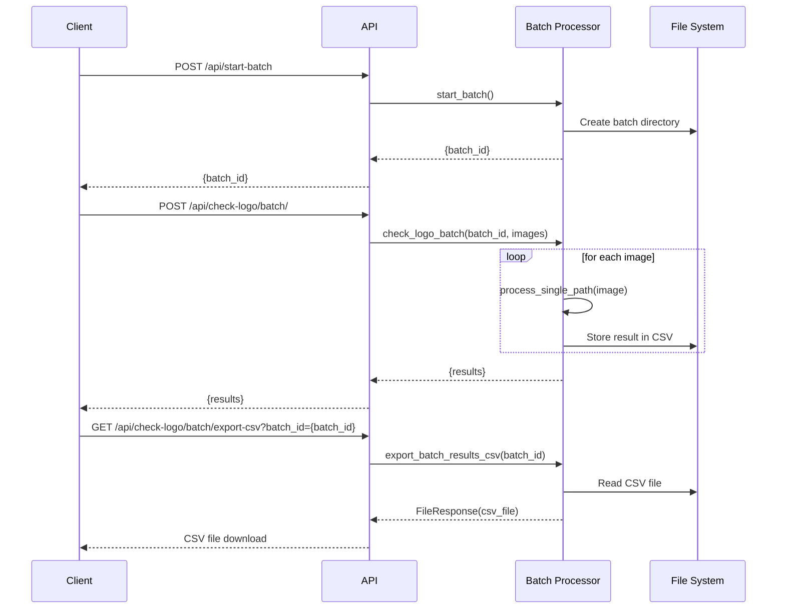
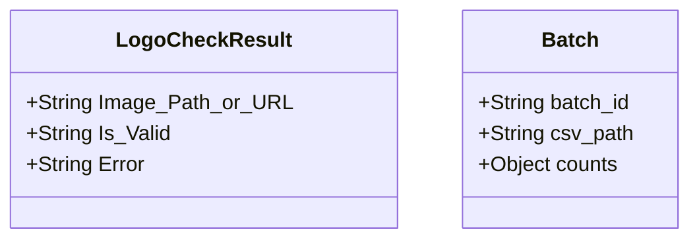

# Code Architecture Analysis

This document provides a detailed analysis of the Symphony Logo Detection System's code architecture. It includes a summary of the existing architecture, a series of diagrams to visualize the system, and a set of recommendations for improvement.

## 1. Existing Architecture Summary

The Symphony Logo Detection System is a web-based application designed to detect the presence of logos in images. It is built using a combination of Python and JavaScript, with a FastAPI backend and a React frontend.

### 1.1. Backend Architecture

The backend is a Python-based application built on the FastAPI framework. It is responsible for handling all business logic, including image processing, logo detection, and data management. The backend is organized into the following key components:

*   **`App.py`**: The main application entry point. It initializes the FastAPI application, sets up logging, CORS, and a rate limiter, and includes the API routers.
*   **`routers/`**: This directory contains the API routers, which are responsible for handling incoming requests and routing them to the appropriate handlers. The routers are organized by functionality, with separate modules for single-image processing, batch processing, and CSV export.
*   **`models/`**: This directory contains the data models for the application.
*   **`utils/`**: This directory contains a collection of utility functions that are used throughout the application. This includes functions for file operations, logging, and response formatting.
*   **`detect_logo.py`**: This module contains the core logo detection logic. It uses the YOLO (You Only Look Once) object detection model to identify logos in images.

### 1.2. Frontend Architecture

The frontend is a single-page application (SPA) built using the React framework. It provides a user-friendly interface for interacting with the logo detection system. The frontend is organized into the following key components:

*   **`src/`**: This directory contains the main source code for the frontend application.
*   **`public/`**: This directory contains the static assets for the application, such as the `index.html` file and the application's logo.

### 1.3. Data Management

The system uses a combination of in-memory data structures and the file system to manage data. Batch processing results are stored in a temporary directory on the file system, and a CSV file is generated to provide a downloadable report of the results.
## 2. Architecture Diagrams

### 2.1. High-Level System Overview

### 2.2. Batch Processing Flow

### 2.3. Data Model

## 3. Strengths and Weaknesses

### 3.1. Strengths

*   **Modularity**: The application is well-organized into a set of distinct modules, each with a clear and specific responsibility. This makes the code easier to understand, maintain, and test.
*   **Separation of Concerns**: The application follows the principle of separation of concerns, with a clear distinction between the frontend, backend, and data management components.
*   **Scalability**: The use of a stateless API and a batch processing system provides a solid foundation for horizontal scalability. The application can be easily scaled by adding more instances of the backend server.
*   **Extensibility**: The modular design of the application makes it easy to add new features and functionality. For example, it would be relatively straightforward to add support for new image formats or new logo detection models.

### 3.2. Weaknesses

*   **State Management**: The current implementation of batch processing relies on the file system to store state. This can be a bottleneck, especially in a distributed environment. It also makes it difficult to manage the lifecycle of batch jobs.
*   **Error Handling**: The error handling in the batch processing system is not as robust as it could be. For example, if a single image in a batch fails to process, it can cause the entire batch to fail.
*   **Testing**: The application lacks a comprehensive set of automated tests. This makes it difficult to ensure the quality and reliability of the code.
*   **Security**: The application does not include any specific security features, such as authentication or authorization. This could be a significant vulnerability, especially if the application is exposed to the public internet.
## 4. Proposed Architectural Improvements

Based on the analysis of the existing architecture, I propose the following improvements:

*   **Introduce a Distributed Cache**: To address the state management bottleneck, I recommend introducing a distributed cache, such as Redis. This would provide a more scalable and reliable way to store batch processing state.
*   **Implement a More Robust Error Handling Strategy**: To improve the reliability of the batch processing system, I recommend implementing a more robust error handling strategy. This should include the ability to gracefully handle failures in individual images, and to provide more detailed error reporting.
*   **Add a Comprehensive Test Suite**: To improve the quality and reliability of the code, I recommend adding a comprehensive suite of automated tests. This should include unit tests, integration tests, and end-to-end tests.
*   **Implement Security Best Practices**: To improve the security of the application, I recommend implementing a set of security best practices. This should include authentication and authorization, as well as input validation and output encoding.