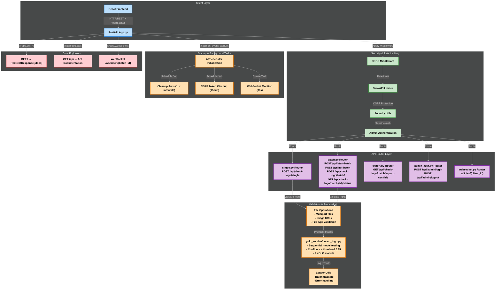
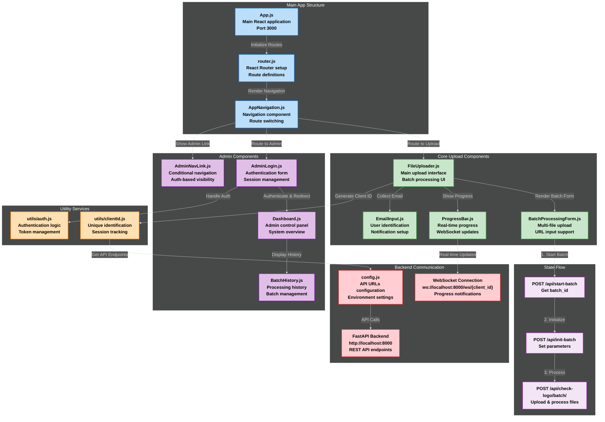
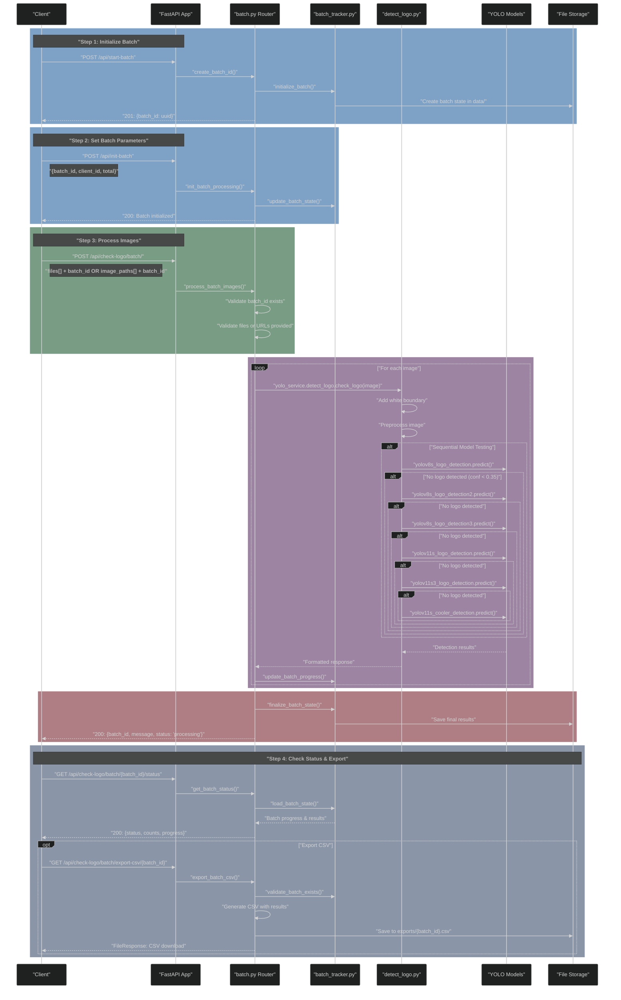
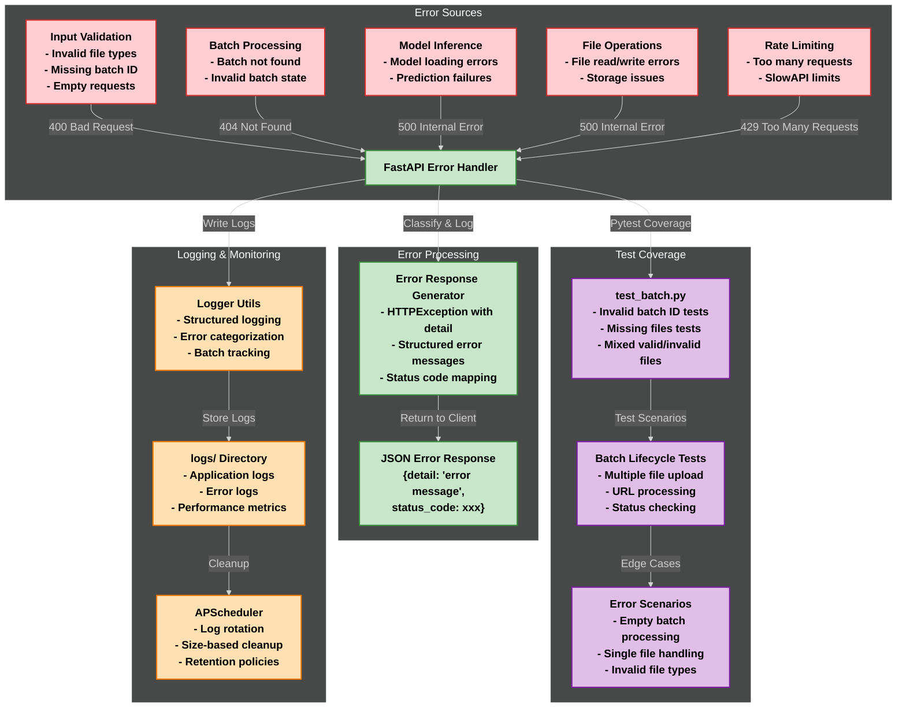
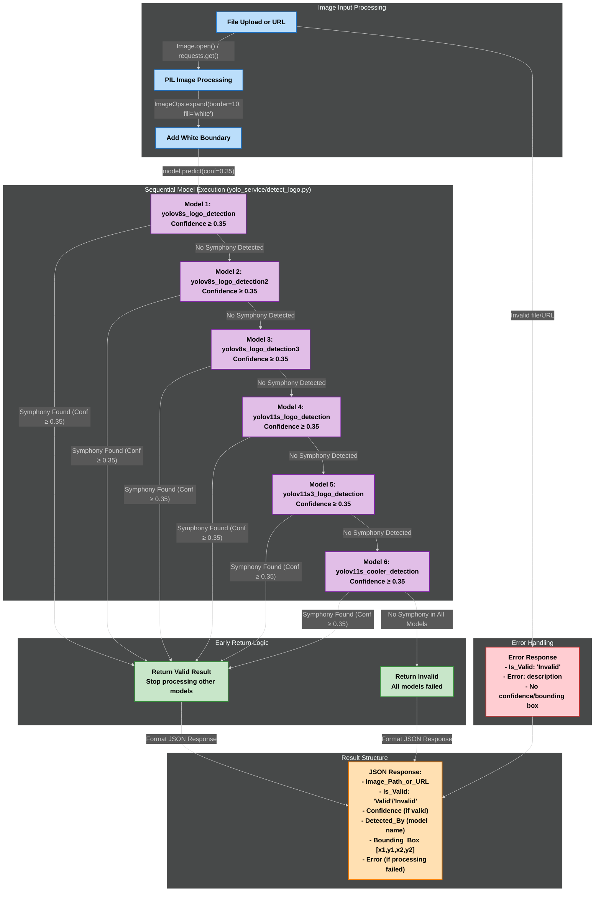
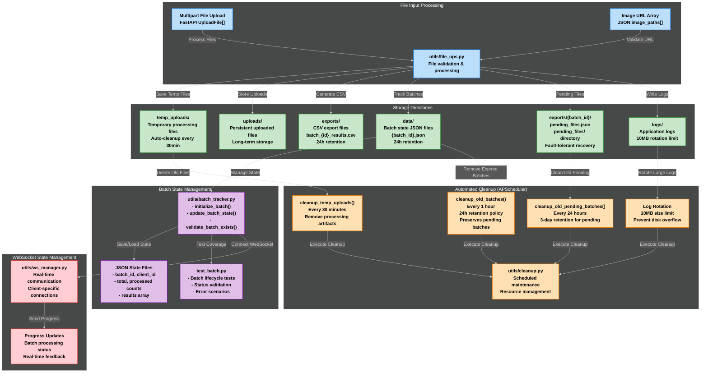
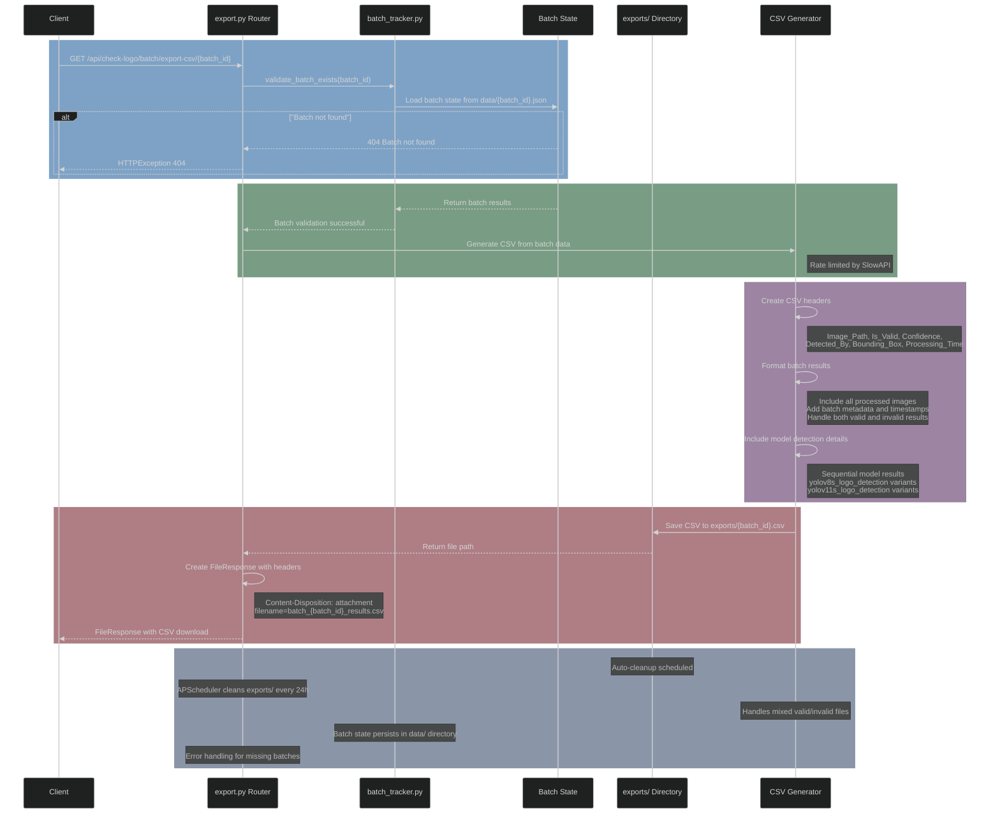

# System Architecture

The Symphony Logo Detection System features a microservice-based architecture with a decoupled FastAPI backend, React frontend, and specialized YOLO service for logo detection.

## High-Level System Overview

This diagram illustrates the complete system architecture showing how the React frontend (port 3000) communicates with the FastAPI backend (port 8000), which routes requests through specialized modules to the core YOLO detection engine. The system includes utility services for batch tracking, WebSocket management, security, and automated cleanup, with persistent storage for temporary files, exports, logs, and batch data.

```mermaid
%%{init: {'theme': 'dark', 'themeVariables': { 'fontFamily': 'arial', 'fontSize': '18px', 'fontWeight': 'bold'}}}%%
graph TD
    subgraph "Frontend Layer"
        style A fill:#bbdefb,stroke:#1976d2,stroke-width:2px,color:#000000,font-weight:bold
        style A1 fill:#bbdefb,stroke:#1976d2,stroke-width:2px,color:#000000,font-weight:bold
        style A2 fill:#bbdefb,stroke:#1976d2,stroke-width:2px,color:#000000,font-weight:bold
        A["React Frontend<br/>Port 3000"] -->|"Render Components"| A1["FileUploader Component<br/>Batch processing UI"]
        A -->|"Admin Access"| A2["Admin Dashboard<br/>Authentication required"]
        A1 -->|"API Calls + WebSocket"| B["FastAPI App.py<br/>Port 8000"]
        A2 -->|"Auth Requests"| B
    end

    subgraph "API Router Layer (routers/)"
        style B fill:#c8e6c9,stroke:#388e3c,stroke-width:2px,color:#000000,font-weight:bold
        style C1 fill:#c8e6c9,stroke:#388e3c,stroke-width:2px,color:#000000,font-weight:bold
        style C2 fill:#c8e6c9,stroke:#388e3c,stroke-width:2px,color:#000000,font-weight:bold
        style C3 fill:#c8e6c9,stroke:#388e3c,stroke-width:2px,color:#000000,font-weight:bold
        style C4 fill:#c8e6c9,stroke:#388e3c,stroke-width:2px,color:#000000,font-weight:bold
        style C5 fill:#c8e6c9,stroke:#388e3c,stroke-width:2px,color:#000000,font-weight:bold
        style C6 fill:#c8e6c9,stroke:#388e3c,stroke-width:2px,color:#000000,font-weight:bold
        style C7 fill:#c8e6c9,stroke:#388e3c,stroke-width:2px,color:#000000,font-weight:bold
        B -->|"Route Single Images"| C1["routers/single.py<br/>POST /api/check-logo/single"]
        B -->|"Route Batch Requests"| C2["routers/batch.py<br/>POST /api/start-batch<br/>POST /api/init-batch<br/>POST /api/check-logo/batch/"]
        B -->|"Route CSV Exports"| C3["routers/export.py<br/>GET /api/check-logo/batch/export-csv/{id}"]
        B -->|"Route Admin Auth"| C4["routers/admin_auth.py<br/>POST /api/admin/login"]
        B -->|"Route WebSocket"| C5["routers/websocket.py<br/>WS /ws/{client_id}"]
        B -->|"Route Dashboard"| C6["routers/dashboard_stats.py<br/>GET /api/admin/dashboard"]
        B -->|"Route Batch History"| C7["routers/batch_history.py<br/>GET /api/admin/batch-history"]
    end

    subgraph "Microservice Detection Engine"
        style D fill:#e1bee7,stroke:#7b1fa2,stroke-width:2px,color:#000000,font-weight:bold
        style D2 fill:#e1bee7,stroke:#7b1fa2,stroke-width:2px,color:#000000,font-weight:bold
        style E1 fill:#e1bee7,stroke:#7b1fa2,stroke-width:2px,color:#000000,font-weight:bold
        style E2 fill:#e1bee7,stroke:#7b1fa2,stroke-width:2px,color:#000000,font-weight:bold
        style E3 fill:#e1bee7,stroke:#7b1fa2,stroke-width:2px,color:#000000,font-weight:bold
        style E4 fill:#e1bee7,stroke:#7b1fa2,stroke-width:2px,color:#000000,font-weight:bold
        style E5 fill:#e1bee7,stroke:#7b1fa2,stroke-width:2px,color:#000000,font-weight:bold
        style E6 fill:#e1bee7,stroke:#7b1fa2,stroke-width:2px,color:#000000,font-weight:bold
        C1 -->|"Call check_logo()"| D["yolo_service/detect_logo.py<br/>Sequential model testing<br/>Confidence threshold 0.35"]
        C2 -->|"Call check_logo()"| D
        D -->|"Via services/yolo_client.py"| D2["yolo_service/<br/>Microservice Architecture<br/>main.py + start.py"]
        D2 -->|"Load Model 1"| E1["runs/detect/yolov8s_logo_detection/<br/>weights/best.pt"]
        D2 -->|"Load Model 2"| E2["runs/detect/yolov8s_logo_detection2/<br/>weights/best.pt"]
        D2 -->|"Load Model 3"| E3["runs/detect/yolov8s_logo_detection3/<br/>weights/best.pt"]
        D2 -->|"Load Model 4"| E4["runs/detect/yolov11s_logo_detection/<br/>weights/best.pt"]
        D2 -->|"Load Model 5"| E5["runs/detect/yolov11s3_logo_detection/<br/>weights/best.pt"]
        D2 -->|"Load Model 6"| E6["runs/detect/yolov11s_cooler_detection/<br/>weights/best.pt"]
    end

    subgraph "Utility Services (utils/)"
        style F1 fill:#ffe0b2,stroke:#f57c00,stroke-width:2px,color:#000000,font-weight:bold
        style F2 fill:#ffe0b2,stroke:#f57c00,stroke-width:2px,color:#000000,font-weight:bold
        style F3 fill:#ffe0b2,stroke:#f57c00,stroke-width:2px,color:#000000,font-weight:bold
        style F4 fill:#ffe0b2,stroke:#f57c00,stroke-width:2px,color:#000000,font-weight:bold
        style F5 fill:#ffe0b2,stroke:#f57c00,stroke-width:2px,color:#000000,font-weight:bold
        style F6 fill:#ffe0b2,stroke:#f57c00,stroke-width:2px,color:#000000,font-weight:bold
        style F7 fill:#ffe0b2,stroke:#f57c00,stroke-width:2px,color:#000000,font-weight:bold
        B -->|"Track Batch State"| F1["utils/batch_tracker.py<br/>JSON state management<br/>24h retention"]
        B -->|"Manage WebSocket"| F2["utils/ws_manager.py<br/>Real-time progress updates<br/>Client connections"]
        B -->|"Schedule Cleanup"| F3["utils/cleanup.py<br/>APScheduler tasks<br/>Resource management"]
        B -->|"Apply Security"| F4["utils/security.py<br/>CORS, rate limiting<br/>SlowAPI integration"]
        B -->|"Write Logs"| F5["utils/logger.py<br/>Structured logging<br/>10MB rotation"]
        B -->|"File Operations"| F6["utils/file_ops.py<br/>File handling utilities"]
        B -->|"Background Tasks"| F7["utils/background_tasks.py<br/>Async task management"]
    end

    subgraph "Storage & Data"
        style G1 fill:#ffcdd2,stroke:#d32f2f,stroke-width:2px,color:#000000,font-weight:bold
        style G2 fill:#ffcdd2,stroke:#d32f2f,stroke-width:2px,color:#000000,font-weight:bold
        style G3 fill:#ffcdd2,stroke:#d32f2f,stroke-width:2px,color:#000000,font-weight:bold
        style G4 fill:#ffcdd2,stroke:#d32f2f,stroke-width:2px,color:#000000,font-weight:bold
        style G5 fill:#ffcdd2,stroke:#d32f2f,stroke-width:2px,color:#000000,font-weight:bold
        D -->|"Save Temp Files"| G1["temp_uploads/<br/>Processing artifacts<br/>30min cleanup"]
        C3 -->|"Generate CSV"| G2["exports/<br/>batch_{id}_results.csv<br/>24h retention"]
        F5 -->|"Write Log Files"| G3["logs/<br/>Application & error logs<br/>Size-based rotation"]
        F1 -->|"Store Batch Data"| G4["data/<br/>{batch_id}.json<br/>State persistence"]
        F1 -->|"Store Pending Files"| G5["exports/{batch_id}/<br/>pending_files.json<br/>pending_files/ directory"]
    end

    subgraph "Testing & Quality (tests/)"
        style H1 fill:#f3e5f5,stroke:#9c27b0,stroke-width:2px,color:#000000,font-weight:bold
        style H2 fill:#f3e5f5,stroke:#9c27b0,stroke-width:2px,color:#000000,font-weight:bold
        style H3 fill:#f3e5f5,stroke:#9c27b0,stroke-width:2px,color:#000000,font-weight:bold
        C2 -->|"Test Coverage"| H1["tests/test_batch.py<br/>tests/test_single.py<br/>tests/test_detect_logo.py"]
        H1 -->|"Frontend Tests"| H2["frontend/src/__tests__/<br/>React component testing<br/>Jest + React Testing Library"]
        H1 -->|"Test Config"| H3["tests/pytest.ini<br/>Test configuration<br/>Coverage reporting"]
    end
```

<strong>📊 System Architecture Diagram</strong> (Click to expand)

**Fallback Description:** The system consists of a React Frontend (port 3000) connecting to FastAPI App.py (port 8000) through API Router Layer (routers/ directory with single.py, batch.py, export.py, admin_auth.py, websocket.py, dashboard_stats.py, batch_history.py). The Microservice Detection Engine uses yolo_service/detect_logo.py with services/yolo_client.py connecting to yolo_service/ microservice, loading 6 YOLO models from runs/detect/ directories. Utility Services (utils/ directory) include batch_tracker.py, ws_manager.py, cleanup.py, security.py, logger.py, file_ops.py, and background_tasks.py. Storage & Data layer manages temp_uploads/, exports/, logs/, data/ directories, and exports/{batch_id}/ for pending files. Testing & Quality includes tests/ directory with pytest configuration and frontend/src/__tests__/ for React components.

## FastAPI Application Architecture (App.py)

This diagram shows the internal structure of the FastAPI application, detailing the middleware stack (CORS, rate limiting, CSRF protection, admin authentication), API router layer, validation and processing flow, startup tasks with APScheduler, and core endpoints. It demonstrates how requests flow through security layers before reaching the detection logic.

<strong>⚙️ FastAPI Architecture Diagram</strong> (Click to expand)

  

**Fallback Description:** FastAPI App.py receives requests from React Frontend and applies middleware layers: CORS Middleware → SlowAPI Limiter → Security Utils → Admin Authentication. Requests are routed through API Router Layer (single.py, batch.py, export.py, admin_auth.py, websocket.py) to Validation & Processing (File Operations → yolo_service/detect_logo.py → Logger Utils). Startup & Background Tasks include APScheduler initialization with cleanup jobs, CSRF token cleanup, and WebSocket monitoring. Core Endpoints provide GET /, GET /api, and WebSocket /ws/batch/{batch_id}.

## React Frontend Component Architecture

This diagram illustrates the React frontend's component hierarchy, showing how the main App.js initializes routing through router.js and AppNavigation.js. It details the core upload components (FileUploader.js, BatchProcessingForm.js, ProgressBar.js, EmailInput.js), admin components (AdminLogin.js, Dashboard.js, BatchHistory.js), utility services, and backend communication flow.

<strong>⚙️ React Frontend Architecture Diagram</strong> (Click to expand)

  

**Fallback Description:** React App.js (port 3000) initializes routes through router.js and renders AppNavigation.js. Core Upload Components include FileUploader.js (main interface with zip file support), BatchProcessingForm.js (multi-file upload), ProgressBar.js (real-time progress with ETA), and EmailInput.js (notifications). Admin Components provide AdminLogin.js (authentication), Dashboard.js (control panel), BatchHistory.js (processing history), and AdminNavLink.js (conditional navigation). Utility Services handle clientId.js (unique identification) and auth.js (authentication logic). Backend Communication uses config.js (API configuration), WebSocket connections with heartbeat (ws://localhost:8000/ws/{client_id}), and FastAPI Backend (http://localhost:8000). State Flow: Start Batch → Initialize → Process files with server-side handling.

## Batch Processing Pipeline

Frontend uploads all files (or a zip) or URLs in a single request. Backend handles chunking, retry, and progress tracking with **dual pending management** (pending_files.json for file uploads, pending_urls.json for URLs). Real-time progress and per-file status are delivered via WebSocket. Final results are fetched after completion via /api/check-logo/batch/{batch_id}/complete.

This sequence diagram shows the complete batch processing workflow from initialization to completion. It demonstrates the 4-step process: batch initialization, parameter setting, image processing with model testing, and status checking with CSV export. The diagram illustrates the interaction between Client, FastAPI App, batch router, tracker, detection logic, YOLO models, and file storage.

<strong>🔄 Batch Processing Sequence Diagram</strong> (Click to expand)

  

**Fallback Description:** Frontend uploads all files (or a zip) or URLs in a single request. Backend handles chunking, retry, and progress tracking with **dual pending management** (pending_files.json for file uploads, pending_urls.json for URLs). Real-time progress and per-file status are delivered via WebSocket. Final results are fetched after completion via /api/check-logo/batch/{batch_id}/complete. Step 1: Client → POST /api/start-batch → FastAPI App creates batch_id → batch_tracker initializes batch → File Storage creates batch state → Returns 201 with batch_id. Step 2: Client → POST /api/init-batch with batch_id, client_id, total → batch_tracker updates state → Returns 200. Step 3: Client → POST /api/check-logo/batch/ with files/URLs + batch_id → **Creates pending_files.json OR pending_urls.json** → **Saves uploaded files to disk (for file uploads)** → Validates batch exists and files provided → For each image: yolo_service/detect_logo processes with white boundary and sequential model testing (yolov8s_logo_detection variants → yolov11s variants → yolov11s_cooler_detection) → Updates batch progress → **Removes processed files from disk and pending list**. Step 4: Client checks status via GET /api/check-logo/batch/{batch_id}/status and optionally exports CSV via GET /api/check-logo/batch/export-csv/{batch_id} → Background tasks clear pending files/URLs on completion.

## Enhanced Batch Processing Features

This diagram shows the advanced batch processing capabilities including zip file handling, retry mechanisms, and email notifications.

```mermaid
%%{init: {'theme': 'dark', 'themeVariables': { 'fontFamily': 'arial', 'fontSize': '18px', 'fontWeight': 'bold'}}}%%
flowchart TD
    subgraph "File Input Processing"
        style A fill:#bbdefb,stroke:#1976d2,stroke-width:2px,color:#000000,font-weight:bold
        style B fill:#bbdefb,stroke:#1976d2,stroke-width:2px,color:#000000,font-weight:bold
        style C fill:#bbdefb,stroke:#1976d2,stroke-width:2px,color:#000000,font-weight:bold
        style D fill:#bbdefb,stroke:#1976d2,stroke-width:2px,color:#000000,font-weight:bold
        A["File Upload/URL Input"] --> B{"File Count > 300?"}
        B -->|"Yes"| C["Create Zip File<br/>zipHelper.js"]
        B -->|"No"| D["Direct Upload"]
        C --> E["Upload Zip to Backend"]
        D --> E
    end

    subgraph "Backend Processing"
        style E fill:#c8e6c9,stroke:#388e3c,stroke-width:2px,color:#000000,font-weight:bold
        style F fill:#c8e6c9,stroke:#388e3c,stroke-width:2px,color:#000000,font-weight:bold
        style G fill:#c8e6c9,stroke:#388e3c,stroke-width:2px,color:#000000,font-weight:bold
        style H fill:#c8e6c9,stroke:#388e3c,stroke-width:2px,color:#000000,font-weight:bold
        E --> F["Extract/Process Files<br/>batch.py"]
        F --> G["Server-Side Processing<br/>background_tasks.py"]
        G --> H["Concurrent YOLO Detection<br/>Semaphore-limited"]
    end

    subgraph "Server-Side Error Handling"
        style I fill:#ffe0b2,stroke:#f57c00,stroke-width:2px,color:#000000,font-weight:bold
        style J fill:#ffe0b2,stroke:#f57c00,stroke-width:2px,color:#000000,font-weight:bold
        style K fill:#ffe0b2,stroke:#f57c00,stroke-width:2px,color:#000000,font-weight:bold
        H --> I{"Timeout/Error?"}
        I -->|"Yes"| J["Server-Side Error Handling"]
        I -->|"No"| L["Update Progress"]
        J --> K["Server-Side Retry Logic"]
        K --> L
    end

    subgraph "Completion & Notification"
        style L fill:#e1bee7,stroke:#7b1fa2,stroke-width:2px,color:#000000,font-weight:bold
        style M fill:#e1bee7,stroke:#7b1fa2,stroke-width:2px,color:#000000,font-weight:bold
        style N fill:#e1bee7,stroke:#7b1fa2,stroke-width:2px,color:#000000,font-weight:bold
        style O fill:#e1bee7,stroke:#7b1fa2,stroke-width:2px,color:#000000,font-weight:bold
        L --> M["Generate CSV Export"]
        M --> N["Send Email Notification<br/>(if configured)"]
        N --> O["WebSocket Complete Event"]
    end
```

<strong>🚀 Advanced Batch Processing Flow</strong> (Click to expand)

**Fallback Description:** File Input Processing: File Upload/URL Input → Check if File Count > 300 → If Yes: Create Zip File → Upload Zip to Backend; If No: Direct Upload. Backend Processing: Extract/Process Files (batch.py) → Server-Side Processing (background_tasks.py) → Concurrent YOLO Detection (Semaphore-limited). Server-Side Error Handling: Check Timeout/Error → If Yes: Server-Side Error Handling → Server-Side Retry Logic; If No: Update Progress. Completion & Notification: Generate CSV Export → Send Email Notification (if configured) → WebSocket Complete Event.

## Error Handling and Monitoring

This diagram illustrates the comprehensive error handling system, showing error sources (input validation, batch processing, model inference, file operations, rate limiting), error processing flow, test coverage with pytest scenarios, and logging & monitoring infrastructure with APScheduler cleanup.

<strong>⚠️ Error Handling & Monitoring Diagram</strong> (Click to expand)

  

**Fallback Description:** Error Sources: Input Validation (invalid file types, missing batch ID, empty requests) → 400 Bad Request; Batch Processing (batch not found, invalid state) → 404 Not Found; Model Inference (loading errors, prediction failures) → 500 Internal Error; File Operations (read/write errors, storage issues) → 500 Internal Error; Rate Limiting (too many requests, SlowAPI limits) → 429 Too Many Requests. Error Processing: FastAPI Error Handler → Error Response Generator (HTTPException with detail, structured messages, status code mapping) → JSON Error Response. Test Coverage: test_batch.py with invalid batch ID tests, missing files tests, mixed valid/invalid files, batch lifecycle tests, URL processing, status checking, error scenarios. Logging & Monitoring: Logger Utils (structured logging, error categorization, batch tracking) → logs/ Directory (application logs, error logs, performance metrics) → APScheduler (log rotation, size-based cleanup, retention policies).

## Sequential Model Processing Flow (detect_logo.py)

This diagram demonstrates the core AI detection logic, showing how images (files or URLs) are processed through PIL Image processing with white boundary addition, then sequentially tested against 6 YOLO models with early return optimization. It illustrates the decision flow and result structure for both successful detections and error handling.

<strong>🤖 AI Model Processing Diagram</strong> (Click to expand)

  

**Fallback Description:** Image Input Processing: File Upload or URL → PIL Image Processing → Add White Boundary (10px). Sequential Model Execution: Model 1 (yolov8s_logo_detection) → Model 2 (yolov8s_logo_detection2) → Model 3 (yolov8s_logo_detection3) → Model 4 (yolov11s_logo_detection) → Model 5 (yolov11s3_logo_detection) → Model 6 (yolov11s_cooler_detection), each with confidence ≥ 0.35. Early Return Logic: If Symphony found (Conf ≥ 0.35) → Return Valid Result and stop processing; if no Symphony in all models → Return Invalid. Result Structure: JSON Response with Image_Path_or_URL, Is_Valid, Confidence, Detected_By, Bounding_Box, Error. Error Handling: Invalid file/URL → Error Response with no confidence/bounding box.

## File Storage and Cleanup System

This diagram shows the file management architecture, illustrating how multipart file uploads and image URLs are processed through utils/file_ops.py, stored in various directories (temp_uploads/, uploads/, exports/, data/, logs/), managed through batch_tracker.py, and automatically cleaned up via APScheduler with WebSocket state management.

<strong>🗄️ File Storage & Cleanup Diagram</strong> (Click to expand)

  

**Fallback Description:** File Input Processing: Multipart File Upload (FastAPI UploadFile[]) and Image URL Array (JSON image_paths[]) → utils/file_ops.py for validation & processing. Storage Directories: temp_uploads/ (temporary processing files, 30min auto-cleanup), uploads/ (persistent uploaded files), exports/ (CSV export files, batch_{id}_results.csv, 24h retention), data/ (batch state JSON files, {batch_id}.json, 24h retention), exports/{batch_id}/ (pending_files.json and pending_files/ directory for fault-tolerant recovery), logs/ (application logs, 10MB rotation limit). Batch State Management: utils/batch_tracker.py (initialize_batch(), update_batch_state(), validate_batch_exists()) → JSON State Files (batch_id, client_id, total/processed counts, results array) → test_batch.py (batch lifecycle tests, status validation, error scenarios). Automated Cleanup (APScheduler): cleanup_temp_uploads() every 30 minutes, cleanup_old_batches() every 1 hour with 24h retention and preserves pending batches, cleanup_old_pending_batches() every 24 hours with 3-day retention for pending batches, Log Rotation with 10MB size limit → utils/cleanup.py for scheduled maintenance. WebSocket State Management: utils/ws_manager.py for real-time communication → Progress Updates with batch processing status.

## CSV Export Lifecycle

This sequence diagram details the CSV export process, showing the complete workflow from client request through batch validation, CSV generation with headers and metadata, file creation in exports/ directory, and FileResponse delivery with automatic cleanup scheduling.

<strong>📄 CSV Export Sequence Diagram</strong> (Click to expand)

  

**Fallback Description:** Client → GET /api/check-logo/batch/export-csv/{batch_id} → export.py Router validates batch exists via batch_tracker.py → Loads batch state from data/{batch_id}.json. If batch not found → 404 HTTPException. If successful → CSV Generator creates headers (Image_Path, Is_Valid, Confidence, Detected_By, Bounding_Box, Processing_Time), formats batch results (all processed images, batch metadata, timestamps, valid/invalid results, model detection details from yolov8s/yolov11s variants) → Saves CSV to exports/{batch_id}.csv → Creates FileResponse with Content-Disposition attachment → Returns CSV download to Client. Auto-cleanup: APScheduler cleans exports/ every 24h, handles mixed valid/invalid files, batch state persists in data/ directory, error handling for missing batches.

 