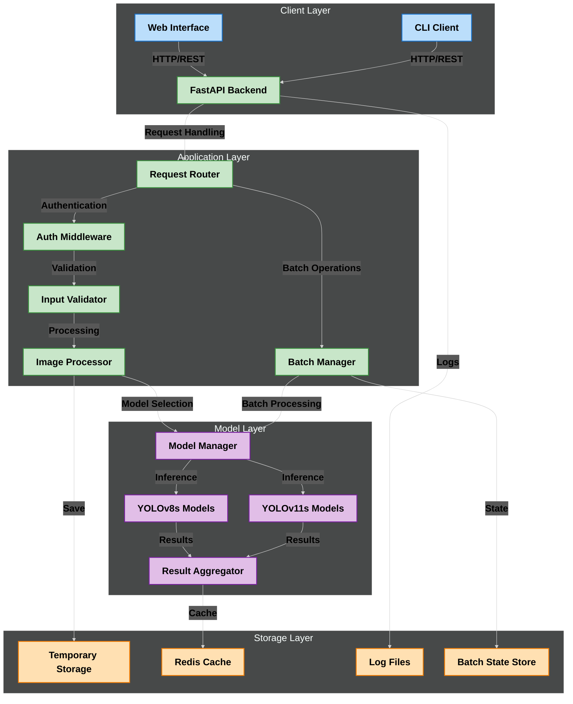
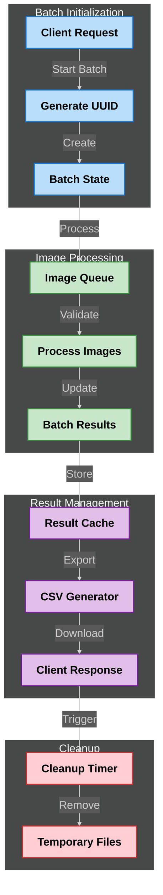
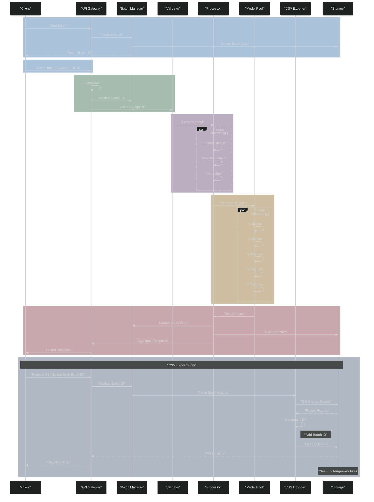
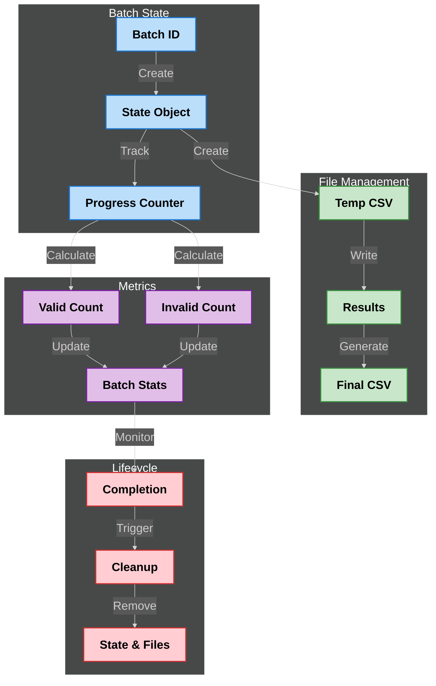

# System Architecture

This document provides a detailed overview of the Symphony Logo Detection System's architecture.

## High-Level System Overview

The system is organized into several layers:
- **Client Layer**: Web interface and CLI clients
- **Application Layer**: Request handling, authentication, batch management, and processing
- **Model Layer**: YOLO model management and inference
- **Storage Layer**: File, cache, and batch state management
- **Monitoring**: System metrics and visualization

## Batch Processing Architecture

Key components of batch processing:
- **Batch Initialization**: UUID generation and state creation
- **Image Processing**: Queue management and parallel processing
- **Result Management**: Caching and CSV generation
- **Cleanup**: Automatic resource management

## Detailed Processing Pipeline

Key processing stages:
1. Batch initialization and ID generation
2. Image submission with batch tracking
3. Authentication and batch validation
4. Image processing and enhancement
5. Model inference and result aggregation
6. Batch state management
7. CSV export with batch identification

## State Management Architecture

State management components:
- **Batch State**: ID management and progress tracking
- **File Management**: Temporary and final CSV handling
- **Metrics**: Processing statistics and counts
- **Lifecycle**: State cleanup and resource management

## Model Architecture

This diagram shows the organization of our YOLO models and their interaction.

Features:
- Multiple YOLO model variants (v8s and v11s)
- Load balancing and model selection
- Result aggregation and confidence checking
- Optimized inference pipeline

## Error Handling and Monitoring

This diagram shows our comprehensive error handling and monitoring system.

Key aspects:
- Error classification and handling
- Logging and metrics collection
- Alert management
- Performance monitoring
- DevOps integration

## Technical Specifications

### Processing Pipeline
- Concurrent image processing
- Automatic model selection
- Early detection return
- CSV export functionality
- Secure file handling

### Storage Management
- Temporary file cleanup
- Cache invalidation
- Result persistence
- Export file management

### Monitoring and Maintenance
- Real-time metrics
- Performance tracking
- Resource utilization
- System health checks

### Security Features
- Input validation
- File sanitization
- Access control
- Rate limiting
- Secure data handling

## Performance Considerations

1. **Optimization Techniques**
   - Concurrent processing
   - Cache utilization
   - Early returns
   - Resource pooling

2. **Scalability Features**
   - Horizontal scaling
   - Load balancing
   - Resource distribution
   - Cache distribution

3. **Resource Management**
   - Memory optimization
   - Storage cleanup
   - Cache invalidation
   - Export file lifecycle

## Future Enhancements

1. **Planned Improvements**
   - Additional model variants
   - Enhanced batch processing
   - Advanced caching strategies
   - Extended export formats

2. **Scalability Plans**
   - Distributed processing
   - Cloud integration
   - Enhanced monitoring
   - Automated scaling

## References

- [API Documentation](./api-reference.md)
- [Deployment Guide](./deployment.md)
- [Security Guidelines](./security.md)
- [Development Guide](./development-guide.md) 